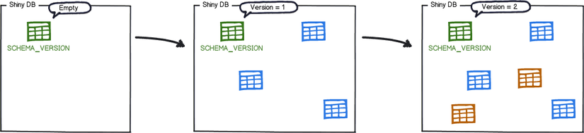
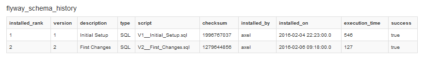
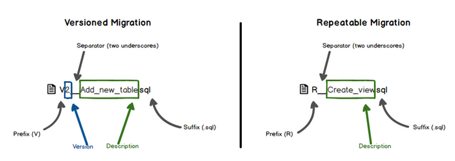
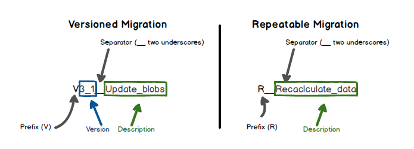

# Flyway
` Hướng dẫn sử dụng Flyway để quản lý version database`
1. Hướng dẫn cấu hình
2. Áp dụng trong triển khai CI/CD
# Flyway
` Hướng dẫn sử dụng flyway để quản lý version database`
1. Flyway là gì?
    Flyway là một java open source library hỗ trợ migrate data cho các ứng dụng, một khi chúng ta cần
    - Nâng cấp database do thay đổi cấu trúc hoặc dữ liệu.
    - Quản lý lịch sử thay đổi version một cách chặt chẽ.
    - Thực thi migrating một cách tự động.
    - Đồng bộ data structure giữa các server development.
    Flyway cũng hỗ trợ các build tools, dependency manager gồm : Maven, Gradle , Ant và SBT build tool 
    for Scala. Ngoài ra còn hỗ trợ tích hợp các plugins để dễ dàng config và sử dụng với các ứng dụng 
    có framework đặc thù.
    Hỗ trợ hầu hết các relational database
2. Cách thức hoạt động
    Flyway tạo ra một table có tên `flyway_schema_history` dùng để quản lý lịch sử phiên bản cũng như trạng 
    thái của database.

    Các file chạy migrate có thể là file Sql script hoặc Java API là những class `VerXXX_Jdbc***` được 
    extends từ flyway core. Các file này đều được đặt tên theo một quy tắc nhất định để xác định version number.

    Tại mỗi thời điểm chạy migration. flyway sẽ kiểm tra `flyway_schema_history` và quét cần migrate để 
    kiểm tra việc migrating tới một version mới hay không. Nếu version đó nhỏ hơn hoặc bằng version 
    hiện tại quá trình này sẽ được bỏ qua.
    Để hình dung quá trình thay đổi database , bạn hãy nhìn hình bên dưới :

    

    Dữ liệu được log trong `flyway_schema_history` :

    
    
3. Các loại migrations
    Flyway support 2 loại migrations là `Versioned migrations` và `Repeatable migrations`.

    `Versioned migrations` : là các versions đã được định danh và có đánh số duy nhất với các version khác, 
    và thường được sử dụng :

      - Creating/altering/dropping tables/indexes/foreign keys/enums/UDTs/...
      - Reference data updates
      - User data corrections

    `Repeatable migrations` : Repeatable thì lại không có version, thay vì đó chúng luôn thực thi sau Versioned 
    migrations mỗi khi có checksum thay đổi từ table SCHEMA_VERSION. Thường được sử dụng :
    
      - (Re-)creating views/procedures/functions/packages/...
      - Bulk reference data reinserts
4. Quy tắc đặt tên version
    Flyway có thể migrate data bằng file Sql hoặc từ Java class, vì vậy quy tắc đặt tên biến 
    có những sự khác nhau như sau :

    

    Tên file sẽ theo format :

      - prefix: Có thể sử dụng prefix khác, default: V cho versioned migrations, R cho repeatable migrations.
      - version: (chỉ áp dung cho Versioned migrations) có thể thêm dấu . hoặc _ để thêm minor version, ví dụ như : V1_2
      - separator: Có thể sử dụng separator khác, default: __ (2 dấu gạch dưới __)
      - description: Dấu gạch dưới hoặc khoảng trắng để phân biệt các từ.
      - suffix: Có thể thiết lập suffix khác, default: .sql

    

    Với Java Migrations thì duy nhất có 2 điểm khác biệt.

    - prefix: luôn luôn là V cho versioned migrations và R cho repeatable migrations.
    - description: luôn luôn là dấu gạch dưới (_) để phân biệt các từ.
5. Ví dụ tích hợp Flyway với command line
   Đối với một database đã tồn tại, trước tiên cần export script sql dữ liệu đang chạy trên database và lưu với version `V1__Baseline.sql`.
   Sau đó run lệnh tạo baseline cho DB:
   ```shell
      ./flyway -user=${userdb} -password=${passwdb} -url=jdbc:mariadb://host:port/dbname baseline
   ```
   Bất kỳ thay đổi nào tới DB cần tạo script và run để đảm bảo có thể lưu lại log thay đổi thực thi trên DB.
    ```shell
        ./flyway -user=${userdb} -password=${passwdb} -url=jdbc:mariadb://host:port/dbname  -locations=filesystem:/home/app/server/flyway-6.0.3/sql/ migrate
    ```
    `locations`: folder chứa file sql apply tới DB


