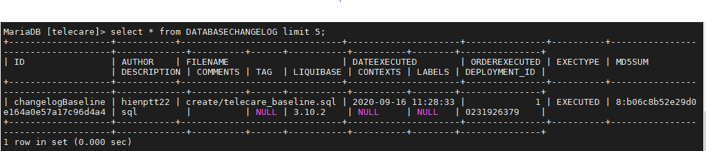
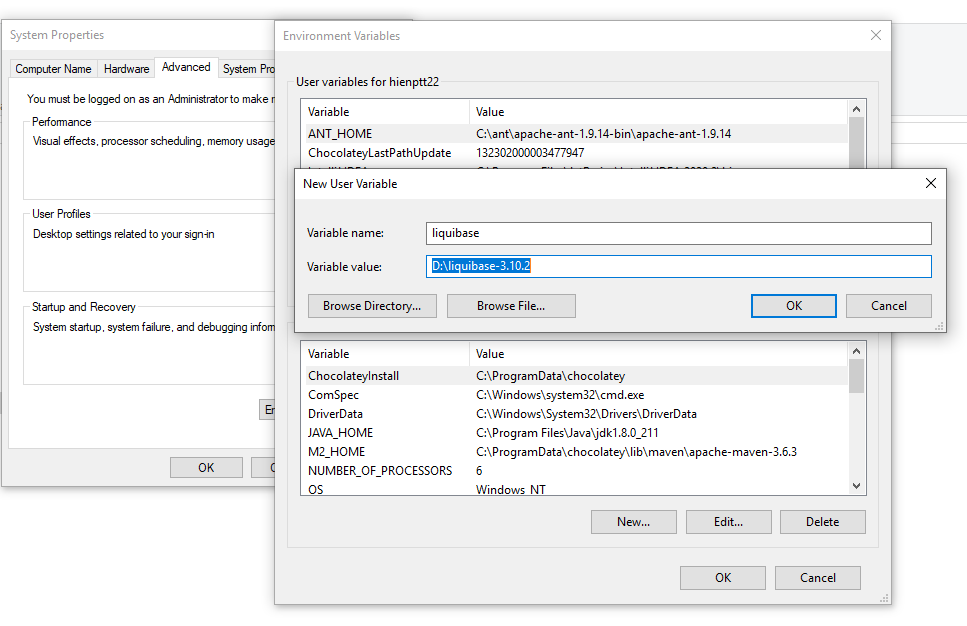
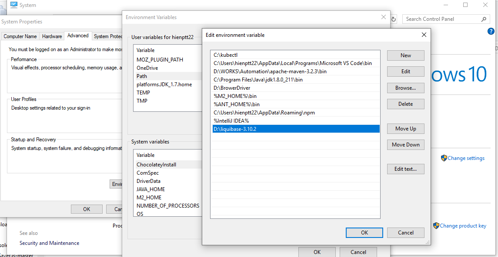
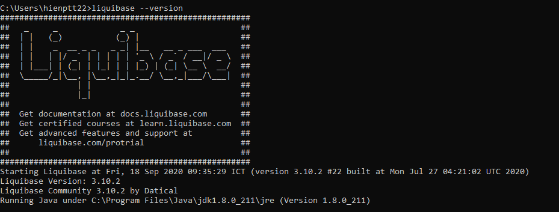
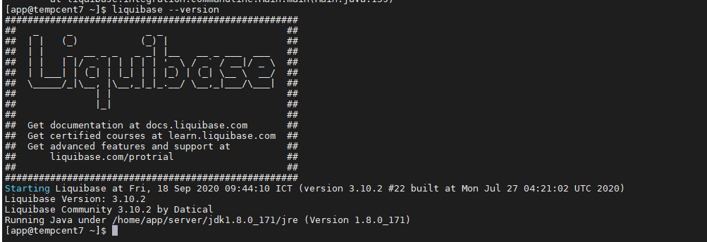
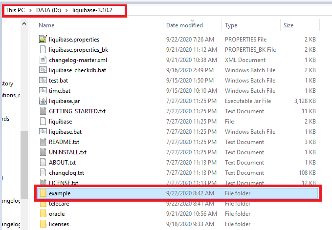

# Liquibase

` Hướng dẫn sử dụng liquibase để quản lý version database`

## Mục lục
- [Giới thiệu](#1-gi%E1%BB%9Bi-thi%E1%BB%87u)
  - [ Các vấn đề khi không quản lý phiên bản database](#11-c%C3%A1c-v%E1%BA%A5n-%C4%91%E1%BB%81-khi-kh%C3%B4ng-qu%E1%BA%A3n-l%C3%BD-phi%C3%AAn-b%E1%BA%A3n-database)
  - [Liquibase là gì?](#12-liquibase-l%C3%A0-g%C3%AC)
  - [ Lợi ích](#13-l%E1%BB%A3i-%C3%ADch)
  - [Cách thức hoạt động](#14-c%C3%A1ch-th%E1%BB%A9c-ho%E1%BA%A1t-%C4%91%E1%BB%99ng)
- [Các khái niệm và thuật ngữ chính cần biết khi sử dụng Liquibase](#2-c%C3%A1c-kh%C3%A1i-ni%E1%BB%87m-v%C3%A0-thu%E1%BA%ADt-ng%E1%BB%AF-ch%C3%ADnh-c%E1%BA%A7n-bi%E1%BA%BFt-khi-s%E1%BB%AD-d%E1%BB%A5ng-liquibase)
  - [Changelog files](#21-changelog-files)
  - [Changesets](#22-changesets)
  - [Change types](#23-change-types)
  - [Preconditions](#24-preconditions)
  - [Contexts](#25-contexts)
  - [Labels](#26-labels)
- [Một số lệnh cơ bản thường dùng](#3-m%E1%BB%99t-s%E1%BB%91-l%E1%BB%87nh-c%C6%A1-b%E1%BA%A3n-th%C6%B0%E1%BB%9Dng-d%C3%B9ng)
- [Hướng dẫn cài đặt](#4-h%C6%B0%E1%BB%9Bng-d%E1%BA%ABn-c%C3%A0i-%C4%91%E1%BA%B7t)
- [Hướng dẫn triển khai](#5-h%C6%B0%E1%BB%9Bng-d%E1%BA%ABn-tri%E1%BB%83n-khai)
  - [Liquibase sử dụng cho một database đang được sử dụng](#51-liquibase-s%E1%BB%AD-d%E1%BB%A5ng-cho-m%E1%BB%99t-database-%C4%91ang-%C4%91%C6%B0%E1%BB%A3c-s%E1%BB%AD-d%E1%BB%A5ng)
  - [Hướng dẫn sử dụng liquibase để tự động export thay đổi tác động qua tool trên database sau khi tích hợp liquibase](#52-h%C6%B0%E1%BB%9Bng-d%E1%BA%ABn-s%E1%BB%AD-d%E1%BB%A5ng-liquibase-%C4%91%E1%BB%83-t%E1%BB%B1-%C4%91%E1%BB%99ng-export-thay-%C4%91%E1%BB%95i-t%C3%A1c-%C4%91%E1%BB%99ng-qua-tool-tr%C3%AAn-database-sau-khi)
- [Một số command thường dùng]((./resource/commandExample/Command.md)) 


## Nội dung chi tiết

### 1. Giới thiệu

#### 1.1. Các vấn đề khi không quản lý phiên bản database

  - Thay đổi cơ sở dữ liệu không nhất quán.

  - Không hiệu quả trong việc quản lý các thay đổi.

  - Tác động vào cơ sở dữ liệu có thể không được phát hiện.

  - Database không đồng bộ giữa các môi trường.

#### 1.2. Liquibase là gì?

  - LiquiBase là một phần mềm opensource, cho phép theo dõi, quản lý và thực thi
    các thay đổi tới database.

  - Liquibase sử dụng `changesets` để thể hiện một thay đổi tới database.

  - Những thay đổi trên databse được lưu trong một file SQL, XML, YAML, JSON và có
    thể được kiểm tra từ source code.

  - LiquiBase thực hiện các thay đổi dựa trên nội dung trong file SQL, XML, YAML,
    JSON để xử lý các phiên bản khác nhau của cấu trúc và dữ liệu trong database.

#### 1.3. Lợi ích

  LiquiBase hỗ trợ thay đổi dữ liệu một cách nhất quán:

  - LiquiBase hỗ trợ thay đổi dữ liệu một cách nhất quán.

  - Quản lý database ở các trạng thái khác nhau.

  - Lưu lại lịch sử các thay đổi.

  - Hỗ trợ rollback tự động.

  - Có khả năng tự động hóa.

  - Hạn chế lỗi tác động từ người dùng.

  - Phù hợp với nhiều loại database khác nhau như mariadb, Mysql, Oracle,…

#### 1.4. Cách thức hoạt động

  - Liquibase hoạt động dựa trên các file changelog.

  - Changelog là một file định dạng xml, json,sql, yaml liệt kê tất cả các thay đổi
    tới database. Một file changelog chứa một bộ các changeset liệt kê từng thay đổi
    đơn lẻ trong database. Một changeLog có thể bao gồm nhiều changlog khác.

  - Một changeSet bao gồm hai loại thông tin: siêu dữ liệu(metadata) về thay đổi và
    chính lệnh thay đổi. Lệnh có thể chứa hoặc nhiều thay đổi (thêm bảng, sửa đổi cột,
    thêm ràng buộc, chèn, v.v.), tuy nhiên, khi nó chạy, Liquibase sẽ xem xét tất cả
    những thay đổi đó như một phần của một changeSet duy nhất.

  - `Metadata` cho phép xác định duy nhất changeSet (thông tin về mã định danh, tác giả
    và tên tệp) và xác định cách áp dụng các thay đổi này tới database.

  - Liquibase quản lý các thay đổi là tập các changeSet đã được thực thi tới database dựa
    trên bảng `DATABASECHANGELOG`. Nếu cơ sở dữ liệu chưa chứa bảng này, Liquibase sẽ tạo nó.

    Ví dụ về nội dung bảng databaseChanglog:
    

  - Nếu Liquibase được chạy lại, nó sẽ có thể nhận ra nếu thay đổi đã được áp dụng. Mặc định,
    Liquibase sẽ chỉ áp dụng các thay đổi mới. Các thay đổi cũ sẽ bị bỏ qua, tuy nhiên, MD5checksum
    của chúng được kiểm tra trong quá trình này. Nếu MD5checksum khác, điều đó có nghĩa là changeSet
    đã được sửa đổi so với lần chạy trước đó, Liquibase dừng và trả lại thông tin về MD5checksum sai.
    Đó là lý do tại sao mọi thay đổi mới phải là một phần của changeSet. Một bảng khác được tạo bởi
    Liquibase là `DATABASECHANGELOGLOCK`, Mục đích của nó là để ngăn việc sửa đổi một phiên bản cơ sở
    dữ liệu từ nhiều người dùng trong cùng một thời điểm.

### 2. Các khái niệm và thuật ngữ chính cần biết khi sử dụng Liquibase

#### 2.1. Changelog files

  - Dev sẽ lưu tất cả các thay đổi tới cơ sở dữ liệu trong các file ở máy local hoặc trên source control
    (ví dụ sử dụng git) và apply các thay đổi này tới cơ sở dữ liệu ở local. Các changelog file này được
    lưu ở source control để cho phép sự cộng tác. Changelog này có thể được sử dụng để cập nhật tới tất cả
    cở sở dữ liệu ở các môi trường khác nhau mà một nhóm sử dụng, từ cơ sở dữ liệu phát triển local, dev,
    staging hay productions.
  - Liquibase sử dụng changelog để liệt kê tất cả các thay đổi, theo thứ tự, được thực hiện cho cơ sở
    dữ liệu của bạn. Nó là một file chứa bản ghi tất cả các thay đổi trong cơ sở dữ liệu (tập thay đổi). Liquibase sử dụng bản ghi thay đổi này để kiểm tra cơ sở dữ liệu và thực hiện bất kỳ thay đổi nào chưa được áp dụng cho cơ sở dữ liệu của bạn.
  - Changelogs có thể có một trong các định dạng sau và có thể được lưu trữ và tạo phiên bản trong source control:
    - changelogs in SQL Format
    - changelogs in XML Format
    - changelogs in JSON Format
    - changelogs in YAML Format
  - Ví dụ về changelogs rỗng

    - SQL changelog

      ```sql
      --liquibase formatted sql
      ```

    - XML Example:

      ```xml
       <?xml version="1.0" encoding="UTF-8"?>
        <databaseChangeLog xmlns="http://www.liquibase.org/xml/ns/dbchangelog"
          xmlns:xsi="http://www.w3.org/2001/XMLSchema-instance"
          xmlns:ext="http://www.liquibase.org/xml/ns/dbchangelog-ext"
          xmlns:pro="http://www.liquibase.org/xml/ns/pro" xsi:schemaLocation="http://www.liquibase.org/xml/ns/dbchangelog http://www.liquibase.org/xml/ns/dbchangelog/dbchangelog-3.8.xsd
            http://www.liquibase.org/xml/ns/dbchangelog-ext http://www.liquibase.org/xml/ns/dbchangelog/dbchangelog-ext.xsd
            http://www.liquibase.org/xml/ns/pro http://www.liquibase.org/xml/ns/pro/liquibase-pro-3.8.xsd ">
        </databaseChangeLog>
      ```

    - YAML example:

      ```yaml
      databaseChangeLog:
      ```

    - JSON example:

      ```json
      { "databaseChangeLog": [] }
      ```

#### 2.2. Changesets

  - `ChangeSets` là các đơn vị thay đổi mà Liquibase theo dõi việc thực thi. Mỗi changeSet được xác định
    duy nhất bởi các thuộc tính tác giả, id và tên tệp. Khi Liquibase chạy, nó truy vấn bảng
    DATABASECHANGELOG cho các changeSets được đánh dấu là đã thực thi và sau đó thực thi tất cả các
    changeSets trong tệp thay đổi chưa được thực thi.

  - `Changeset tag` được sử dụng để nhóm các Loại Thay đổi(`Change Types`) trong cơ sở dữ liệu
    lại với nhau và là một đơn vị thay đổi mà Liquibase thực thi trên cơ sở dữ liệu. Danh sách các
    thay đổi được tạo bởi nhiều tập thay đổi được theo dõi trong bảng thay đổi.

  - Tập hợp các thay đổi được gắn thẻ duy nhất bởi cả tác giả và thuộc tính id (tác giả: id),
    cũng như đường dẫn tệp thay đổi. Thẻ id chỉ được sử dụng như một định danh, nó không xác định
    thứ tự chạy các thay đổi.

#### 2.3. Change types

  - Mỗi tập thay đổi chứa một hoặc nhiều Loại thay đổi mô tả một loại thay đổi hoặc hành động
    bạn muốn áp dụng cho cơ sở dữ liệu. Liquibase hỗ trợ cả Kiểu thay đổi mô tả tạo SQL cho
    cơ sở dữ liệu được hỗ trợ và SQL thô. Nói chung, chỉ nên có một Loại thay đổi cho mỗi tập
    thay đổi để tránh việc tự động commit trạng thái làm cho cơ sở dữ liệu ở một trạng thái
    không mong muốn.

#### 2.4. Preconditions

  - Các điều kiện tiên quyết có thể được áp dụng cho toàn bộ bảng thay đổi hoặc cho các
    tập thay đổi riêng lẻ. Điều kiện tiên quyết kiểm soát việc thực hiện cập nhật dựa
    trên trạng thái của cơ sở dữ liệu và có thể tạm dừng cập nhật, bỏ qua tập thay đổi,
    đánh dấu tập thay đổi là chạy hoặc hiển thị cảnh báo.
  - Tham khảo tại [Preconditions](https://docs.liquibase.com/concepts/preconditions.html?_ga=2.217647571.47895837.1600130948-1158385192.1597717171)

#### 2.5. Contexts

  - `Contexts` có thể được áp dụng cho `changeSets` để kiểm soát xem chúng có được chạy
    trong các môi trường khác nhau hay không. Ví dụ: một số Bộ thay đổi có thể được
    gắn thẻ là "production" và những bộ khác là "test". Nếu không có ngữ cảnh nào được
    chỉ định, thì changeSet sẽ chạy bất kể bối cảnh thực thi là gì. Các bối cảnh có thể
    được chỉ định dưới dạng biểu thức logic trong changeSet để điều khiển chính xác
    hơn việc thực thi.

#### 2.6. Labels

  - Tương tự như Contexts, Labels cũng có thể được áp dụng cho các tập thay đổi để
    kiểm soát tập thay đổi nào được thực thi. Ngược lại với các ngữ cảnh có thể là
    các biểu thức phức tạp, các Labels là một danh sách đơn giản trên mỗi tập thay đổi.
    Tuy nhiên, đối với Labels, các biểu thức phức tạp có thể được cung cấp trong thời
    gian chạy. Sự kết hợp giữa Contexts và Labels mang lại khả năng kiểm soát chi
    tiết đối với việc thực thi các tập thay đổi nào.

### 3. Một số lệnh cơ bản thường dùng

| STT 	| Type                                  	| Command                                        	| Description                                                                                                                                                                                                                                    	|
|-----	|---------------------------------------	|------------------------------------------------	|------------------------------------------------------------------------------------------------------------------------------------------------------------------------------------------------------------------------------------------------	|
| 1   	| Database update commands              	| update                                         	| Updates   database to current version.                                                                                                                                                                                                         	|
|     	|                                       	| updateSQL                                      	| A   helper command that allows you to inspect the SQL Liquibase will run while   using the update command.                                                                                                                                     	|
|     	|                                       	| updateCount                                    	| Applies   the next <value> changesets.                                                                                                                                                                                                         	|
|     	|                                       	| updateCountSQL                                 	| Writes   SQL to apply the next <value> changesets to STDOUT.                                                                                                                                                                                   	|
|     	|                                       	| updateTestingRollback                          	| Updates   the database, then rolls back changes before updating again.                                                                                                                                                                         	|
| 2   	| Database rollback commands            	| rollback                                       	| Rolls   back the database to the state it was in when the tag was applied.                                                                                                                                                                     	|
|     	|                                       	| rollbackSQL                                    	| A   helper command that produces the raw SQL Liquibase would run when using the   rollbackByTag command.                                                                                                                                       	|
|     	|                                       	| rollbackToDate                                 	| Rolls   back the database to the state it was in at the given date/time.                                                                                                                                                                       	|
|     	|                                       	| rollbackToDateSQL                              	| A   helper command that allows you to inspect the SQL Liquibase will run while   using the rollbackToDate command.                                                                                                                             	|
|     	|                                       	| rollbackCount                                  	| Rolls   back the last <value> changesets.                                                                                                                                                                                                      	|
|     	|                                       	| rollbackCountSQL                               	| Writes   SQL to roll back the last <value> changesets to STDOUT.                                                                                                                                                                               	|
|     	|                                       	| futureRollbackSQL                              	| Writes   SQL to roll back the database to the current state after the changes in the   changelog have been applied.                                                                                                                            	|
|     	|                                       	| updateTestingRollback                          	| Updates   the database, then rolls back changes before updating again.                                                                                                                                                                         	|
| 3   	| Diff commands                         	| generateChangeLog                              	| Generate   a changelog from a database when adding Liquibase to a new project.   Conceptually, does a diff of the current database to an empty database,   creating a changelog that has all the changes needed to update an empty   database. 	|
|     	|                                       	| diff                                           	| Writes   description of differences between two databases to standard out.                                                                                                                                                                     	|
|     	|                                       	| diffChangeLog                                  	| Adds   any differences between the databases specified to a changelog. Can append in   any of the supported changelog formats.                                                                                                                 	|
| 4   	| Documentation   commands              	| dbDoc                                          	| Generates   Javadoc-like documentation based on current database and changelog.                                                                                                                                                                	|
| 5   	|  Maintenance commands                 	| changelogSync                                  	| Mark   all changes as executed in the database.                                                                                                                                                                                                	|
|     	|                                       	| changelogSyncSQL                               	| Writes   SQL to mark all changes as executed in the database to STDOUT.                                                                                                                                                                        	|
|     	|                                       	| clearCheckSums                                 	| Removes   current checksums from database. On next update changesets that have already   been deployed will have their checksums recomputed, and changesets that have   not been deployed will be deployed.                                    	|
|     	|                                       	| dropAll                                        	| Drops   all database objects owned by the user. DANGEROUS!                                                                                                                                                                                     	|
|     	|                                       	| listLocks                                      	| Lists   who currently has locks on the database changelog.                                                                                                                                                                                     	|
|     	|                                       	| markNextChangeSetRan                           	| Mark   the next change set as executed in the database.                                                                                                                                                                                        	|
|     	|                                       	| releaseLocks                                   	| Releases   all locks on the database changelog.                                                                                                                                                                                                	|
|     	|                                       	| status --verbose                               	| Outputs   count (list if --verbose) of changesets that have not been run.                                                                                                                                                                      	|
|     	|                                       	| snapshot                                       	| Gathers   the current database schema and displays that information to STDOUT. With   options, can save the schema in JSON format, and that JSON snapshot can serve   as a comparison database.                                                	|
|     	|                                       	| tag                                            	| "Tags"   the current database state for future rollback.                                                                                                                                                                                       	|
|     	|                                       	| tagExists                                      	| Checks   whether the given tag already exists.                                                                                                                                                                                                 	|
|     	|                                       	| validate                                       	| Checks   the changelog for errors.                                                                                                                                                                                                             	|
|     	|                                       	| Options                                        	| Description                                                                                                                                                                                                                                    	|
| 6   	| Required parameters for most commands 	| --changeLogFile=<path   and filename>          	| The   changelog file to use.                                                                                                                                                                                                                   	|
|     	|                                       	| --username=<value>                             	| Database   username.                                                                                                                                                                                                                           	|
|     	|                                       	| --password=<value>                             	| Database   password.                                                                                                                                                                                                                           	|
|     	|                                       	| --url=<value>                                  	| Database   JDBC URL.                                                                                                                                                                                                                           	|
|     	|                                       	| --driver=<jdbc.driver.ClassName>               	| Database   driver class name.                                                                                                                                                                                                                  	|
| 7   	| Optional parameters                   	| --classpath=<value>                            	| Classpath   containing migration files and JDBC Driver. List multiple items using the   standard path separator for your platform, which is a colon (:) on Mac/Linux,   and a semicolon (;) on Windows.                                        	|
|     	|                                       	| --contexts=<value>                             	| changesets   Contexts to execute.                                                                                                                                                                                                              	|
|     	|                                       	| --defaultSchemaName=<schema>                   	| Specifies   the default schema to use for managed database objects and for Liquibase   control tables.                                                                                                                                         	|
|     	|                                       	| --databaseClass=<custom.DatabaseImpl>          	| Specifies   a custom Database implementation to use                                                                                                                                                                                            	|
|     	|                                       	| --defaultsFile=</path/to/file>                 	| File   containing default option values. (default: ./liquibase.properties)                                                                                                                                                                     	|
|     	|                                       	| --includeSystemClasspath=<true or false>       	| Include   the system classpath in the Liquibase classpath. (default: true)                                                                                                                                                                     	|
|     	|                                       	| --promptForNonLocalDatabase=<true or   false>  	| Prompt   if non-localhost databases. (default: false)                                                                                                                                                                                          	|
|     	|                                       	| --currentDateTimeFunction=<value>              	| Overrides   current date time function used in SQL. Useful for unsupported   databases.                                                                                                                                                        	|
|     	|                                       	| --labels=<value>                               	| Filter the changelog using Labels.                                                                                                                                                                                                             	|
|     	|                                       	| --logLevel=<level>                             	| Execution   log level (debug, info, warning, severe, off).                                                                                                                                                                                     	|
|     	|                                       	| --logFile=<filename>                           	| Rather   than logging to console, send logging messages to a file.                                                                                                                                                                             	|
|     	|                                       	| --liquibaseProLicenseKey=<licenKey>            	| A   Liquibase Pro license key (base64 encoded string) unlocks additional   features.                                                                                                                                                           	|
|     	|                                       	| --help                                         	| Output   command line parameter help.                                                                                                                                                                                                          	|
|     	|                                       	| --dataOutputDirectory                          	| Directory   where insert statement csv files will be kept (required by generatechangelog   command).                                                                                                                                           	|
|     	|                                       	| --propertyProviderClass=<properties.ClassName> 	| Custom   properties implementation to use                                                                                                                                                                                                      	|
|     	|                                       	| --schemas=<name1,name2>                        	| A   comma-separated list of database schemas from which to include objects when   executing a command, such as snapshot, generatechangelog, or diffchangelog.   This flag is required when you are referencing multiple schemas in a command.  	|
| 8   	| Required diff parameters              	| --referenceUsername=<value>                    	| Base   Database username.                                                                                                                                                                                                                      	|
|     	|                                       	| --referencePassword=<value>                    	| Base   Database password.                                                                                                                                                                                                                      	|
|     	|                                       	| --referenceUrl=<value>                         	| Base   Database URL.                                                                                                                                                                                                                           	|
| 9   	| Optional diff parameters              	| --referenceDriver=<jdbc.driver.ClassName>      	| Base   Database driver class name.                                                                                                                                                                                                             	|
|     	|                                       	| --referenceDefaultSchemaName=<schema>          	| Base   Database default schema name.                                                                                                                                                                                                           	|
| 10  	| changelog   properties                	| -D<property.name>=<property.value>             	| Pass   a name/value pair for substitution of ${} blocks in the changelogs.                                                                                                                  


### 4. Hướng dẫn cài đặt
  Trong bài viết này sẽ hướng dẫn sử dụng `Liquibase CLI` để thực hiện triển khai quản lý version
  database và kiểm tra các thay đổi trên database.
  Liquibase có thể sử dụng command-line để chạy trên các hệ điều hành như Windows, Linux, Mac.
  Sử dụng `Liquibase CLI` để migrate dữ liệu mà không cần tích hợp vào ứng dụng hoặc cài đặt
  công cụ. Liquibase yêu cầu từ Java 8+ trở lên.

- Trong phần này sẽ hướng dẫn sử dụng liquibase version 3.10.2. Download file
  [liquibase-3.10.2.zip](./resource/liquibase-3.10.2.zip) và giải nén tới thư
  mục. Ở đây sử dụng ổ D:

- Đối với hệ điều hành windows, thực hiện cấu hình trong enviroment như sau:

  - Setup enviroment:
    

  - Set Path trên windows:
    

  - Kiểm tra kết quả cài đặt:
    

- Đối với hệ điều hành Linux cấu hình trong enviroment. Ví dụ cài trên centos 7 cấu hình
  trong `~./bashrc`, ubuntu cấu hình trong `/etc/environment`:

  ```shell
  vi ~/.bashrc
  export LIQUIBASE_HOME=/home/app/server/liquibase_3.10
  export PATH=$PATH:$LIQUIBASE_HOME
  source ~/.bashrc
  ```

  - Kiểm tra kết quả cài đặt:
    

### 5. Hướng dẫn triển khai

#### 5.1. Liquibase sử dụng cho một database đang được sử dụng
  - Để thực hiện triển khai cần tạo một workspace để làm việc. Thực hiện copy folder 
    [example](./resource/example) tới thư mục giải nén liquibase. Ví dụ như hình:

    

  - Trong folder `example` có chứa một số folder và file như sau:

    - [build](./resource/example/build): chứa toàn bộ script để update tới database. 
      Folder này được định nghĩa trong file [changelog-master.xml](./resource/example/changelog-master.xml).

    - [changelog](./resource/example/changelog): folder để chứa tất cả các file 
      changelog được sinh tự động từ liquibase khi sử dụng command `generateChangeLog` hoặc `diffChangeLog`. Do Liquibase hỗ trợ tạo 
      file changelog ở hai định dạng là sql và xml nên trong folder cũng tách riêng script 
      cho hai loại này.

    - [diffLog](./resource/example/diffLog): folder chứa outputFile khi chạy command `diff`

    - [snapshot](./resource/example/snapshot): folder chứa file snapshot dạng json được 
      sử dụng để phát hiện thay đổi của 1 database.

    - [liquibase.properties](./resource/example/liquibase.properties): file cấu hình các 
      tham số sử dụng như JDBC connect, user, pass, driver, classpath,...

    - [changelog-master.xml](./resource/example/changelog-master.xml): file changelog 
      được sử dụng để định nghĩa changeSet hay script chạy khi run  `liquibase update`.

    - [genChangelog.bat](./resource/example/genChangelog.bat): script được sử dụng 
      để tạo changelog, snapshot cho database đã tồn tại. Lưu ý, command này chỉ nên 
      chạy lần đầu tiên. File này được chạy kết hợp với driver trong folder liquibase, 
      file `liquibase.properties.
    - [liquibase_snapshot.bat](./resource/example/liquibase_snapshot.bat): script được
      sử dụng để tạo file changelog chứa script đã được tác động manal trên database.
      Trên thực tế, script này sẽ so sánh database với bản snapshot đã được tạo khi chạy
      script `genChangelog.bat`. Nếu không có sự thay đổi nào tới database thì sẽ tự động
      xóa file changelog để bỏ đi file rác. Mặc định tên file sẽ được đặt theo thời gian.
      Ngoài ra sau khi chạy lệnh check thay đổi sẽ tạo ra bản snapshot mới cho database để
      đảm bảo chỉ export ra sự thay đổi ở thời điểm hiện tại.
      ==> `Mỗi lần chạy file này sẽ so sánh database với bản snapshot mới nhất.`

  - `Bước 1`: Thực hiện tạo ra một file changelog chứa tất cả các thay đổi về database bằng
    cách thủ công hoặc tự động qua liquibase tool. Có thể thực hiện như sau:

    - `Đối với cách sinh thử công`: Thực hiện dump file chứa tất cả các thay đổi của Database
      cơ sở. Đối với các này, để có thể apply changeSet tới database, cần thêm metadata ở
      đầu tới file sql để có thể run qua liquibase.
      Ví dụ:

      - Database `Telecare` đang được sử dụng.
      - Thực hiện dump file database và đặt tên là `telecare_baseline.sql`
        Trong file dump add thêm metadata như sau:

        ```sql
        --liquibase formatted sql

        --changeset hienptt22:changelogBaseline
        ```

      - Tạo ra file changelog-master.xml để update thay đổi tới database và điền vào
        bảng `DATABASECHANGELOG`.
        Nội dung file changelog. Tham khảo file [changelog-master.xml](./resource/example/changelog-master.xml) như sau:
        ```xml
        <?xml version="1.1" encoding="UTF-8" standalone="no"?>
          <databaseChangeLog xmlns="http://www.liquibase.org/xml/ns/dbchangelog"
            xmlns:ext="http://www.liquibase.org/xml/ns/dbchangelog-ext"
            xmlns:pro="http://www.liquibase.org/xml/ns/pro"
            xmlns:xsi="http://www.w3.org/2001/XMLSchema-instance" xsi:schemaLocation="http://www.liquibase.org/xml/ns/dbchangelog-ext http://www.liquibase.org/xml/ns/dbchangelog/dbchangelog-ext.xsd http://www.liquibase.org/xml/ns/pro http://www.liquibase.org/xml/ns/pro/liquibase-pro-3.8.xsd http://www.liquibase.org/xml/ns/dbchangelog http://www.liquibase.org/xml/ns/dbchangelog/dbchangelog-3.8.xsd">
            <includeAll path="update/" relativeToChangelogFile="true" />
          </databaseChangeLog>
        ```
        ==> `includeAll`: là tag được sử dụng để chạy tất cả các changeSet trong folder `create`

    - Có thể sử dụng liquibase để tạo ra các thay đổi cho database dùng `generateChangeLog`.
      Tuy nhiên, liquibase có một số hạn chế, nó không thể tạo ra các thay đổi liên quan
      đến `stored procedures, functions, packages, triggers` trong DB. Vì vậy, khi tạo
      ra file changelog sử dụng tool cần kiểm tra lại đầu ra xem tập các thay đổi đã được
      tạo và đảm bảo rằng các kiểu dữ liệu đã như mong muốn hay chưa.
      Lệnh genchangelog có thể tham khảo trong file 
      [genChangelog.bat](./resource/example/genChangelog.bat) hoặc tạo file changelog dùng `generateChangeLog` như sau:
      ```shell
      liquibase --driver=org.mariadb.jdbc.Driver --classpath=drivers/mariadb-java-client-2.4.0.jar --defaultSchemaName=telecare --url=jdbc:mariadb://10.60.157.110:3306/telecare --username={{username}} --password={{password}} --changeLogFile=telecare/db_telecare_generateChangeLog_%currDate%.mariadb.sql generateChangeLog
      ```
      Mặc định `generateChangelog` chỉ export ra danh sách các types như: tables, views, 
      columns, indexes, foreignkeys, primarykeys, uniqueconstraints. Có thể export data 
      trên database sử dụng thêm options `--diffTypes="data"`. Lệnh này cũng đã được thêm 
      trong file [genChangelog.bat](./resource/example/genChangelog.bat)

  - `Bước 2`: Apply file changelog tới bảng `DATABASECHANGELOG`
    - Để tạo bảng `DATABASECHANGELOG` lần đầu, sử dụng `changeLogSync`. Lệnh `changeLogSync`
      sẽ điền vào bảng DATABASECHANGELOG với metadata của các bộ thay đổi.
    - Chạy `changeLogSyncSQL` để kiểm tra SQL và đảm bảo mọi thứ hoạt động ổn định trước
      khi chạy `changeLogSync`.
      Ví dụ đối với file dump được tạo ra ở trên, thực hiện chạy lệnh như sau để tạo ra
      table `DATABASECHANGELOG`. Do file được export từ database đã tồn tại nên sẽ chỉ
      ghi thay đổi tới `DATABASECHANGELOG` và không thực hiện chạy các lệnh sql.
    ```shell
    liquibase --driver=org.mariadb.jdbc.Driver --classpath=drivers/mariadb-java-client-2.4.0.jar --defaultSchemaName=telecare --url=jdbc:mariadb://10.60.157.110:3306/telecare --username={{user}} --password={{password}} --changeLogFile=telecare/changelog-master.xml changeLogSync
    ```

  - Bước 3: Tất cả các thay đổi sau này, cần tạo ra script và thêm vào foler `build` để
    có thể được update thực thi trên database.
    - Lệnh để thực hiện update thay đổi tới database như sau:

      ```shell
      liquibase --driver=org.mariadb.jdbc.Driver --classpath=drivers/mariadb-java-client-2.4.0.jar --changeLogFile=changelog-master.xml --url="jdbc:mariadb://10.60.157.110:3306/telecare" --username={{user}} --password={{pass}} update
      ```

#### 5.2. Hướng dẫn sử dụng liquibase để tự động export thay đổi tác động qua tool trên database sau khi
  tích hợp liquibase.
  - Trước khi 
  Trong phần này sẽ hướng dẫn phát hiện các thay đổi tới database khi thay đổi thủ công
  không qua `update` liquibase.

  - `Bước 1`: Tạo bản snapshot cho databases như sau: tham khảo file [liquibase_snapshot.bat](./resource/example/liquibase_snapshot.bat)
    ```shell
    liquibase --driver=org.mariadb.jdbc.Driver --classpath=drivers/mariadb-java-client-2.4.0.jar --defaultSchemaName=telecare --url=jdbc:mariadb://10.60.157.110:3306/telecare --username={{username}} --password={{password}} snapshot --snapshotFormat=json > telecare\snapshot\snapshot_%currDate%.json
    ```
  - `Bước 2`: Thêm mới một bảng trên database

  - `Bước 3`: Check thay đổi trên database sử dụng `diff` và tạo ra file changelog
    với `diffChangeLog`. Tham khảo file [liquibase_snapshot.bat](./resource/example/liquibase_snapshot.bat)

    - `diff` chỉ ra các thay đổi giữa bản snapshot được tạo và database

    ```shell
    liquibase --driver=org.mariadb.jdbc.Driver --classpath=drivers/mariadb-java-client-2.4.0.jar --defaultSchemaName=telecare --referenceUrl=jdbc:mariadb://10.60.157.110:3306/telecare --referenceUsername=telecare --referencePassword=123456aA@ --outputFile=telecare\diffLog\diff_%currDate%.txt --url=offline:mariadb?snapshot=telecare\snapshot\%newest% diff
    ```
    - `diffChangeLog` được sử dụng để tạo ra file changeSet chứa các thay đổi.

    ```shell
    liquibase --driver=org.mariadb.jdbc.Driver --classpath=drivers/mariadb-java-client-2.4.0.jar --defaultSchemaName=telecare --referenceUrl=jdbc:mariadb://10.60.157.110:3306/telecare --referenceUsername=telecare --referencePassword=123456aA@ --url=offline:mariadb?snapshot=telecare\snapshot\%newest% --changeLogFile=telecare\changelog\changelog_%currDate%.mariadb.sql diffChangeLog
    ```

### 6. Một số command thường dùng. Tham khảo tại [command line](./resource/commandExample/Command.md)
