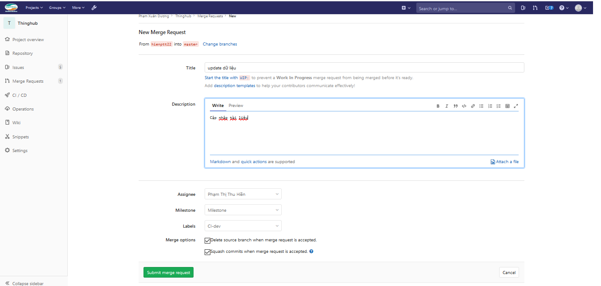

# Sử dụng GitLab

- [Sử dụng GitLab](#s%E1%BB%AD-d%E1%BB%A5ng-gitlab)
  - [GitLab - sử dụng và các lưu ý](#gitlab---s%E1%BB%AD-d%E1%BB%A5ng-v%C3%A0-c%C3%A1c-l%C6%B0u-%C3%BD)
    - [Các lưu ý trên giao diện GitLab](#c%C3%A1c-l%C6%B0u-%C3%BD-tr%C3%AAn-giao-di%E1%BB%87n-gitlab)
    - [Khái niệm, tính năng chính nên quan tâm trong GitLab](#kh%C3%A1i-ni%E1%BB%87m-t%C3%ADnh-n%C4%83ng-ch%C3%ADnh-n%C3%AAn-quan-t%C3%A2m-trong-gitlab)
      - [Branch](#branch)
      - [Merge Request](#merge-request)
      - [Tag và Release](#tag-v%C3%A0-release)
      - [Issue list và các thao tác liên quan](#issue-list-v%C3%A0-c%C3%A1c-thao-t%C3%A1c-li%C3%AAn-quan)

Sử dụng GitLab để lưu trữ mã nguồn của dự án, việc này sẽ giúp cho các động tác
liên quan đến CI/CD sau này trở nên dễ dàng tích hợp hơn.

## GitLab - các lưu ý

### Các lưu ý trên giao diện GitLab

Một số điểm chính cần lưu ý khi sử dụng GitLab trên nền web:

- Project
- Repository: Compare, Graph
- Issues: List, Board, Labels, Milestones
- Merge request
  - Merge request là gì
  - Tạo merge request như thế nào
  - Các thao tác có thể làm với Merge request
  - Comment/Discussion
- Wiki
- Time tracking
- Due date
- Assignee
- Project settings
- Profile settings
- Comment & Discussion

### Khái niệm, tính năng chính nên quan tâm trong GitLab

#### Branch

Nhánh trong GitLab (và Git nói chung) là một khái niệm quan trọng trong môi
trường phát triển phần mềm với sự tham gia của nhiều devs.

Tại màn hình hiển thị chính của một repository, để xem các nhánh hiện có,
ta chọn `Repository` --> `Branches`. Giao diện sẽ như dưới.

Danh sách các nhánh hiện có.

#### Merge Request

Với hệ thống thinghub, nhánh chính hiện tại là `master` (mặc định của git), mặc định, các
developer sẽ không có quyền và không được khuyến nghị code trực tiếp trên nhánh
`master` này mà nên tuân theo quy trình có sử dụng Merge Request (đối với
GitLab).

Để tạo Merge Request, có thể tham khảo luồng dưới đây (hoặc xem docs
chính thức của Gitlab [tại đây](http://10.60.156.11/help/user/project/repository/web_editor.md#tips))

_Lưu ý_: Trên giao diện GitLab có rất nhiều cách để tạo và thao tác,
tuy nhiên, ở đây chỉ giới thiệu cách "chính quy".

Bước 1: Bấm tạo mới Merge Request

Bước 2: Chọn nhánh code muốn merge và nhánh đích (thường là master)

Tại đây, Source Branch có thể là bất kỳ nhánh nào mà đang phát triển,
Target Branch thường sẽ là `master` hoặc là một nhánh dùng để release (sẽ nói
trong phần CI/CD và release)

Bước 3: Nhập các nội dung liên quan đến Merge Request

- Nhập tiêu đề cho Merge Request này, có thể thêm tiền tố `WIP:`
  như `WIP: Cập nhật tài liệu` (WIP = Work In Progress) để chỉ
  định rằng phần công việc này đang làm, chưa cần người vào review vội.
- Nhập nội dung chi tiết của Merge Request, kiểu như nhánh này làm gì,
  có những tính năng gì, fix bug gì, lưu ý gì, ...
- Assignee là người sẽ review code có trong Merge Request này.
- Ngoài ra, còn có thể chọn Milestone (như nhiệm vụ tháng),
  hay Labels (thường để đánh nhãn là fix bug hay phát triển tính năng mới)
- Tùy chọn `Remove source branch when merge request is accepted.` nên được chọn
  để giúp GitLab tự xóa nhánh sau khi đã merge thành công, cái này giúp đỡ rác
  cho hệ thống, đỡ mất công quản lý
- Tùy chọn `Squash commits when merge request is accepted.` sẽ gom nhiều commit
  có mặt trong Merge Request thành 1 commit, phần này sẽ làm cho history trở
  nên rất gọn gàng sạch sẽ và dễ theo dõi, tránh những commit nhỏ lẻ trông khá
  rác

Sau khi đã tạo Merge Request, có code thêm gì thì chỉ việc push vào
nhánh mà làm việc, các commit sẽ được hiển thị ở trên Merge Request cho
quan sát và người khác review.

#### Tag và Release

Tags trong GitLab là các nhãn (sure, và khác với label), mỗi nhãn được gắn với
1 commit nhất định trong hệ thống. Tag thường được dùng để đánh dấu vị trí của
một phiên bản phần mềm trong hệ thống.

Trong Thinghub, tag được dùng để đánh dấu phiên bản release, mỗi khi tạo tag mới,
code sẽ được tự động build và đẩy lên môi trường production sử dụng phiên bản
tương ứng với tag đó.

Ví dụ: Dùng tag để đánh dấu là vị trí commit nào đó ứng với phiên bản `v1.2`

#### Issue list và các thao tác liên quan

Quản lý danh mục các issue, có thể sử dụng issue để lưu trữ các bug,
các trao đổi công việc.

Board được sử dụng như bảng Kanban trong Agile

Milestone được dùng để đặt mục tiêu trong tuần/tháng/quý này sẽ cần phải làm
những issue nào.

