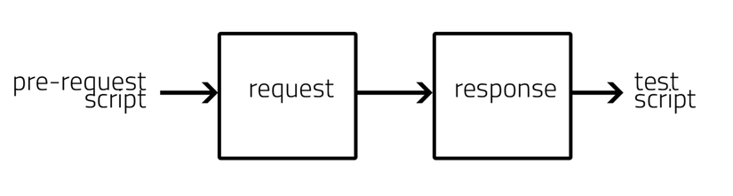
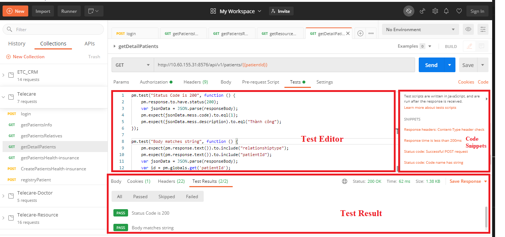
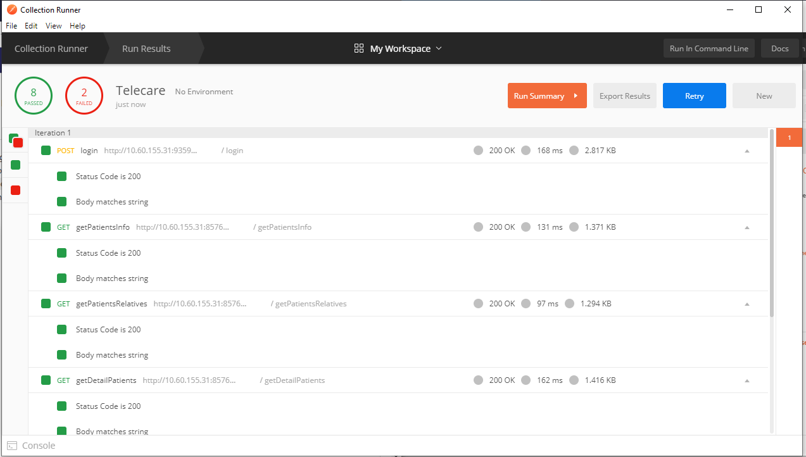
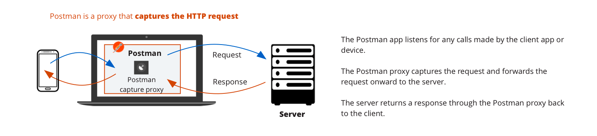
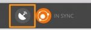
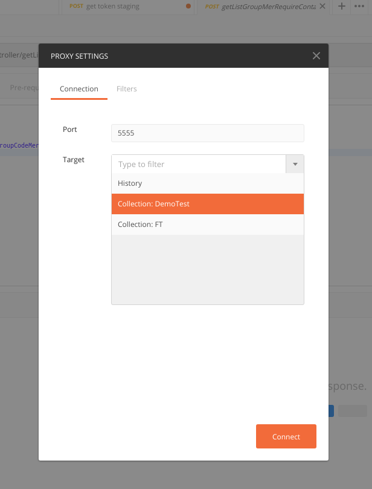
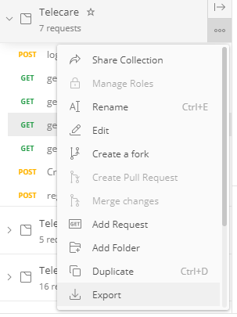
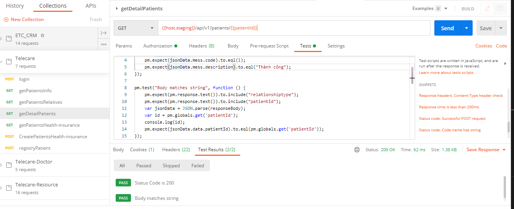
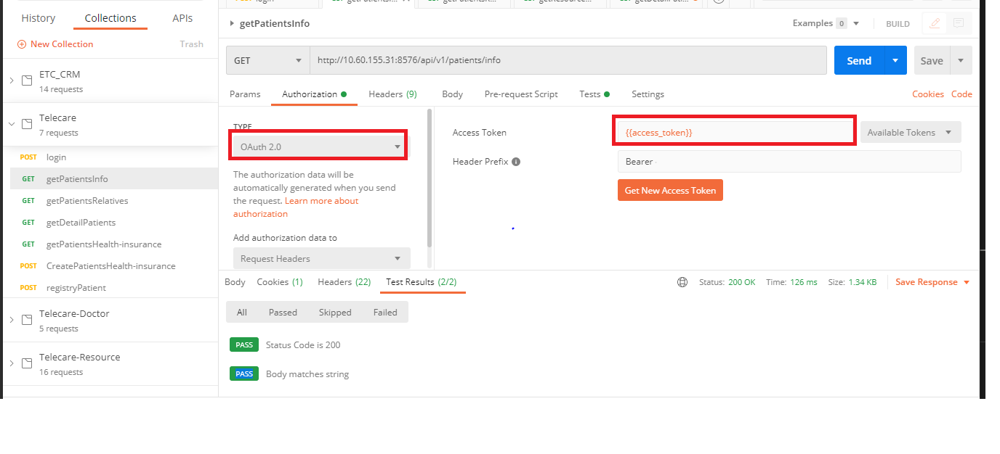

# Functional Testing với Postman

- [Functional Testing với Postman](#functional-testing-v%E1%BB%9Bi-postman)
  - [Postman là gì](#postman-l%C3%A0-g%C3%AC)
  - [Testing trong Postman](#testing-trong-postman)
  - [Kiểm thử tự động](#ki%E1%BB%83m-th%E1%BB%AD-t%E1%BB%B1-%C4%91%E1%BB%99ng)
    - [Xây dựng các test case](#x%C3%A2y-d%E1%BB%B1ng-c%C3%A1c-test-case)
      - [Cài đặt proxy trong Postman](#c%C3%A0i-%C4%91%E1%BA%B7t-proxy-trong-postman)
      - [Cấu hình proxy trong thiết bị Client](#c%E1%BA%A5u-h%C3%ACnh-proxy-trong-thi%E1%BA%BFt-b%E1%BB%8B-client)
      - [Viết test script cho các HTTP Request captured được](#vi%E1%BA%BFt-test-script-cho-c%C3%A1c-http-request-captured-%C4%91%C6%B0%E1%BB%A3c)
    - [Tích hợp các test case vào kiểm thử tự động](#t%C3%ADch-h%E1%BB%A3p-c%C3%A1c-test-case-v%C3%A0o-ki%E1%BB%83m-th%E1%BB%AD-t%E1%BB%B1-%C4%91%E1%BB%99ng)
    - [Một số lưu ý dành riêng cho dự án Vsmart](#m%E1%BB%99t-s%E1%BB%91-l%C6%B0u-%C3%BD-d%C3%A0nh-ri%C3%AAng-cho-d%E1%BB%B1-%C3%A1n-vsmart)
  - [Tài liệu tham khảo](#t%C3%A0i-li%E1%BB%87u-tham-kh%E1%BA%A3o)

## Postman là gì

`Postman` là công cụ giúp chúng ta làm việc với API, nhất là REST, giúp ích
rất nhiều cho việc testing. `Postman` cho phép thực hiện các HTTP Request
riêng rẽ hoặc một collection bao gồm list các HTTP Request sử dụng
`Postman Collection Runner`. Ngoài ra `Postman` cho phép người dùng định
nghĩa các Test Case viết bằng Javascript để verify các response trả về từ
http request hay collections. Ví dụ như Response Code là 200, Response Body
chứa 1 string nào đó hay không ...

`Newman` là công cụ giúp chạy `Collection` của `Postman` bằng cách export
`Collection` trong Postman ra file có dạng `.json` và chạy nó trong giao diện
dòng lệnh thay vì sử dụng `Postman Collection Runner`

## Testing trong Postman



Với mỗi 1 request trong Postman chúng ta có thể viết script cho 2 phase:

- Trước khi thực hiện request (được định nghĩa trong `pre-request script`)
  thường dùng để thiết lập các biến môi trường, request data..
- Sau khi response được trả về (được định nghĩa `test script`) thường dùng để
  verify response, thiết lập biến môi trường cho request sau trong 1 collection
  Trong ứng dụng Postman, request builder ở trên cùng chứa tab Test nơi bạn viết
  tests của mình. Response viewer ở cuối có chứa một tab Test Result tương ứng,
  nơi bạn có thể xem kết quả của các tests của mình.

Để bắt đầu xây dựng các test cases một cách nhanh chóng, các snippets được sử
dụng phổ biến được liệt kê bên cạnh trình soạn thảo tests. Chọn một snippet để
nối code vào trình soạn thảo test.



Ví dụ về một Test Script:

```javascript
// Status Code trả về là 200 hay không
pm.test("Status Code is 200", function () {
  pm.response.to.have.status(200);
});

// Biến môi trường được sử dụng là có là môi trường production hay không
pm.test("environment to be production", function () {
  pm.expect(pm.environment.get("env")).to.equal("production");
});

// Response Body chứa String "relationshiptype" hay không
pm.test("Body matches string", function () {
  pm.expect(pm.response.text()).to.include("relationshiptype");
});
```

Người dùng có thể chạy test bằng cách chạy HTTP request một cách riêng rẽ hoặc
chạy 1 collection chứa list các HTTP request chứa nhiều testscript. Khi chạy
một collection sử dụng `Postman Collection Runner` trong ứng dụng Postman, bạn
có thể xem tests của bạn đang chạy và kết quả theo thời gian thực.



Hoặc người dùng cũng có thể chạy collection bằng công cụ CLI Postman Newman để
có thể xem kết quả trên giao diện dòng lệnh.

## Kiểm thử tự động

Chúng ta đã có khái niệm cơ bản trong Postman, đó là HTTP Request, Collection
chứa nhiều HTTP Request, hay cách viết test script và cách chạy những test
script đó, biết cách chạy nhiều HTTP Request có chứa các test case cùng 1 lúc
bằng cách sử dụng `Postman Collection Runner` hoặc bằng giao diện dòng lệnh
`Newman`. Trong phần này, mình sẽ nói tới các bước cần thực hiện để có thể tích
hợp kiểm thử tự động Functional Testing trong dự án.

### Xây dựng các test case

Trong quá trình phát triển, định nghĩa API thì Developer hay Tester cần xây
dựng một bộ HTTP requests và viết test script tương ứng cho từng HTTP request
để kiểm thử API xem có thỏa mãn các điều kiện định nghĩa trước đó của API hay
không. Công việc này được hỗ trợ rất tốt bởi `Postman GUI` giúp loại bỏ hầu hết
các thao tác thủ công mà có thể dẫn tới sai sót từ việc build HTTP request tới
viết các test script

Trong Postman có chứa 1 built-in proxy lắng nghe các request được gửi từ các
thiết bị client gửi tới server giúp bắt được các HTTP request, và lưu nó vào
Collection mà chúng ta muốn. Sau đó chúng ta có thể vào từng test-script editor
của từng HTTP request viết các test script bằng sự hỗ trợ của các snippet (các
đoạn mã Javascript thường dùng) có sẵn mà Postman cung cấp cho người dùng.



#### Cài đặt proxy trong Postman

Mở `PROXY SETTINGS` trong ứng dụng Postman bằng cách click vào nút trong
header toolbar



Cài đặt thông số của proxy: Port, target collection. Ngoài ra chúng ta còn có
thể chuyển qua tab filter để cấu hình lọc đúng những HTTP Request chúng ta cần
lấy.



#### Cấu hình proxy trong thiết bị Client

Cấu hình proxy sử dụng proxy chúng ta cài đặt ở bước 1

#### Viết test script cho các HTTP Request captured được

Sử dụng test script editor và snippet được giới thiệu ở trên

### Tích hợp các test case vào kiểm thử tự động

Để tích hợp các các test case đã xây dựng vào luồng CI phục vụ cho việc kiểm
thử tự động, chúng ta cần xuất Collection chứa các HTTP Request và test case
ra file dạng `.json` và đưa nó vào thư mục phù hợp trong source code chính của
dự án (Với mỗi dự án, tùy vào ngôn ngữ phát triển, thói quen của team dự án,
sẽ có những vị trí thư mục phù hợp khác nhau). Sau đó chúng ta thực hiện push
những thay đổi trên lên Git Repository, luồng CI/CD sẽ làm những công việc còn
lại, bao gồm việc kiểm thử tự động.

Để export Postman Collection ra file có định dạng `.json`, chúng ta click vào
Export trong menu.



### Một số lưu ý dành riêng cho dự án tích hợp CI/CD

- Trong từng HTTP request cần sửa host server thành `{{host.staging}}` để có thể
  tích hợp được với luồng CI



- Đối với mọi Collection, request đầu tiên phải là request gọi tới route link login
  Ví dụ: `auth/realms/test/protocol/openid-connect/token` để lấy được `access_token`. Trong test script của
  request này phải thực hiện thiết lập biến global `access_token` mà các request
  sau đó sẽ sử dụng trong header

```groovy

pm.test("Status Code is 200", function () {
    pm.response.to.have.status(200);
});
pm.test("Body matches string", function () {
    pm.expect(pm.response.text()).to.include("access_token");
});
var jsonData = JSON.parse(responseBody);
pm.globals.set("access_token", jsonData.access_token);

```

Sử dụng biến `access_token` trong header của các request



### Tích hợp chạy auto test api với jenkinsfile

thêm code tới file:
```groovy
@NonCPS
def getFunctionalTestStatus(unitTestResult) {
    def functionalTestResult = [:]
    def testResult = getTestResultFromJenkins()
    if (testResult != null && unitTestResult != null) {
        functionalTestResult["total"] = testResult["total"] - unitTestResult["total"].toInteger()
        functionalTestResult["failed"] = testResult["failed"] - unitTestResult["failed"].toInteger()
        functionalTestResult["skipped"] = testResult["skipped"] - unitTestResult["skipped"].toInteger()
        functionalTestResult["passed"] = testResult["passed"] - unitTestResult["passed"].toInteger()
    }
    return functionalTestResult
}
@NonCPS
def getTestResultFromJenkins() {
    def testResult = [:]
    AbstractTestResultAction testResultAction = currentBuild.rawBuild.getAction(AbstractTestResultAction.class)
    testResult["total"] = testResultAction.totalCount
    echo "total : $testResultAction.totalCount"
    testResult["failed"] = testResultAction.failCount
    testResult["skipped"] = testResultAction.skipCount
    testResult["passed"] = testResultAction.totalCount - testResultAction.failCount - testResultAction.skipCount
    return testResult
}
@NonCPS
def getFunctionalTestStatus(unitTestResult) {
    def functionalTestResult = [:]
    def testResult = getTestResultFromJenkins()
    if (testResult != null && unitTestResult != null) {
        functionalTestResult["total"] = testResult["total"] - unitTestResult["total"].toInteger()
        functionalTestResult["failed"] = testResult["failed"] - unitTestResult["failed"].toInteger()
        functionalTestResult["skipped"] = testResult["skipped"] - unitTestResult["skipped"].toInteger()
        functionalTestResult["passed"] = testResult["passed"] - unitTestResult["passed"].toInteger()
    }
    return functionalTestResult
}
def autoTest(){
    dir("autoTest"){
        try {
            sh """
                pwd
                ls -la
                npm i newman
                npm i yargs
                npm install newman-reporter-html
                ls -la
                node run-collections-in-directory.js --folder=./autotest_api/ --host=http://10.60.155.31:8576
            """
        } catch (err) {
            echo "${err}"
        } finally {
            def exists = fileExists 'newman'
            if (exists) {
                junit 'newman/newman-run-report-*.xml'
                sh 'pwd'
                publishHTML([
                    allowMissing         : false,
                    alwaysLinkToLastBuild: false,
                    keepAll              : true,
                    reportDir            : 'newman/',
                    reportFiles          : 'index.html',
                    reportName           : 'API-Patient-report',
                    reportTitles         : 'API-Patient-report'])
            }
            def unitTestResult=[]
            if(env.UNIT_TEST_TOTAL == null){
                unitTestResult = [
                    "passed" : 0,
                    "failed" : 0,
                    "skipped": 0,
                    "total"  : 0
                ]
            } else {
                unitTestResult = [
                    "passed" : env.UNIT_TEST_PASSED,
                    "failed" : env.UNIT_TEST_FAILED,
                    "skipped": env.UNIT_TEST_SKIPPED,
                    "total"  : env.UNIT_TEST_TOTAL
                ]
            }

            def functionalTestResult = getFunctionalTestStatus(unitTestResult)
            echo "pass : ${functionalTestResult['passed']}"
            def functionalTestResultString = "- Passed: <b>${functionalTestResult['passed']}</b> <br/>" +
                "- Failed: <b>${functionalTestResult['failed']}</b> <br/>" +
                "- Skipped: <b>${functionalTestResult['skipped']}</b> <br/>"
            def testResultComment = "<b>Functional Test Result:</b> <br/><br/>" +
                "${functionalTestResultString}" +
                "<i><a href='${env.BUILD_URL}testReport/'>Details Funcational Test Report...</a></i><br/><br/>"
            env.FUNCTIONAL_TEST_RESULT_STR = testResultComment
            echo "env.FUNCTIONAL_TEST_RESULT_STR: $env.FUNCTIONAL_TEST_RESULT_STR"
            if (functionalTestResult.failed > 0) {
                error "Failed ${functionalTestResult.failed} functional tests"
            }
        }
    }

}

```

## Tài liệu tham khảo

- <https://learning.getpostman.com/docs/postman/sending_api_requests/capturing_http_requests/>
- <https://learning.getpostman.com/docs/postman/scripts/test_scripts/>
