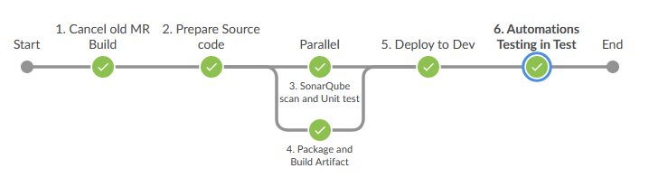
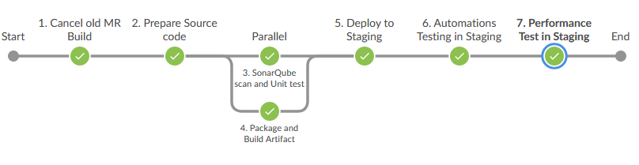
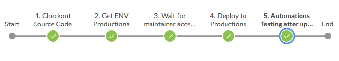

# Giới thiệu về tích hợp liên tục và triển khai liên tục - CI/CD

Tài liệu này bao gồm các nội dung sau:

- Giới thiệu chung về mô hình phát triển phần mềm tích hợp liên tục/triển khai liên
  tục - CI/CD.
- Mô tả nền tảng phát triển sử dụng cho mô hình CI/CD hiện tại đang được
  sử dụng ở một dự án cụ thể - dự án Thinghub, và cách thức nhóm phát triển
  thực hiện mô hình CI/CD trong quá trình phát triển dự án thinghub trên thực tế.

## Mục lục

- [Hướng dẫn cấu hình triển khai CI/CD pipeline](#giới-thiệu-về-tích-hợp-liên-tục-và-triển-khai-liên-tục-cicd)
  - [Mục lục](#mục-lục)
  - [Giới thiệu chung](#giới-thiệu-chung)
    - [Tích hợp liên tục - CI](#tích-hợp-liên-tục-ci)
    - [Các thay đổi mà CI đem tới cho quá trình phát triển phần mềm](#các-thay-đổi-mà-ci-đem-tới-cho-quá-trình-phát-triển-phần-mềm)
    - [Các điều kiện cần thiết để triển khai CI/CD](#các-điều-kiện-cần-thiết-để-có-thể-thực-hành-tích-hợp-liên-tục)
  - [Luồng CI/CD tiêu chuẩn](#luồng-cicd-tiêu-chuẩn)
  - [Các thành phần của hệ thống CI/CD cho dự án Thinghub](#các-thành-phần-của-hệ-thống-cicd-cho-dự-án-thinghub)
  - [Luồng CI của hệ thống thinghub](#luồng-ci-của-hệ-thống-thinghub)
  - [Các luồng xử lý phục vụ cho quá trình tích hợp liên tục - CI](#các-luồng-xử-lý-phục-vụ-cho-quá-trình-tích-hợp-liên-tục-ci)
    - [Luồng merge Request Build - CI-dev](#luồng-merge-request-build-ci-dev)
    - [Luồng merge Request Build - CI-staging](#luồng-merge-request-build-ci-staging)
  - [Kịch bản nhà phát triển thực hiện phát triển phần mềm theo mô hình CI](#kịch-bản-nhà-phát-triển-thực-hiện-phát-triển-phần-mềm-theo-mô-hình-ci)
    - [Quá trình phát triển tính năng trên nhánh phát triển](#quá-trình-phát-triển-tính-năng-trên-nhánh-phát-triển)
    - [Quá trình tích hợp tính năng vào nhánh chính của mã nguồn](#quá-trình-tích-hợp-tính-năng-vào-nhánh-chính-của-mã-nguồn)
  - [Luồng CD của hệ thống thinghub](#luồng-cd-của-hệ-thống-thinghub)
  - [Các bước tiến hành release](#các-bước-tiến-hành-release)

## Giới thiệu chung

### Tích hợp liên tục - CI

Continous Integrations (CI) - Tích hợp liên tục, là một phương pháp phát triển
phần mềm mà những người phát triển trong dự án phần mềm sẽ tích hợp sự thay đổi
lên nhánh chính (trong git là `master`) trên kho mã nguồn của dự án một cách
liên tục và thường xuyên, với tần suất được khuyến nghị là ít nhất 1 lần/ngày.
Trong môi trường sử dụng Git làm repository, nhà phát triển thực hiện tích hợp
bằng cách tạo ra các commit, và merge request để tích hợp sự thay đổi vào
nhánh chính.

Mỗi sự tích hợp do những người phát triển tạo ra đều được kiểm thử và xác nhận
tự động bởi một hệ thống CI/CD. Hệ thống CI/CD sẽ tự động phát hiện sự thay đổi
về mã nguồn khi nhà phát triển đẩy các commit lên các nhánh của repository,
sau đó tùy thuộc vào sự thay đổi mà người phát triển tạo ra liên quan đến việc
tích hợp vào nhánh phát triển (push commit) hay tích hợp vào nhánh chính
(merge request) mà hệ thống CI/CD sẽ lựa chọn hình thức kiểm thử tích hợp
phù hợp. Nếu hệ thống CI/CD phát hiện lỗi xảy ra với mã nguồn trong quá trình
kiểm thử tự động, hệ thống sẽ gửi thông báo tới người phát triển.

### Các thay đổi mà CI đem tới cho quá trình phát triển phần mềm

Áp dụng phương thức phát triển tích hợp liên tục, nhóm phát triển chia quá
trình phát triển tính năng/fix bug/hotfix thành các giai đoạn nhỏ, mỗi một
giai đoạn nhỏ bao gồm việc phát triển một phần của tính năng rồi tích hợp vào
repository, thay vì việc phát triển toàn bộ tính năng trong 1 thời gian dài,
sau đó tích hợp một khối lượng lớn mã nguồn đã phát triển vào repository.

Việc mỗi chu kỳ phát triển - tích hợp có thời gian ngắn đồng nghĩa với việc
khối lượng mã nguồn hệ thống đã thay đổi có kích thước nhỏ, khối lượng mã nguồn
thay đổi trong 1 lần tích hợp nhỏ cho phép các nhà phát triển dễ dàng kiểm soát
những thay đổi gì đã được thực hiện lên mã nguồn, dễ dàng viết các bài test
tự động cho các thay đổi mã nguồn nhỏ, dễ dàng phát hiện các lỗi của mã nguồn.
Lý do, đó là việc quản lý, kiểm soát và viết mã test tự động cho một khối lượng
mã nguồn thay đổi nhỏ với kích thước khoảng vài trăm dòng luôn dễ dàng hơn
rất nhiều so với việc phải rà soát và kiểm tra một khối mã nguồn đã bị thay
đổi vài nghìn dòng.

Việc thường xuyên tích hợp cho phép mã nguồn được thường xuyên kiểm thử tự động
khi xảy ra các thay đổi. Kiểm thử tự động cho phép phát hiện các lỗi xảy ra khi
mã nguồn bị thay đổi thông qua việc thực hiện các bài test, từ đó hệ thống này
sẽ thông báo cho nhà phát triển về các lỗi đã xuất hiện. Và với kích thước
mã nguồn bị thay đổi là nhỏ, nhà phát triển có thể dễ dàng xử lý các lỗi đó.

Mã nguồn được tích hợp liên tục mỗi ngày cũng cho phép các nhà phát triển
trong nhóm liên tục thấy được các thay đổi mà các người phát triển khác
trong nhóm đã tạo ra trên mã nguồn chung, từ đó có thể phát hiện các thay đổi,
xung đột giữa mã nguồn của người ấy với các người khác trên hệ thống. Do các
thay đổi là nhỏ, do vậy việc xử lý xung đột sẽ đơn giản, dễ dàng và nhanh chóng
hơn rất nhiều so với việc 2 lập trình viên ngồi phát triển hai khối mã nguồn
hàng nghìn dòng trên hai nhánh độc lập, sau đó tích hợp vào nhánh chính ở
những ngày cuối của milestone và tìm cách xử lý hàng loạt các xung đột xảy ra
khi tích hợp hai khối code khổng lồ với nhau vào nhánh chính.

Để các nhà phát triển có thể tích hợp các thay đổi lên nhánh mã nguồn chính
liên tục với chu kỳ ngắn, đòi hỏi việc phân tích yêu cầu và chức năng phải
phân chia công việc trong quá trình phát triển thành các phần đủ nhỏ,
để cho phép những người phát triển có thể hoàn thành phần công việc được giao
trong một khoảng thời gian ngắn, tối đa là từ 1 đến hai ngày, sau đó tích hợp
ngay phần công việc đã hoàn thành lên nhánh mã nguồn chính thông qua các
công cụ như pull request và merge request.

### Các điều kiện cần thiết để có thể thực hành tích hợp liên tục

- **Duy trì một nhánh chính (master) và một nhánh phát triển (dev)** trên
  repository. Các thành viên nên thực hiện việc tích hợp kết quả công việc
  từ nhánh phát triển tính năng (feature) vào nhánh dev (merge nhánh
  tính năng vào nhánh phát triển) **ít nhất 1 lần 1 ngày**.

- **Các nhà phát triển cần tích hợp code vào mã nguồn thường xuyên
  và liên tục với kích thước vừa phải:** Mã nguồn có kích thước vừa phải sẽ
  giúp cho tất cả mọi người có thể thường xuyên
  theo dõi và kiểm soát được tất cả các thay đổi đã xảy ra trên mã nguồn.
- **Phát triển mã ngưồn và mã kiểm thử của mã nguồn vừa viết trong một chu kỳ
  tích hợp:** Khi áp dụng tích hợp liên tục, việc kiểm thử đơn thuần bằng con
  người là không còn phù hợp, do số lượng tích hợp xảy ra trong một ngày là rất
  lớn, vượt quá khả năng xử lý của con người. Vì vậy ở quá trình tích hợp phải
  áp dụng kiểm thử tự động thay cho kiểm thử bằng con người, điều này
  đồng nghĩa với việc nhà phát triển sẽ thực hiện đồng thời việc phát triển
  mã ngưồn với việc viết mã kiểm thử cho mã nguồn ấy trong một chu kỳ
  tích hợp, sao cho mã kiểm thử có thể xác nhận chất lượng của mã nguồn đã
  phát triển đáp ứng các yêu cầu đặt ra.
- **Đảm bảo quá trình kiểm thử diễn ra nhanh, trả về kết quả
  kiểm thử trong thời gian ngắn**, để nhà phát triển có thể phát hiện ra các
  vấn đề xảy ra một cách sớm nhất có thể. Để tối ưu hóa quá trình kiểm thử,
  các bài kiểm thử nhanh, tốn ít thời gian (unit test) sẽ được thực hiện trước,
  các bài kiểm thử phức tạp, tốn nhiều thời gian (integration test,
  end to end test) sẽ được thực hiện sau.
- **Kiểm soát và xử lý các lỗi xảy ra trên mã nguồn ngay khi nhận được thông báo
  phát hiện ra lỗi từ quá trình kiểm thử tự động.** Kiểm thử trước khi tích hợp
  thay đổi từ phát triển tính năng (feature) vào nhánh phát triển (dev), sao cho
  hạn chế tối đa việc xảy ra các lỗi trên mã nguồn nhánh chính khi kiểm thử.
  Việc xảy ra lỗi trên mã nguồn nhánh chính đồng nghĩa với việc tất cả mọi người
  trong nhóm phát triển phải dừng việc tích hợp lại và chờ đợi mã nguồn nhánh chính
  được fix hết lỗi, sau đó mới có thể tiếp tục quá trình tích hợp. Để làm được
  điều này, nhà phát triển cần đặt ưu tiên cho việc fix các lỗi xảy ra hơn
  tất cả các việc khác.

## Luồng CI/CD tiêu chuẩn

Dưới đây là luồng CI/CD tiêu chuẩn được vẽ bởi @truongdx8. Dự án Thinghub follow
theo luồng này và có chỉnh sửa cho phù hợp.

## Các thành phần của hệ thống CI/CD cho dự án thinghub:

Để áp dụng mô hình phát triển phần mềm CI/CD cho dự án thinghub, P.CNSX đã xây dựng một nền tảng phát triển bao gồm các thành phần sau:
Để áp dụng mô hình phát triển phần mềm CI/CD cho dự án thinghub, P.CNSX
đã xây dựng một nền tảng phát triển bao gồm các thành phần sau:

- Hệ thống quản lý dự án, lưu trữ mã nguồn và cấu hình hệ thống: **Gitlab.**
- Hệ thống CI/CD thực hiện việc build/test tự động và triển khai mã nguồn
  lên môi trường dev, staging và môi trường production: **Jenkins**
- Hệ thống lưu trữ các sản phẩm phần mềm (artifact) và các thư viện được
  sử dụng trong hệ thống Tiêm chủng và các dự án khác (chưa viết CI/CD pipeline): **Nexus Repository**
- Hệ thống thông báo kết quả build: **Mail Viettel.**

## Luồng CI của hệ thống thinghub

## Các luồng xử lý phục vụ cho quá trình tích hợp liên tục - CI

Với dự án Thinghub, để thực hiện công việc tích hợp liên tục, hiện tại hệ thống
CI/CD có hai luồng xử lý chính tương ứng với hai loại sự kiện sau:

- Sự kiện mã nguồn trong **nhánh phát triển tính năng (feature branch)**
  thay đổi khi nhà phát triển đã bắt đầu quá trình tích hợp mã nguồn -
  nhà phát triển đã tạo merge request từ **nhánh phát triển tính năng (feature branch)**
  tới **nhánh phát triển chung (develop branch)**. Lúc này luồng xử lý
  _merge request build_ được sử dụng. Trong trường hợp nhánh đích của
  merge request thay đổỉ, luồng xử lý merge request build cũng được kích hoạt,
  yêu cầu cần kiểm tra lại kết quả sau tích hợp giữa nhánh phát triển
  tính năng và nhánh phát triển chung có vấn đề gì không. ==> \*\*khi
  có sự kiện merge request build từ nhánh phát triển tính năng
  (feature branch) tới nhánh phát triển chung (develop branch)
  luồng `CI dev` sẽ được thực hiện.
- Sự kiện mã nguồn trong nhánh phát triển chung (develop branch)
  thay đổi khi sự kiện merge request build của `CI dev` được accept.
  Nhà phát triển bắt đầu quá trình tích hợp mã nguồn tức là đã tạo
  merge request từ **nhánh phát triển chung (develop branch)**
  tới **nhánh chính (master branch)**. Lúc này luồng xử lý merge
  request build được sử dụng. Trong trường hợp nhánh đích của merge
  request thay đổỉ, luồng xử lý merge request build cũng được kích hoạt,
  yêu cầu cần kiểm tra lại kết quả sau tích hợp giữa nhánh phát triển chung
  và nhánh phát triển chính có vấn đề gì không. ==> khi có sự kiện merge request
  build từ nhánh phát triển chung (develop branch) tới nhánh chính (master branch)
  luồng `CI staging` sẽ được thực hiện.

### Luồng merge request build - CI-dev

Luồng xử lý merge request build diễn ra các hoạt động sau:

1. Sự kiện kích hoạt luồng: `Nhà phát triển` có thể kích hoạt luồng merge
   request build bằng một trong cách cách sau:

   - Nhà phát triển tạo một merge request mới.
   - Mã nguồn của nhánh nguồn hoặc nhánh đích của một quá trình tích hợp -
     merge request bị thay đổi.
   - Người dùng sử dụng chuỗi ký tự đặc biệt (hiện tại là `recheck`) comment
     vào Merge Request để yêu cầu build lại Merge Request.

2. Hệ thống quản lý mã nguồn
   Gitlab gửi thông điệp trigger hệ thống CI/CD, với tham số đầu vào là tên
   nhánh đích, tên nhánh nguồn của merge request và các HEAD commitID trên
   các nhánh này tại thời điểm kích hoạt trigger.
3. Dựa vào các tham số đầu vào được `Gitlab` gửi qua webhook và thông tin cấu
   hình trên các job ở Jenkins, `Jenkins Master` lựa chọn ra job, node phù hợp.
4. `Jenkins Master` chuyển tiếp build tới `Build Machine Jenkins Slaves` để
   tiến hành các bước kiểm thử.
5. Hệ thống CI/CD ngừng tất cả các merge request build đang build cho merge
   request này, sau đó thực hiện lấy mã nguồn của nhánh nguồn và mã nguồn
   nhánh đích từ `Gitlab` rồi tích hợp chúng lại với nhau để
   tạo ra mã nguồn sau tích hợp.
6. Tại Build Machine Jenkins Slaves, hệ thống CI/CD tiến hành thực hiện các
   bước để kiểm thử mã nguồn, bao gồm: biên dịch mã nguồn, test đơn vị
   (unit test), test độ bao phủ kiểm thử (code coverage test), test an
   toàn thông tin cho mã nguồn (sonarqube scan).
7. Nếu pass qua các bài test kiểm thử trên, hệ thống CI/CD thực hiện việc
   deploy tới `môi trường test` và thực hiện `test tự động` tính năng
   (Automations Testing) trên môi trường `test`.
8. Hệ thống CI/CD chuyển kết quả merge request commit build từ
   `Build MachinE Jenkins Slaves` về cho `Jenkins Master`
9. Hệ thống CI/CD trả kết quả merge request commit build về cho hệ thống quản
   lý dự án `Gitlab`, thông báo kết quả build merge request,
   bao gồm các nội dung sau:

   - Kết quả kiểm thử cho mã nguồn trên nhánh phát triển ở đúng commitID
     đã được truyền lên. Kết quả kiểm thử bao gồm các thông tin chi tiết về
     kết quả các bài test, và kết quả tổng thể của push commit Build, bao gồm:
   - Số lượng unit test thành công/thất bại
   - Độ bao phủ kiểm thử của mã nguồn trên nhánh phát triển (code coverage)
     theo tỉ lệ %
   - Số lượng các lỗi an toàn thông tin.
   - Địa chỉ của môi trường `test`.
   - Kết quả tổng thể của Merge request build: Nếu tất cả các bước 2,3,4,5,6
     đều không có vấn đề, merge request build có kết quả là thành
     công- success. Nếu không, merge request build có kết quả là thất bại.

10. Hệ thống `Gitlab` gửi thông báo về kết quả merge request build tới `Viettel Mail Sever`.
11. `Nhà phát triển` check mail để nhận thông báo kết quả.

### Luồng merge request build - CI-staging

Luồng xử lý merge request build diễn ra các hoạt động sau:

1. Sự kiện kích hoạt luồng: `Nhà phát triển` có thể kích hoạt luồng merge
   request build bằng một trong cách cách sau:

   - Nhà phát triển tạo một merge request mới.
   - Mã nguồn của nhánh nguồn hoặc nhánh đích của một quá trình tích hợp -
     merge request bị thay đổi.
   - Người dùng sử dụng chuỗi ký tự đặc biệt (hiện tại là `recheck`) comment
     vào Merge Request để yêu cầu build lại Merge Request.

2. Hệ thống quản lý mã nguồn
   Gitlab gửi thông điệp trigger hệ thống CI/CD, với tham số đầu vào là tên
   nhánh đích, tên nhánh nguồn của merge request và các HEAD commitID trên
   các nhánh này tại thời điểm kích hoạt trigger.
3. Dựa vào các tham số đầu vào được `Gitlab` gửi qua webhook và thông tin cấu
   hình trên các job ở Jenkins, `Jenkins Master` lựa chọn ra job, node phù hợp.
4. `Jenkins Master` chuyển tiếp build tới `Build Machine Jenkins Slaves` để
   tiến hành các bước kiểm thử.
5. Hệ thống CI/CD ngừng tất cả các merge request build đang build cho merge
   request này, sau đó thực hiện lấy mã nguồn của nhánh nguồn và mã nguồn
   nhánh đích từ `Gitlab` rồi tích hợp chúng lại với nhau để
   tạo ra mã nguồn sau tích hợp.
6. Tại Build Machine Jenkins Slaves, hệ thống CI/CD tiến hành thực hiện các
   bước để kiểm thử mã nguồn, bao gồm: biên dịch mã nguồn, test đơn vị
   (unit test), test độ bao phủ kiểm thử (code coverage test), test an
   toàn thông tin cho mã nguồn (sonarqube scan).
7. Nếu pass qua các bài test kiểm thử trên, hệ thống CI/CD thực hiện việc
   deploy tới `môi trường test` và thực hiện `test tự động` tính năng
   (Automations Testing) trên môi trường `test`.
8. Hệ thống CI/CD chuyển kết quả merge request commit build từ
   `Build MachinE Jenkins Slaves` về cho `Jenkins Master`
9. Hệ thống CI/CD trả kết quả merge request commit build về cho hệ thống quản
   lý dự án `Gitlab`, thông báo kết quả build merge request,
   bao gồm các nội dung sau:

   - Kết quả kiểm thử cho mã nguồn trên nhánh phát triển ở đúng commitID
     đã được truyền lên. Kết quả kiểm thử bao gồm các thông tin chi tiết về
     kết quả các bài test, và kết quả tổng thể của push commit Build, bao gồm:
   - Số lượng unit test thành công/thất bại
   - Độ bao phủ kiểm thử của mã nguồn trên nhánh phát triển (code coverage)
     theo tỉ lệ %
   - Số lượng các lỗi an toàn thông tin.
   - Kết quả chạy `Automations Test` và `Perfomance Test` trên jenkins.
   - Địa chỉ của môi trường `staging`.
   - Kết quả tổng thể của Merge request build: Nếu tất cả các bước 2,3,4,5,6
     đều không có vấn đề, merge request build có kết quả là thành
     công- success. Nếu không, merge request build có kết quả là thất bại.

10. Hệ thống `Gitlab` gửi thông báo về kết quả merge request build tới `Viettel Mail Sever`.
11. `Nhà phát triển` check mail để nhận thông báo kết quả.

## Kịch bản nhà phát triển thực hiện phát triển phần mềm theo mô hình CI

Sử dụng các luồng xử lý của nền tảng phát triển, nhà phát triển thực hiện phát
triển phần mềm theo phương pháp tích hợp liên tục trong dự án Thinghub
theo kịch bản sau.

### Quá trình phát triển tính năng trên nhánh phát triển

Sau khi tính năng đã được hoàn thiện trên nhánh phát triển tính năng.
Nhà phát triển bắt đầu quá trình tích hợp mã nguồn nhánh phát triển tính năng
vào mã nguồn nhánh phát triển chung để đưa tính năng mới lên server để kiểm thử.
Quá trình tích hợp bắt đầu khi nhà phát triển tạo yêu cầu tích hợp trên Gitlab
bằng cách tạo ra một **Merge Request** từ nhánh phát triển tính năng (feature branch)
tới nhánh phát triển chung (dev branch) . Khi merge request được tạo ra, luồng xử
lý **merge request build** sẽ được thực hiện. Nếu merge request build phát hiện lỗi
xảy ra trong quá trình tích hợp, như:

- Xung đột - conflict giữa mã nguồn nhánh phát triển tính năng và nhánh
  phát triển chung.
- Kết quả kiểm thử thất bại.
  thì nhà phát triển cần xử lý các lỗi này và cập nhật lại mã nguồn nhánh phát
  triển tính năng. Cho đến khi luồng xử lý merge request build thành công trên
  môi trường test. Lúc này người kiểm thử - tester hoặc người phát triển tính
  năng đó sẽ tham gia vào kiểm thử để xác nhận tính năng mới đã đạt các yêu cầu
  đặt ra. Đồng thời, trưởng nhóm phát triển (PM) sẽ tham gia vào review code. Nhà
  phát triển tiếp tục cập nhật mã nguồn nhánh phát triển tính năng, cho đến khi
  người trưởng nhóm và tester đồng ý tính năng mới đã đạt yêu cầu. Lúc này trưởng
  nhóm sẽ thực hiện chấp nhận merge request, mã nguồn nhánh phát triển được tích
  hợp vào nhánh chính và quá trình tích hợp kết thúc.

### Quá trình tích hợp tính năng vào nhánh chính của mã nguồn

Sau khi tính năng đã được hoàn thiện trên nhánh phát triển chung. Nhà phát
triển bắt đầu quá trình tích hợp mã nguồn nhánh phát triển chung vào mã
nguồn nhánh chính để đưa tính năng mới ra phục vụ người dùng. Quá trình
tích hợp bắt đầu khi nhà phát triển tạo yêu cầu tích hợp trên Gitlab bằng
cách tạo ra một **Merge Request** từ nhánh phát triển chung (dev branch)
tới nhánh chính (master branch) . Khi merge request được tạo ra, luồng xử
lý **merge request build** sẽ được thực hiện. Nếu merge request build phát
hiện lỗi xảy ra trong quá trình tích hợp, như:

- Xung đột - conflict giữa mã nguồn nhánh phát triển và nhánh chính.
- Kết quả kiểm thử thất bại.

thì nhà phát triển cần xử lý các lỗi này và cập nhật lại mã nguồn nhánh
phát triển. Cho đến khi luồng xử lý merge request build thành công trên
môi trường staging. Lúc này người kiểm thử - tester sẽ tham gia vào kiểm
thử để xác nhận tính năng mới đã đạt các yêu cầu đặt ra. Đồng thời, trưởng
nhóm phát triển (PM) sẽ tham gia vào review code. Nhà phát triển tiếp tục cập
nhật mã nguồn nhánh phát triển, cho đến khi người trưởng nhóm và tester đồng ý
tính năng mới đã đạt yêu cầu. Lúc này trưởng nhóm sẽ thực hiện chấp nhận
merge request, mã nguồn nhánh phát triển được tích hợp vào nhánh chính và
quá trình tích hợp kết thúc.

## Luồng CD của hệ thống Thinghub

Sau khi nhánh chính mã nguồn của dự án đã được tích hợp thêm các tính năng mới,
tại các thời điểm thích hợp quản lý dự án sẽ thực hiện việc build mã nguồn của
dự án thành chương trình và triển khai ra môi trường production để phục vụ cho
người dùng cuối.

## Các bước tiến hành release

Các bước như dưới đây:

1.  Checkout nhánh mới từ master và đặt tên VD: `v1.0`, hay `v1.1`
2.  Tiến hành tạo `tag` tương ứng với version release
    (VD: tag với tên v1.0) và điền các thông tin liên quan
    đến bản release như message và changelog
3.  Chờ Jenkins tự trigger release
