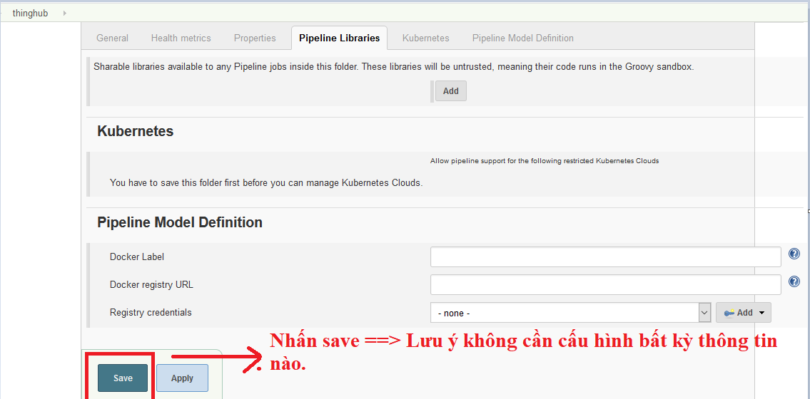

# Tài liệu hướng dẫn thiết lập các luồng xử lý tích hợp liên tục - CI pipelines cho một dự án phần mềm

Đây là một phần trong hướng dẫn thiết lập các luồng
xử lý CI/CD - `CI/CD pipelines` cho một dự án phần mềm. Hướng dẫn hiện tại bao gồm
các phần sau:

- Phần 1: Cách thiết lập các luồng xử lý tích hợp liên tục - `CI pipelines`, cho một
  dự án phần mềm. - **Đây là nội dung hiện tại bạn đang đọc**
- Phần 2: Cách thiết lập các luồng xử lý triển khai liên tục - `CD pipelines`,
  cho một dự án phần mềm.

Xuyên suốt tài liệu hướng dẫn, một dự án Java sử dụng `Maven multi-module` để quản lý -
dự án `Thinghub`, sẽ được sử dụng để làm ví dụ minh họa cho nội dung
hướng dẫn.

Các dự án có ngôn ngữ lập trình khác, có project layout khác với dự án được lấy
ra làm ví dụ vẫn có thể áp dụng các thiết kế và giải pháp CI/CD đã áp dụng cho
hệ thống `Thinghub`, nhưng sẽ cần chỉnh sửa thiết kế bên trong từng bước
(stage) cho phù hợp với ngôn ngữ, công nghệ và project layout mà dự án sử dụng.

## Mục lục

- [Tài liệu hướng dẫn thiết lập các luồng xử lý tích hợp liên tục - CI pipelines cho một dự án phần mềm](#t%C3%A0i-li%E1%BB%87u-h%C6%B0%E1%BB%9Bng-d%E1%BA%ABn-thi%E1%BA%BFt-l%E1%BA%ADp-c%C3%A1c-lu%E1%BB%93ng-x%E1%BB%AD-l%C3%BD-t%C3%ADch-h%E1%BB%A3p-li%C3%AAn-t%E1%BB%A5c---ci-pipelines-cho-m%E1%BB%99t-d%E1%BB%B1-%C3%A1n-ph%E1%BA%A7n-m%E1%BB%81m)
  - [Mục lục](#m%E1%BB%A5c-l%E1%BB%A5c)
    - [Các sự kiện và các luồng xử lý CI/CD chính của một Project](#c%C3%A1c-s%E1%BB%B1-ki%E1%BB%87n-v%C3%A0-c%C3%A1c-lu%E1%BB%93ng-x%E1%BB%AD-l%C3%BD-cicd-ch%C3%ADnh-c%E1%BB%A7a-m%E1%BB%99t-project)
  - [Thiết lập các cấu hình ở các thành phần trong hệ thống CI/CD](#thi%E1%BA%BFt-l%E1%BA%ADp-c%C3%A1c-c%E1%BA%A5u-h%C3%ACnh-%E1%BB%9F-c%C3%A1c-th%C3%A0nh-ph%E1%BA%A7n-trong-h%E1%BB%87-th%E1%BB%91ng-cicd)
    - [Cấu hình Jenkins](#c%E1%BA%A5u-h%C3%ACnh-jenkins)
    - [Cấu hình GitLab](#c%E1%BA%A5u-h%C3%ACnh-gitlab)
  - [Thiết lập các luồng xử lý tích hợp liên tục - CI pipelines](#thiết-lập-các-luồng-xử-lý-tích-hợp-liên-tục-ci-pipelines)
    - [Xác định loại event trigger build và rẽ nhánh build tới đúng luồng xử lý](#x%C3%A1c-%C4%91%E1%BB%8Bnh-lo%E1%BA%A1i-event-trigger-build-v%C3%A0-r%E1%BA%BD-nh%C3%A1nh-build-t%E1%BB%9Bi-%C4%91%C3%BAng-lu%E1%BB%93ng-x%E1%BB%AD-l%C3%BD)
    - [Thiết lập luồng xử lý Push Commit Build](#thi%E1%BA%BFt-l%E1%BA%ADp-lu%E1%BB%93ng-x%E1%BB%AD-l%C3%BD-push-commit-build)
      - [Stage checkout source code](#stage-checkout-source-code)
      - [Stage Unit Test](#stage-unit-test)
      - [Stage Code Coverage Test](#stage-code-coverage-test)
      - [Stage Check Style Test](#stage-check-style-test)
      - [Stage SonarQube Test](#stage-sonarqube-test)
    - [Thiết lập luồng xử lý Merge Request Build (Open Merge Request và Rebuild Merge Request)](#thi%E1%BA%BFt-l%E1%BA%ADp-lu%E1%BB%93ng-x%E1%BB%AD-l%C3%BD-merge-request-build-open-merge-request-v%C3%A0-rebuild-merge-request)
      - [Stage Checkout Source Code](#stage-checkoutsourcecode)
      - [Stage Unit Test](#stage-unit-test-1)
      - [Stage SonarQube](#stage-sonarqube)
      - [Stage Quality Gate](#stage-quality-gate)
      - [Cancel Old Merge Request Build - Thiết lập cơ chế cancel các build không cần thiết trong quá trình build một Merge Request](#cancel-old-merge-request-build-thiết-lập-cơ-chế-cancel-các-build-không-cần-thiết-trong-quá-trình-build-một-merge-request)
      - [Kết quả cập nhật vào commit status](#kết-quả-cập-nhật-vào-commit-status)
    - [Các vấn đề liên quan đến Jenkins credentials](#các-vấn-đề-liên-quan-đến-jenkins-credentials)
      - [Hướng dẫn lấy Credential Id trong jenkins](#hướng-dẫn-lấy-credential-trên-jenkins)
      - [Sử dụng jenkins credentials trong Build Script](#sử-dụng-jenkins-credentials-trong-build-script)
    - [Các biến môi trường được GitLab plugin inject vào build](#các-biến-môi-trường-được-gitlab-plugin-inject-vào-build)
    - [Vấn đề về build node và node label](#vấn-đề-về-build-node-và-node-label)
  - [Song song hóa các luồng thực thi để giảm thời gian build](#song-song-hóa-các-luồng-thực-thi-để-giảm-thời-gian-build)
  - [Project Layout](#project-layout)
  - [Các kiến thức và công nghệ chính đã được sử dụng để thiết lập luồng CI/CD](#các-kiến-thức-và-công-nghệ-chính-đã-được-sử-dụng-để-thiết-lập-luồng-cicd)
  - [Một số lưu ý](#một-số-lưu-ý)


Một luồng xử lý CI/CD bao gồm các hoạt động sau:

- Người dùng tạo ra trên hệ thống GitLab một sự kiện CI/CD thông qua một trong
  số các hành động sau:
  - Push commits lên branch.
  - Tạo ra merge request. Đóng merge request, cập nhật merge request.
  - Tạo Project Tag
  - ...
- Khi một sự kiện CI/CD xuất hiện, GitLab tạo ra một event và gửi event đó tới
  Jenkins thông qua http request.
- Dựa vào loại event và nội dung của event được GitLab gửi lên,
  `Jenkins GitLab plugin` tìm ra Jenkins Job chịu trách nhiệm xử lý event này
  và kích hoạt một build mới của Jenkins Job này để xử lý event.
- Jenkins Build được tạo ra thực thi script xử lý được định nghĩa trong cấu hình
  của Jenkins Job.
- Dựa vào kết quả thực thi script, Jenkins Build cập nhật kết quả build lên
  GitLab thông qua các công cụ như commit status, Merge Request comments, issue
- GitLab sử dụng hệ thống email của tập đoàn để gửi email thông báo kết quả
  xử lý sự kiện CI/CD của Jenkins Build cho những người có liên quan tới sự kiện
  CI/CD được tạo ra trên GitLab.

### Các sự kiện và các luồng xử lý CI/CD chính của một Project

Trong quá trình phát triển và vận hành một dự án phần mềm, các sự kiện CI/CD
sau được người dùng tạo ra:

- Sự kiện người dùng cập nhật một branch trên GitLab Repo băng cách đẩy các
  commit mới lên branch này: `Push commit event`.
- Sự kiện người dùng tạo merge request mới và sự kiện source hoặc target Branch
  của một Open Merge Request event được thay đổi: `Open Merge Request event`
- Sự kiện người dùng Accept/Merge một merge Request: `Accept Merge Request event`
- Sự kiện người dùng Close một merge Request: `Close Merge Request event`
- Sự kiện người dùng Comment vào một Open Merge Request: `Note Event`
- Sự kiện người dùng tạo ra một Tag mới cho Project: `Tag Push Event`.

Các luồng xử lý được tạo ra để xử lý các event trên:

- Luồng xử lý `Push Commit Build`: Xử lý Sự kiện `Push commit` event
- Luồng xử lý `Open Merge Request Build`: Xử lý Sự kiện `Open Merge Request` event
  và `Merge Request Note` event (`Rebuild Merge Request` event)
- Luồng xử lý `Accept/Close Merge Request Build`: Xử lý các Sự kiện
  `Accept Merge Request` event và `Close Merge Request` event.
- Luồng xử lý `Deploy to Production`: Xử lý `Tag Push Event`

Trong 4 luồng xử lý trên, 3 luồng xử lý đầu thuộc về phần CI, còn luồng xử lý
`Deploy to Production` thuộc phần CD. Trong phần này hướng dẫn thiết lập các
luồng xử lý tích hợp liên tục - `CI pipelines`, cho một dự án phần mềm, do đó
trong phần này sẽ hướng dẫn xây dựng và thiết lập luồng xử lý trong luồng
tích hợp liên tục, đó là luồng `Open Merge Request Build`. Khi thực hiện merge
Request Build vào hai nhánh tích hợp trên gitlab là dev branch và master
branch sẽ có hai CI pipeline tướng ứng chạy trên hai môi trường khác nhau
là môi trường test (`CI_dev`) và môi trường staging (`CI_staging`).

## Thiết lập các cấu hình ở các thành phần trong hệ thống CI/CD

### Cấu hình Jenkins

Chịu trách nhiệm chính trong việc xử lý các luồng xử lý CI/CD trong hệ thống là
các `Jenkins Job`. Một Jenkins Job định nghĩa ra các điều kiện, hay các sự kiện
sẽ kích họat một luồng xử lý của Jenkins - được gọi là `Jenkins Build`, và
`script xử lý` mà Jenkins Build đó sẽ thực thi sau khi được sinh ra. Với việc
định nghĩa ra luồng xử lý CI cho hệ thống CI/CD ở phần trước, thì ở phần này,
chúng ta cần thiết lập 2 Jenkins Job sau để xây dựng và thực thi 2 luồng xử
lý trên:

- Jenkins Job `CI_dev` : Lắng nghe và xử lý event `Open Merge Request` event
  và `Merge Request Note` event - `Rebuild Merge Request` event khi có sự
  kiện merge request build từ nhánh phát triển tính năng tới nhánh phát triển
  chung => Jenkins Job này thực thi luồng xử lý `Open Merge Request Build` và
  ứng dụng được deploy tới môi trường `test`.
- Jenkins Job `CI_staging` : Lắng nghe và xử lý event `Open Merge Request`
  event và `Merge Request Note` event - `Rebuild Merge Request` event khi
  có sự kiện merge request build từ nhánh phát triển chung tới nhánh
  chính để chuẩn bị release chức năng=> Jenkins Job này thực thi luồng
  xử lý `Open Merge Request Build` và ứng dụng sẽ được deploy tới môi trường `staging`.

Với mỗi Jenkins Job, chúng ta cần thực hiện các cấu hình sau:

#### **Bước 1**: Tạo một folder cho Project. Folder này sẽ chứa tất cả các job

triển khai CI/CD của project đó. ==> **NOTE**: Folder chỉ tạo một lần.
Mỗi một project chỉ có 1 folder duy nhất trên Jenkins.




#### **Bước 2**: Tạo job CI tương ứng và cấu hình chung cho job

Job CI, CD, rollback được tạo trong folder. Để tạo một job build jenkins
tương ứng với project thực hiện vào folder. Folder mới tạo sẽ có
button `create new job` như hình dưới đây:


Tạo job CI_dev như sau:


Cấu hình số lượng bản build cần lưu trữ trên server và để đảm bảo tại một
thời điểm chỉ có một bản build của job chạy, cần tích chọn điều kiện như sau:


Ngoài ra, có thể cấu hình thêm tham số sử dụng cho job. Do phần initscript cần admin `approve`
vì vậy khi cần thay đổi branh hay slave chạy job có thể thêm parameter cho job như sau:


#### **Bước 3**: Cấu hình lựa chọn các Gitlab event mà job sẽ xử lý


#### **Bước 4**: Cấu hình init script: Cả 2 job đều dùng chung 1 Init Script:

Do [hạn chế](https://github.com/jenkinsci/GitLab-plugin#pipeline-jobs)
của GitLab plugin, nên cần thiết lập script tiền xử lý lấy Jenkinsfile
chứa script xử lý sự kiện. Script tiền xử lý này để ở phần Pipeline
Script trong cấu hình của job. Ví dụ, đoạn script tiền xử lý sau
thực hiện lấy Jenkinsfile của merge request rồi thực thi các xử lý
đã được định nghĩa trong Jenkinsfile:

Đây là phần tham khảo. Đề xuất sử dụng initscript với parameter.
```groovy
   node('slave_43'){
      checkout changelog: true, poll: true, scm: [
              $class                           : 'GitSCM',
              branches                         : [[name: "dev_cicd"]],
              doGenerateSubmoduleConfigurations: false,
              extensions                       : [[$class: 'UserIdentity', email: 'hienptt22@viettel.com.vn', name: 'hienptt22']],
              submoduleCfg                     : [],
              userRemoteConfigs                : [[credentialsId: 'CredentialID',
                                                   name         : 'origin',
                                                   url          : "${env.gitlabSourceRepoHomepage}" + ".git"]]
      ]
      jenkinsfile_bootstrap = load 'jenkinsfile_bootstrap.groovy'
      jenkinsfile_bootstrap.bootstrap_build()
  }
```

`**initscript with parameter**`:
Hai parameter được sử dụng trong initscript được cấu hình tại bước 2.

```groovy
   node("$node"){
        checkout changelog: true, poll: true, scm: [
                $class                           : 'GitSCM',
                branches                         : [[name: "$branch"]],
                doGenerateSubmoduleConfigurations: false,
                extensions                       : [[$class: 'UserIdentity', email: 'cicdBot@viettel.com.vn', name: 'cicdBot']],
                submoduleCfg                     : [],
                userRemoteConfigs                : [[credentialsId: 'a5eedd9f-332d-4575-9756-c358bbd808eb',
                                                     name         : 'origin',
                                                     url          : "${env.gitlabSourceRepoHomepage}" + ".git"]]
        ]
        jenkinsfile_bootstrap = load 'jenkinsfile_bootstrap.groovy'
        jenkinsfile_bootstrap.bootstrap_build()
    }
```


Đoạn script trên thực thi các công việc sau:

- Lựa chọn slave node có label là `slave_43`,`node_cicd` hoặc `slave_116` để làm build node cho job
  build này. Các thực thi trong các script sau này sẽ được thực thi ở
  build node này, trừ trường hợp người thiết lập CI/CD chuyển hướng
  luồng xử lý sang build node khác bằng cách sử dụng keyword node.
- Checkout source code ở nhánh `dev_cicd` về build node. Sau đó
  load các CI/CD script `jenkinsfile_bootstrap.groovy` và `Jenkinsfile` khác.
- Luồng thực thi nhảy tới thực thi phương thức `bootstrap_build` được định
  nghĩa trong file `jenkinsfile_bootstrap`, quá trình xử lý 1 CI/CD event
  được bắt đầu.

Mục đích của việc load các CI/CD script từ nhánh `dev_cicd` ( nhánh này
tương ứng với nhánh phát triển chung , nhằm đảm bảo rằng mọi thay đổi
tới luồng xử lý CI/CD của môi trường `staging` được kiểm soát.

Job `CI_staging` thực hiện cấu hình trên jenkins tương tự `CI_dev` tuy nhiên
phần `Allows Branch` chỉ include branch master và phần `init script` sẽ load
CI/CD script từ nhánh `master`, nhằm đảm bảo rằng mọi thay đổi tới
luồng CI/CD của môi trường `productions` được kiểm soát bởi `maintainer`
vì mã nguồn trong master branch trên repository chỉ có thể được cập nhật
bởi maintainer của dự án.

`**NOTE**`: Init script của vùng staging sẽ chỉnh sửa phần bôi đỏ của
init script `CI_dev` với branch là `master`.

### Cấu hình GitLab

Sau khi đã thiết lập Jenkins Jobs bên phía hệ thống Jenkins, chúng ta
cần thiết lập các webhook để khi có một sự kiện xảy ra trên Gitlab Project,
GitLab sẽ gửi các sự kiện này tới đúng các Jenkins Job chịu trách nhiệm xử
lý loại sự kiện đó. Thực hiện tạo các webhook bằng cách vào
phần `Settings` của dự án -> mục `Webhooks`.


Với mỗi job được tạo trên Jenkins, thực hiện thêm 1 webhook,
ở mỗi web hook cấu hình hai thông tin: Địa chỉ của jenkins
job xử lý webhook này, và loại event mà Webhook sẽ gửi đi.

## Thiết lập các luồng xử lý tích hợp liên tục - CI pipelines

Luồng xử lý CI/CD được thiết lập bằng cách viết `Jenkins pipeline script`.
Các luồng xử lý đã được nêu ra sẽ dùng chung một pipeline script để dễ quản
lý cũng như cho phép các luồng xử lý dùng chung các thành phần giống nhau
(các `stage`, các `phương thức` được dùng trong nhiều luồng xử lý).

Trước mỗi luồng xử lý CI/CD sẽ có một hình vẽ minh họa các stage mà luồng
xử lý đó sẽ đi qua. Hiện tại các stage này đang được sắp xếp theo một đường
thẳng, stage nào viết trước hay được gọi trước sẽ chạy trước, và kết quả
chạy của stage chạy trước sẽ ảnh hưởng tới việc stage sau có được chạy hay không.
Tuy nhiên khi áp dụng các thiết kế luồng xử lý này vào 1 project, tùy thuộc vào
nhu cầu mà người quản trị CI/CD có thể thực hiện.

Để phân biệt các luồng xử lý, chúng ta dựa trên các biến môi trường được Gitlab
Plugin gửi lên để xác định loại event nào đã trigger build này. Dựa vào thông
tin này chúng ta sử dụng rẽ nhánh `**if/else**` để đưa luồng thực thi đến đúng luồng
xử lý của loại sự kiện đó.

### Xác định loại event trigger build và rẽ nhánh build tới đúng luồng xử lý

Như đã nói ở trên, do chúng ta sử dụng chung một CI/CD script để xử lý tất cả
các luồng, các sự kiện CI/CD. Vì vậy, ở bước đầu tiên luồng thực thi script,
chúng ta cần xác định xem sự kiện kích hoạt luồng xử lý thuộc loại sự kiện nào,
từ đó điều hướng luồng xứ lý đến đúng script xử lý loại sự kiện được gửi tới.

Việc xác định loại sự kiện của sự kiện kích hoạt được thực hiện thông qua việc
kiểm tra các biến môi trường được Jenkins GitLab plugin inject vào build,
bằng phương thức `checkBuildType()`:

```groovy
def checkBuildType() {
    def buildType = "none"
    if ("${env.gitlabActionType}".toString() == "PUSH") {
        buildType = "push_commit_build"
    } else if ("${env.gitlabActionType}".toString() == "MERGE") {
        if ("${env.gitlabMergeRequestState}".toString() == "opened") {
            buildType = "merge_request_build"
        } else if ("${env.gitlabMergeRequestState}".toString() == "closed") {
            buildType = "close_mr_build"
        } else if ("${env.gitlabMergeRequestState}".toString() == "merged") {
            buildType = "accept_mr_build"
        } else {
            buildType = "merge_request_build"
        }
    } else if ("${env.gitlabActionType}".toString() == "NOTE") {
        buildType = "rebuild_merge_request"
    } else if ("${env.gitlabActionType}".toString() == "TAG_PUSH") {
        buildType = "deploy_production"
    }
    return buildType
}

```

Sau khi đã lấy được loại sự kiện bằng phương thức `checkBuildType()`, script
thực hiện điều hướng luồng xử lý tới đúng script xử lý loại sự kiện này.
Phương thức `bootstrap_build` được sử dụng để xử lý đúng loại sự kiện.

```groovy
  def bootstrap_build() {
    initGlobalEnv()
    env.BUILD_TYPE = checkBuildType()
    switch (env.BUILD_TYPE) {
        case "push_commit_build":
            echo "push_commit_build"
            bootstrapPushCommitBuild()
            break
        case "merge_request_build":
            bootstrapMergeRequestBuild()
            echo "merge_request_build"
            break
        case "rebuild_merge_request":
            bootstrapRebuildMergeRequest()
            echo "rebuild_merge_request"
            break
        case "accept_mr_build":
            break
        case "close_mr_build":
            bootstrapAcceptAndCloseMergeRequestBuild()
            echo "close_mr_build"
            break
        case "deploy_production":
            bootstrapDeployToProduction()
            echo "deploy_production"
            break
        default:
            break
    }
}
```

### Thiết lập luồng xử lý Push Commit Build

Như đã giới thiệu ở bài viết `CI/CD và luồng deploy/release`,
luồng xử lý push commit build bao gồm các hoạt động sau


Mô hình hoạt động của luồng push commit buid như sau:


#### Stage checkout source code

```groovy
def checkout() {
    //noinspection GroovyAssignabilityCheck
    checkout changelog: true, poll: true, scm: [
        $class                           : 'GitSCM',
        branches                         : [[name: "${env.gitlabAfter}"]],
        doGenerateSubmoduleConfigurations: false,
        extensions                       : [[$class: 'UserIdentity',
                                             email : 'userGit@viettel.com.vn', name: 'userGit'],
                                            [$class: 'CleanBeforeCheckout']],
        submoduleCfg                     : [],
        userRemoteConfigs                : [[credentialsId: "gitlab_credentials_id",
                                             name         : 'origin',
                                             url          : "${env.gitlabSourceRepoHomepage}" + ".git"]]
    ]
}
```

Ở luồng push commit build, stage này thực hiện việc kết nối tới Gitlab
(`env.gitlabSourceRepoHomepage`) và lấy mã nguồn tại commit có commitID
tương ứng event push commit `env.gitlabAfter` trong Gitlab repository.

Ở script này, thông tin xác thực được sử dụng để kết nối với GitLab là
`credentialsId: "${env.GitSCM_CredentialsId}"`. Thông tin xác thực này là thông
tin username và password của một GitLab Account có quyền truy cập vào project
được build. Credentials này được lưu dưới dạng username-password vì chúng ta sử
dụng giao thức http để checkout repository. Ref:
[https://stackoverflow.com/a/38462645](https://stackoverflow.com/a/38462645)

#### Stage Unit Test

Stage này thực hiện bài test unit test thông qua việc đưa working dir hiện tại
vào một maven container, sau đó sử dụng maven tool trong container chạy unit test
trên toàn bộ repository

  1. Đối với dự án java maven
  `Lưu ý`: ĐỐi với project java dùng maven, ant cần add thêm jacoco vào file pom.xml.
   Tham khảo file [pom.xml](../../resource/ci-cd-script-example/unit-test/pom.xml)
```groovy
    stage('3.1. Unit Test & Code Coverage'){
       try {
            echo "code coverage started"
            sh './build.sh coverage'
            echo "code coverage done"
            jacoco([
                classPattern: 'ms-device/target/classes,auth/target/classes,ms-user-manage/target/classes,ms-app-manage/target/classes',
                sourcePattern: 'ms-device/src/main/java,,auth/src/main/java,ms-user-manage/src/main/java,ms-app-manage/src/main/java'
            ])
            def coverageResultStrComment = "<b>Coverage Test Result:</b> <br/><br/>"
            def coverageInfoXmlStr = readFile "cicd/target/jacoco-aggregate-report/jacoco.xml"
            echo "Coverage Info: ${getProjectCodeCoverageInfo(coverageInfoXmlStr)} "
            coverageResultStrComment += getProjectCodeCoverageInfo(coverageInfoXmlStr)
            coverageResultStrComment += "<i><a href='${env.BUILD_URL}Code-Coverage-Report/jacoco'>" +
                    "Details Code Coverage Test Report...</a></i><br/><br/>"
                env.CODE_COVERAGE_RESULT_STR = coverageResultStrComment
        } catch (err) {
            echo "Error when test Unit Test"
             throw err
        }

sh './build.sh coverage'
=>
     set -e
    echo "Generate code coverage reports for project"
    mvn test org.jacoco:jacoco-maven-plugin:0.8.2:report-aggregate
    echo "DONE!"
```

sau đó ghi nhận lại kết quả và đẩy kết quả lên Jenkins thông qua lệnh DSL `junit`
[https://jenkins.io/doc/pipeline/steps/junit/](https://jenkins.io/doc/pipeline/steps/junit/)
và sau đó truy cập vào Jenkins lấy kết quả build thông qua phương thức helper
`getUnitTestStatus` để add kết quả chạy unit test vào GitLab Build Result
Comment ở block `finally`

```groovy
  finally {
            sh 'ls -al'
            junit '*/target/*-results/test/TEST-*.xml'
            def unitTestResult = getTestResultFromJenkins()

            env.UNIT_TEST_PASSED = unitTestResult["passed"]
            env.UNIT_TEST_FAILED = unitTestResult["failed"]
            env.UNIT_TEST_SKIPPED = unitTestResult["skipped"]
            env.UNIT_TEST_TOTAL = unitTestResult["total"]

            def testResultContent = "- Passed: <b>${unitTestResult['passed']}</b> <br/>" +
                    "- Failed: <b>${unitTestResult['failed']}</b> <br/>" +
                    "- Skipped: <b>${unitTestResult['skipped']}</b> <br/>"

            def testResultString = "<b> Unit Test Result:</b> <br/><br/>${testResultContent} " +
                    "<i><a href='${env.BUILD_URL}testReport/'>Details Unit Test Report...</a></i><br/><br/>"
                env.UNIT_TEST_RESULT_STR = testResultString

            if (unitTestResult['failed'] > 0) {
                error "Failed ${unitTestResult['failed']} unit tests"
                env.UNIT_TEST_RESULT_STR += "Failed ${unitTestResult['failed']} unit tests"
            }
        }
```
  2. Đối với dự án .NET
Script để chạy run unitest và coverage code
`Lưu ys`: Để có thể chạy unittest và đọc report của coverage code. Yêu cầu add thêm lib cho project. Bao gồm:
- Lib: `Microsoft.NET.Test.Sdk`
- lib: `MSTest.TestAdapter`
```groovy
    @NonCPS
    def getTestResultFromJenkins() {
        def testResult = [:]
        AbstractTestResultAction testResultAction = currentBuild.rawBuild.getAction(AbstractTestResultAction.class)
        testResult["total"] = testResultAction.totalCount
        testResult["failed"] = testResultAction.failCount
        testResult["skipped"] = testResultAction.skipCount
        testResult["passed"] = testResultAction.totalCount - testResultAction.failCount - testResultAction.skipCount
        return testResult
    }

    @NonCPS
    def getCoverageResultFromJenkins(){
        def coverageResult = [:]
        def coverageAction = currentBuild.rawBuild.getAction(hudson.plugins.cobertura.CoberturaBuildAction.class).getResults();
        coverageResult['LINE'] = coverageAction[CoverageMetric.LINE]
        coverageResult['LINE_PERCENTAGE'] = coverageAction[CoverageMetric.LINE].getPercentageFloat()
        coverageResult['PACKAGES']=coverageAction[CoverageMetric.PACKAGES]
        coverageResult['PACKAGES_PERCENTAGE']=coverageAction[CoverageMetric.PACKAGES].getPercentageFloat()
        coverageResult['CLASSES'] = coverageAction[CoverageMetric.CLASSES]
        coverageResult['CLASSES_PERCENTAGE'] = coverageAction[CoverageMetric.CLASSES].getPercentageFloat()
        coverageResult['METHOD']=coverageAction[CoverageMetric.METHOD]
        coverageResult['METHOD_PERCENTAGE']=coverageAction[CoverageMetric.METHOD].getPercentageFloat()
        coverageResult['CONDITIONAL']=coverageAction[CoverageMetric.CONDITIONAL]
        coverageResult['CONDITIONAL_PERCENTAGE']=coverageAction[CoverageMetric.CONDITIONAL].getPercentageFloat()
        return coverageResult
    }
    //Ví dụ run unittest trong .NET
    def unitTestAndCodeCoverage(buildType){
        node("slave_203"){
            stage("Checkout source code"){
                jenkinsfile_utils.checkoutSourceCode(buildType)
            }
            stage("Unit Test & Code Coverage"){
                bat "D:\\VS2017\\MSBuild\\15.0\\Bin\\MSBuild.exe " +
                "SParent.sln " +
                "/T:Clean;Build /p:Configuration=Release /p:AutoParameterizationWebConfigConnectionStrings=False /p:DeployOnBuild=true"
                bat """
                    coverlet SParent.Business.Tests/bin/Release/SParent.Business.Tests.dll --target "dotnet" --targetargs "test -c Release --no-build --logger:"trx;LogFileName=TestResults.trx"" -f cobertura
                    echo %errorlevel%
                    """
                echo "code coverage done"
                cobertura autoUpdateHealth: false,
                        autoUpdateStability: false,
                        coberturaReportFile: 'coverage.cobertura.xml',
                        conditionalCoverageTargets: '70, 0, 0',
                        failUnhealthy: false,
                        failUnstable: false,
                        lineCoverageTargets: '80, 0, 0',
                        maxNumberOfBuilds: 0,
                        methodCoverageTargets: '80, 0, 0',
                        onlyStable: false,
                        sourceEncoding: 'ASCII',
                        zoomCoverageChart: false
                // def coverageResultStrComment = "<b>Coverage Test Result:</b> <br/><br/>"
                def coverageCodeResult = getCoverageResultFromJenkins()
                def coverageResultStrComment = "- <b>LINE: </b>: ${coverageCodeResult['LINE']} (<b>${coverageCodeResult['LINE_PERCENTAGE']}%</b>)<br/>" +
                                    "- <b>PACKAGES: </b>: ${coverageCodeResult['PACKAGES']} (<b>${coverageCodeResult['PACKAGES_PERCENTAGE']}%</b>)<br/>" +
                                    "- <b>CLASSES: </b>: ${coverageCodeResult['CLASSES']} (<b>${coverageCodeResult['CLASSES_PERCENTAGE']}%</b>)<br/>" +
                                    "- <b>METHOD: </b>: ${coverageCodeResult['METHOD']} (<b>${coverageCodeResult['METHOD_PERCENTAGE']}%</b>)<br/>" +
                                    "- <b>CONDITIONAL: </b>: ${coverageCodeResult['CONDITIONAL']} (<b>${coverageCodeResult['CONDITIONAL_PERCENTAGE']}%</b>)<br/>" +
                                    "<i><a href='${env.BUILD_URL}cobertura'>" +
                                    "Details Code Coverage Test Report...</a></i><br/><br/>"
                echo "coverageResultStrComment : $coverageResultStrComment"
                env.CODE_COVERAGE_RESULT_STR = coverageResultStrComment
                // publish result test and gen message result test
                mstest testResultsFile:"**/TestResults.trx", failOnError: true, keepLongStdio: true
                def unitTestResult = getTestResultFromJenkins()
                env.UNIT_TEST_PASSED = unitTestResult["passed"]
                env.UNIT_TEST_FAILED = unitTestResult["failed"]
                env.UNIT_TEST_SKIPPED = unitTestResult["skipped"]
                env.UNIT_TEST_TOTAL = unitTestResult["total"]
                def testResultContent = "- Passed: <b>${unitTestResult['passed']}</b> <br/>" +
                                        "- Failed: <b>${unitTestResult['failed']}</b> <br/>" +
                                        "- Skipped: <b>${unitTestResult['skipped']}</b> <br/>"
                def testResultString = 	"<b> Unit Test Result:</b> <br/><br/>${testResultContent} " +
                                        "<i><a href='${env.BUILD_URL}testReport/'>Details Unit Test Report...</a></i><br/><br/>"
                env.UNIT_TEST_RESULT_STR = testResultString
                if (unitTestResult['failed'] > 0) {
                    error "Failed ${unitTestResult['failed']} unit tests"
                    env.UNIT_TEST_RESULT_STR += "Failed ${unitTestResult['failed']} unit tests"
                }
            }
        }
    }
```
#### Stage SonarQube Test

Stage này thực hiện quét SonarQube cho source code của project để phát hiện
các lỗi, các vi phạm An toàn thông tin tiềm ẩn. Để kết nối với SonarQube
Server, người thiết lập CI/CD cần sử dụng block DSL `withSonarQubeEnv`,
với tham số truyền vào là một trong số các SonarQube server được cấu hình
trên Jenkins, cần liên lạc với team quản trị hệ thống Jenkins để lấy danh
sách các SonarQube server khả dụng.

Tool được sử dụng trong stage này là sonarqube plugin của maven.
Trước khi quét sonarQube, cần sinh ra sonarQube key được sử dụng
trong lần quét này. Hiện tại, các project trong tài liệu sinh SonarQube
key theo tên Project và tên nhánh source/ target branch của sự kiện trigger build.

```groovy
    stage('3.2. SonarQube analysis') {
      env.SONAR_QUBE_PROJECT_KEY = genSonarQubeProjectKey()
      withSonarQubeEnv('SONARQ_V6'){
          sh "/home/app/server/sonar-scanner/bin/sonar-scanner " +
              "-Dsonar.projectName=${env.SONAR_QUBE_PROJECT_KEY} " +
              "-Dsonar.projectKey=${env.SONAR_QUBE_PROJECT_KEY} " +
              "-Dsonar.java.binaries=. " +
              "-Dsonar.sources=./ " +
              "-Dsonar.inclusions=**/*.java,**/*.cs " +
              "-Dsonar.exclusions=**/res/**,**/target/**,**/build/**,**/share/**,**.html*,*/.settings/**,**/.mvn/**"
          sh 'ls -al'
          sh 'cat .scannerwork/report-task.txt'
          def props = readProperties file: '.scannerwork/report-task.txt'
          env.SONAR_CE_TASK_ID = props['ceTaskId']
          env.SONAR_PROJECT_KEY = props['projectKey']
          env.SONAR_SERVER_URL = props['serverUrl']
          env.SONAR_DASHBOARD_URL = props['dashboardUrl']

          echo "SONAR_SERVER_URL: ${env.SONAR_SERVER_URL}"
          echo "SONAR_PROJECT_KEY: ${env.SONAR_PROJECT_KEY}"
          echo "SONAR_DASHBOARD_URL: ${env.SONAR_DASHBOARD_URL}"
      }
  }
```

- Sau khi thực hiện quét xong Maven SonarQube ở máy Build Machine,
  cần chờ cho đến khi SonarQube server xử lý xong. Ở các project trong
  tài liệu, hệ thống thực hiện giai đoạn này bằng một vòng lặp timeout,
  nếu chờ quá 10 lần mà không nhận được kết quả, build sẽ bị đánh dấu là fail.
  Nếu như SonarQube server trả về kết quả fail, build cũng bị tính là fail.

  ```groovy
    stage("3.3. Quality Gate") {
        def qg = null
        try {
            def sonarQubeRetry = 0
            def sonarScanCompleted = false
            while (!sonarScanCompleted) {
                try {
                    sleep 10
                    timeout(time: 1, unit: 'MINUTES') {
                        script {
                            qg = waitForQualityGate()
                            sonarScanCompleted = true
                            if (qg.status != 'OK') {
                                if (env.bypass == 'true') {
                                    echo "Sonar contain error"
                                }else {
                                    error "Pipeline failed due to quality gate failure: ${qg.status}"
                                }
                            }
                        }
                    }
                } catch (FlowInterruptedException interruptEx) {
                    // check if exception is system timeout
                    if (interruptEx.getCauses()[0] instanceof org.jenkinsci.plugins.workflow.steps.TimeoutStepExecution.ExceededTimeout) {
                        if (sonarQubeRetry <= 10) {
                            sonarQubeRetry += 1
                        } else {
                            if (env.bypass == 'true') {
                                echo "Sonar contain error"
                            } else {
                                error "Cannot get result from Sonarqube server. Build Failed."
                            }
                        }
                    } else {
                        throw interruptEx
                    }
                }
                catch (err) {
                    throw err
                }
            }
        }
        catch (err) {
            throw err
        } finally {
            def codeAnalysisResult = getSonarQubeAnalysisResult(env.SONAR_SERVER_URL, env.SONAR_PROJECT_KEY)
            def sonarQubeAnalysisStr = "- Vulnerabilities: <b>${codeAnalysisResult["vulnerabilities"]}</b> <br/>" +
                "- Bugs: <b>${codeAnalysisResult["bugs"]}</b> <br/>" +
                "- Code Smell: <b>${codeAnalysisResult["code_smells"]}</b> <br/>"
            def sonarQubeAnalysisComment = "<b>SonarQube Code Analysis Result: ${qg.status}</b> <br/><br/>${sonarQubeAnalysisStr} " +
                "<i><a href='${SONAR_DASHBOARD_URL}'>" +
                "Details SonarQube Code Analysis Report...</a></i><br/><br/>"
            env.SONAR_QUBE_SCAN_RESULT_STR = sonarQubeAnalysisComment
            if ("${env.gitlabActionType}".toString() == "MERGE" || "${env.gitlabActionType}".toString() == "NOTE") {
                echo "check vulnerabilities, code smell and bugs"
                int maximumAllowedVulnerabilities = env.MAXIMUM_ALLOWED_VUNERABILITIES as Integer
                int maximumAllowedBugs = env.MAXIMUM_ALLOWED_BUGS as Integer
                int maximumAllowedCodeSmell = env.MAXIMUM_ALLOWED_CODE_SMELL as Integer
                echo "maximum allow vulnerabilities:  ${maximumAllowedVulnerabilities} "
                echo "maximum allow bugs:  ${maximumAllowedBugs}"
                echo "maximum allow code smell:  ${maximumAllowedCodeSmell}"
                if (codeAnalysisResult["vulnerabilities"] > maximumAllowedVulnerabilities ||
                    codeAnalysisResult["bugs"] > maximumAllowedBugs || codeAnalysisResult["code_smells"] > maximumAllowedCodeSmell) {
                    if (env.bypass == 'true') {
                        echo "Vulnerability, code smell or bug number overs allowed limits!"
                    } else {
                        error "Vulnerability, code smell or bug number overs allowed limits!"
                    }

                }
            }
        }
    }
  ```

- Cuối cùng, kết quả SonarQube được lấy thông qua câu lệnh:
  `def codeAnalysisResult = getSonarQubeAnalysisResult(env.SONAR_SERVER_URL, env.SONAR_PROJECT_KEY)`
  sau đó kết quả quét sonarqube được kiểm tra, nếu số lượng lỗi hoặc số lượng
  nguy cơ an toàn thông tin vượt ngưỡng, build bị đánh dấu là fail.

### Thiết lập luồng xử lý Merge Request Build (Open Merge Request và Rebuild Merge Request)

Các script được định nghĩa trong các file groovy cụ thể như sau:

- Một số hàm dùng chung được viết vào file `jenkinsfile_utils.groovy` để có thể dùng chung.
- `jenkinsfile_bootstrap.groovy` được sử dụng để định nghĩa việc xử lý
  các event trên gitlab và luồng xử lý.
- `jenkinsfile_CI.groovy` được sử dụng để định nghĩa luồng xử lý CI.
- `jenkinsfile_CD.groovy` được sử dụng để định nghĩa luồng xử lý CD và rollback.

Một số stage được sử dụng trong luồng CI_dev và CI_staging cụ thể như sau:

#### Stage checkoutSourceCode

`Checkout Push Commit Build`

    ```groovy
    def checkoutSourceCode(checkoutType){
    if (checkoutType == "PUSH"){
        checkout changelog: true, poll: true, scm: [
            $class                           :  'GitSCM',
            branches                         : [[name: "${env.gitlabAfter}"]],
            doGenerateSubmoduleConfigurations: false,
            extensions                       : [[$class: 'UserIdentity',
                                                 email : 'hienptt22@viettel.com.vn', name: 'hienptt22'],
                                                [$class: 'CleanBeforeCheckout']],
            submoduleCfg                     : [],
            userRemoteConfigs                : [[credentialsId: "CredentialID",
                                                 url          : "${env.gitlabSourceRepoHomepage}" +".git"]]
        ]}

    ```

Ở luồng push commit build, stage này thực hiện việc kết nối tới Gitlab
(`env.gitlabSourceRepoHomepage`) và lấy mã nguồn tại commit có commitID tương ứng
event push commit `env.gitlabAfter` trong Gitlab repository.

Ở script này, thông tin xác thực được sử dụng để kết nối với GitLab là
`credentialsId: "${env.GitSCM_CredentialsId}"`. Thông tin xác thực này là thông tin username
và password của một GitLab Account có quyền truy cập vào project được build. Credentials
này được lưu dưới dạng username-password vì chúng ta sử dụng giao thức http để
checkout repository.

`Checkout Merge Request Build`

Bước này thực hiện checkout source code trước khi build. Khác với `Push commit build`,
để checkout source code cho Merge Request Build, chúng ta phải xác định `source branch`
và `target branch` của `Merge Request` kích hoạt Build, sau đó thực hiện merge
`source branch` vào `target branch`.

```groovy
   else if (checkoutType == "MERGE") {
      checkout changelog: true, poll: true, scm: [
          $class                           : 'GitSCM',
          branches                         : [[name: "origin/${env.gitlabSourceBranch}"]],
          doGenerateSubmoduleConfigurations: false,
          extensions                       : [[$class : 'PreBuildMerge',
                                               options: [
                                                   fastForwardMode: 'FF',
                                                   mergeRemote    : 'origin',
                                                   mergeStrategy  : 'RESOLVE',
                                                   mergeTarget    : "${env.gitlabTargetBranch}"
                                               ]],
                                              [$class: 'UserIdentity',
                                                  email : 'hienptt22@viettel.com.vn', name: 'hienptt22'],
                                              [$class: 'CleanBeforeCheckout']],
          submoduleCfg                     : [],
          userRemoteConfigs                : [[credentialsId: "credentailID",
                                               url          : "${env.gitlabSourceRepoHomepage}" + ".git"]]
      ]
  }
}
```

Ở bước merge source branch vào target branch, chúng ta có 3 chế độ merge có thể lựa chọn :

- `--ff`: When the merge resolves as a fast-forward, only update the branch pointer,
  without creating a merge commit. This is the default behavior.
- `--no-ff`: Create a merge commit even when the merge resolves as a fast-forward.
  This is the default behaviour when merging an annotated (and possibly signed) tag
  that is not stored in its natural place in refs/tags/ hierarchy.
- `--ff-only`: Refuse to merge and exit with a non-zero status unless the current HEAD
  is already up to date or the merge can be resolved as a fast-forward.

#### Stage Unit Test

    Stage này thực hiện chạy Unit Test đã viết và tính Coverage Code

```groovy
  stage('3.1. Unit Test & Code Coverage'){
     try {
          echo "code coverage started"
          sh './build.sh coverage'
          echo "code coverage done"
          jacoco([
              classPattern: 'ms-device/target/classes,auth/target/classes,ms-user-manage/target/classes,ms-app-manage/target/classes',
              sourcePattern: 'ms-device/src/main/java,,auth/src/main/java,ms-user-manage/src/main/java,ms-app-manage/src/main/java'
          ])
          def coverageResultStrComment = "<b>Coverage Test Result:</b> <br/><br/>"
          def coverageInfoXmlStr = readFile "cicd/target/jacoco-aggregate-report/jacoco.xml"
          echo "Coverage Info: ${getProjectCodeCoverageInfo(coverageInfoXmlStr)} "
          coverageResultStrComment += getProjectCodeCoverageInfo(coverageInfoXmlStr)
          coverageResultStrComment += "<i><a href='${env.BUILD_URL}Code-Coverage-Report/jacoco'>" +
                  "Details Code Coverage Test Report...</a></i><br/><br/>"
              env.CODE_COVERAGE_RESULT_STR = coverageResultStrComment
      } catch (err) {
          echo "Error when test Unit Test"
           throw err
      }

```

    Sau đó ghi nhận lại kết quả và đẩy kết quả lên `Jenkins` thông qua lệnh
    DSL `junit` và sau đó truy cập vào Jenkins lấy kết quả build thông qua
    phương thức helper `getUnitTestStatus` để add kết quả chạy unit test vào
    GitLab Build Result Comment ở block `finally`

    ```groovy
    finally {
            sh 'ls -al'
            junit '*/target/*-results/test/TEST-*.xml'
            def unitTestResult = getTestResultFromJenkins()

            env.UNIT_TEST_PASSED = unitTestResult["passed"]
            env.UNIT_TEST_FAILED = unitTestResult["failed"]
            env.UNIT_TEST_SKIPPED = unitTestResult["skipped"]
            env.UNIT_TEST_TOTAL = unitTestResult["total"]

            def testResultContent = "- Passed: <b>${unitTestResult['passed']}</b> <br/>" +
                    "- Failed: <b>${unitTestResult['failed']}</b> <br/>" +
                    "- Skipped: <b>${unitTestResult['skipped']}</b> <br/>"

            def testResultString = "<b> Unit Test Result:</b> <br/><br/>${testResultContent} " +
                    "<i><a href='${env.BUILD_URL}testReport/'>Details Unit Test Report...</a></i><br/><br/>"
                env.UNIT_TEST_RESULT_STR = testResultString

            if (unitTestResult['failed'] > 0) {
                error "Failed ${unitTestResult['failed']} unit tests"
                env.UNIT_TEST_RESULT_STR += "Failed ${unitTestResult['failed']} unit tests"
            }
        }

    ```

#### Stage SonarQube

    Stage này thực hiện quét SonarQube cho source code của project để phát hiện các lỗi,
    các vi phạm An toàn thông tin tiềm ẩn. Để kết nối với SonarQube Server, người thiết
    lập CI/CD cần sử dụng block DSL `withSonarQubeEnv`, với tham số truyền vào là một
    trong số các SonarQube server được cấu hình trên Jenkins, cần liên lạc với team quản
    trị hệ thống Jenkins để lấy danh sách các SonarQube server khả dụng.

    Tool được sử dụng trong stage này là sonarqube plugin của maven. Trước khi quét
    sonarQube, cần sinh ra sonarQube key được sử dụng trong lần quét này. Hiện tại, các
    project trong tài liệu sinh SonarQube key theo tên Project và tên nhánh source/ target branch
    của sự kiện trigger build.

```groovy
    stage('3.2. SonarQube analysis') {
          env.SONAR_QUBE_PROJECT_KEY = genSonarQubeProjectKey()
          withSonarQubeEnv('SONARQ_V6'){
              sh "/home/app/server/sonar-scanner/bin/sonar-scanner " +
                  "-Dsonar.projectName=${env.SONAR_QUBE_PROJECT_KEY} " +
                  "-Dsonar.projectKey=${env.SONAR_QUBE_PROJECT_KEY} " +
                  "-Dsonar.java.binaries=. " +
                  "-Dsonar.sources=./ " +
                  "-Dsonar.inclusions=**/*.java,**/*.cs " +
                  "-Dsonar.exclusions=**/res/**,**/target/**,**/build/**,**/share/**,**.html*,*/.settings/**,**/.mvn/**"
              sh 'ls -al'
              sh 'cat .scannerwork/report-task.txt'
              def props = readProperties file: '.scannerwork/report-task.txt'
              env.SONAR_CE_TASK_ID = props['ceTaskId']
              env.SONAR_PROJECT_KEY = props['projectKey']
              env.SONAR_SERVER_URL = props['serverUrl']
              env.SONAR_DASHBOARD_URL = props['dashboardUrl']

              echo "SONAR_SERVER_URL: ${env.SONAR_SERVER_URL}"
              echo "SONAR_PROJECT_KEY: ${env.SONAR_PROJECT_KEY}"
              echo "SONAR_DASHBOARD_URL: ${env.SONAR_DASHBOARD_URL}"
          }
      }
```

#### Stage Quality Gate

Sau khi thực hiện quét xong Maven SonarQube ở máy Build Machine, cần chờ cho đến khi
SonarQube server xử lý xong. Ở các project trong tài liệu, hệ thống thực hiện giai đoạn
này bằng một vòng lặp `timeout`, nếu chờ quá `10 lần` mà không nhận được kết quả, build
sẽ bị đánh dấu là `fail`. Nếu như SonarQube server trả về kết quả `fail`, build cũng bị
tính là `fail`.

```groovy
stage("3.3. Quality Gate") {
      def qg = null
      try {
          def sonarQubeRetry = 0
          def sonarScanCompleted = false
          while (!sonarScanCompleted) {
              try {
                  sleep 10
                  timeout(time: 1, unit: 'MINUTES') {
                      script {
                          qg = waitForQualityGate()
                          sonarScanCompleted = true
                          if (qg.status != 'OK') {
                                error "Pipeline failed due to quality gate failure: ${qg.status}"
                          }
                      }
                  }
              } catch (FlowInterruptedException interruptEx) {
                  // check if exception is system timeout
                  if (interruptEx.getCauses()[0] instanceof org.jenkinsci.plugins.workflow.steps.TimeoutStepExecution.ExceededTimeout) {
                      if (sonarQubeRetry <= 10) {
                          sonarQubeRetry += 1
                      } else {
                          error "Cannot get result from Sonarqube server. Build Failed."
                      }
                  } else {
                      throw interruptEx
                  }
              }
              catch (err) {
                  throw err
              }
          }
      }
      catch (err) {
          throw err
      } finally {
          def codeAnalysisResult = getSonarQubeAnalysisResult(env.SONAR_SERVER_URL, env.SONAR_PROJECT_KEY)
          def sonarQubeAnalysisStr = "- Vulnerabilities: <b>${codeAnalysisResult["vulnerabilities"]}</b> <br/>" +
              "- Bugs: <b>${codeAnalysisResult["bugs"]}</b> <br/>" +
              "- Code Smell: <b>${codeAnalysisResult["code_smells"]}</b> <br/>"
          def sonarQubeAnalysisComment = "<b>SonarQube Code Analysis Result: ${qg.status}</b> <br/><br/>${sonarQubeAnalysisStr} " +
              "<i><a href='${SONAR_DASHBOARD_URL}'>" +
              "Details SonarQube Code Analysis Report...</a></i><br/><br/>"
          env.SONAR_QUBE_SCAN_RESULT_STR = sonarQubeAnalysisComment
          if ("${env.gitlabActionType}".toString() == "MERGE" || "${env.gitlabActionType}".toString() == "NOTE") {
              echo "check vulnerabilities, code smell and bugs"
              int maximumAllowedVulnerabilities = env.MAXIMUM_ALLOWED_VUNERABILITIES as Integer
              int maximumAllowedBugs = env.MAXIMUM_ALLOWED_BUGS as Integer
              int maximumAllowedCodeSmell = env.MAXIMUM_ALLOWED_CODE_SMELL as Integer
              echo "maximum allow vulnerabilities:  ${maximumAllowedVulnerabilities} "
              echo "maximum allow bugs:  ${maximumAllowedBugs}"
              echo "maximum allow code smell:  ${maximumAllowedCodeSmell}"
              if (codeAnalysisResult["vulnerabilities"] > maximumAllowedVulnerabilities ||
                  codeAnalysisResult["bugs"] > maximumAllowedBugs || codeAnalysisResult["code_smells"] > maximumAllowedCodeSmell) {
                    error "Vulnerability, code smell or bug number overs allowed limits!"
              }
          }
      }
  }

```

Cuối cùng, kết quả SonarQube được lấy thông qua câu lệnh:
`def codeAnalysisResult = getSonarQubeAnalysisResult(env.SONAR_SERVER_URL, env.SONAR_PROJECT_KEY)`
sau đó kết quả quét sonarqube được kiểm tra, nếu số lượng lỗi hoặc số lượng nguy cơ
an toàn thông tin vượt ngưỡng, build bị đánh dấu là fail.

#### Stage build

  Tùy từng dự án sẽ có các cách build khác nhau. Cụ thể:

##### 1.Project Maven

  Script build có thể như sau: ==> Phần này sử dụng biến để có thể dùng cho nhiều service tương tự nhau.
    - Luồng build một service như sau:
      - Thực hiện build file jar
      - Copy file jar tới folder docker (folder chứa Dockerfile)
      - build images docker ( build theo đúng pattern để có thể đẩy lên Repo quản lý images docker là Habor)
      - Sau khi build xong images sẽ push lên trên habor

`**Stage Build**`:

```groovy
   def buildService(buildType,version,habor,service) {
    stage("Checkout Source Code") {
        jenkinsfile_utils.checkoutSourceCode(buildType)
        echo  'Checkout source code'
    }
    stage('Build module back end'){
        try{
            def folder = sh(script: 'pwd', returnStdout: true)
            env.buildFolderResult = folder.trim()
            sh """
            mvn clean install -DskipTests
            find target/ -name "*.jar" -print0 | xargs -0 cp -t docker/
            cd docker
            ls -la
            docker build . -t ${habor}/[Nhập tên project trên habor]/${service}:${version}
            """
        } catch(err){
            error "Build Failure"
        }

    }
}
```

`**Stage push images to habor**`:

   - Login tới habor
   - Push images tới habor

```groovy
   def pushImageToDockerRepo(service,version){
    stage ("Login to Docker Repository"){
        withCredentials([usernamePassword(credentialsId: "$env.HABOR_CREDENTIALS_ID", usernameVariable: 'username',
                passwordVariable: 'password')]){
            sh """
                docker --config ~/.docker/.[nhập tên account login Habor] login -u ${username} -p '${password}' 10.60.156.72
            """
        }
    }
    stage ("Push image to Docker Repository"){
      sh """
        echo "Push ${service}"
              docker --config ~/.docker/.[nhập tên account login Habor] push 10.60.156.72/[Tên project trên habor]/${service}:${version}
              docker rmi 10.60.156.72/[Tên project trên habor]/${service}:${version}
              echo "Finish Push ${service}"
        """
    }
  }
```

##### 2.Project NPM-Angular

    - Luồng build một service như sau:
      - Thực hiện build file binary.
      - Build images docker (build theo đúng pattern để có thể đẩy lên Repo quản lý images docker là Habor).
      - Sau khi build xong images sẽ push lên trên habor.

`**Stage Build**`:

```groovy
  def buildService(buildType,version,service) {
      stage("Checkout Source Code") {
          jenkinsfile_utils.checkoutSourceCode(buildType)
          echo  'Checkout source code'
      }
      stage('Build module front end'){
        try {
          def folder = sh(script: 'pwd', returnStdout: true)
          env.buildFolderResult = folder.trim()
          sh 'npm install'

          echo "build module front-end"
          sh """
              npm run build:[Nhập profile enviroment]
              ls -la
              echo "Start build docker"
              docker build . -t 10.60.156.72/[Tên project trên habor]/${service}:${version}
            """
        } catch( err){
          error "Build Failure"
        }
      }
  }
```

`**Stage push images to habor**`:

```groovy
   def pushImageToDockerRepo(service,version){
    stage ("Login to Docker Repository"){
        withCredentials([usernamePassword(credentialsId: "$env.HABOR_CREDENTIALS_ID", usernameVariable: 'username',
                passwordVariable: 'password')]){
            sh """
                docker --config ~/.docker/.[nhập tên account login Habor] login -u ${username} -p '${password}' 10.60.156.72
            """
        }
    }
    stage ("Push image to Docker Repository"){
      sh """
        echo "Push ${service}"
        docker --config ~/.docker/.[nhập tên account login Habor] push 10.60.156.72/etc/${service}:${version}
        docker rmi 10.60.156.72/[Tên project trên habor]/${service}:${version}
        echo "Finish Push ${service}"
      """
    }
}
```
##### 3. Project .NET:

`**Stage Build**`:

  Tham khảo một số script build.
```groovy
  stage('Build all module'){
        bat "D:\\VS2017\\MSBuild\\15.0\\Bin\\MSBuild.exe " +
                "SParent.sln " +
                "/T:Clean;Build /p:Configuration=Release /p:AutoParameterizationWebConfigConnectionStrings=False /p:DeployOnBuild=true"
  }
```

```groovy
   stage('Build module ThiQG_TiepNhanHS'){
        def folder = bat(script: ' @echo off && echo %cd%', returnStdout: true)
        env.buildFolderResult = folder.trim()
        echo "env.buildFolderResult: $env.buildFolderResult"
        bat """
            "E:\\Program Files (x86)\\Microsoft Visual Studio\\2019\\Community\\MSBuild\\Current\\Bin\\MSBuild.exe" QuanLy\\ThiQG_TiepNhanHS.sln /T:Clean;Build /p:Configuration=Release /p:AutoParameterizationWebConfigConnectionStrings=False /p:DeployOnBuild=true
        """
    }
```

`**Stage push artifact to Nexus Repository**`:

  Đối với dự án .NET cần push bản build lên Nexus Repository như script ví dụ như sau:

```groovy
   def packageServicesAndUploadToRepo(groupId, artifactId, moduleName){
    stage("Remove file DB dll and file config"){
        echo "Remove file DB dell and file config"
        bat """
           del ".\\${moduleName}\\obj\\Release\\Package\\PackageTmp\\bin\\Oracle.DataAccess.dll" ".\\${moduleName}\\obj\\Release\\Package\\PackageTmp\\Web.config"
        """

    }
    stage("Packaging module ${moduleName}"){
        echo "Packaging zip file"
         bat "7z a -tzip " +
                "${groupId}_${artifactId}_${moduleName}.zip " +
                ".\\${moduleName}\\obj\\Release\\Package\\PackageTmp\\*"
    }
    stage("Upload artifact module ${moduleName}to Nexus server"){
        def uploadSuccessComment = "<b>Build & package Artifact Results - " +
                                      "Build Artifact module ${moduleName} is created. "
            nexusArtifactUploader artifacts: [[artifactId: "${artifactId}_${moduleName}", classifier: '', file: "${groupId}_${artifactId}_${moduleName}.zip", type: 'zip']], credentialsId: 'bc9e98f9-72f8-49a7-8c63-1081210daa3c', groupId: "${groupId}", nexusUrl: '10.60.156.26:8081', nexusVersion: 'nexus3', protocol: 'http', repository: 'msbuild', version: "1.${BUILD_NUMBER}"
            env.PACKAGE_UPLOAD_IMAGE_RESULT_STR = uploadSuccessComment
    }
}
```

##### 4. Project android build Gradle

  `Lưu ý`: Do server offline nên cần cấu hình trỏ đến repo nội bộ.
  File build.gradle cần add thêm thư viện trỏ đến Nexus ví dụ như sau:
  jcenter(), google() repo đã được add vào repo tập trung của maven nên chỉ cần add maven repo
  thì có thể lấy được lib ngoài internet.

```shell
   buildscript {
    repositories {
        # jcenter()
        # google()
        maven {
            url  "http://10.60.108.23:9001/repository/maven-public/"
        }
    }
}

allprojects {
    repositories {
        # jcenter()
        # google()
        maven {
            url  "http://10.60.108.23:9001/repository/maven-public/"
        }
    }
}
```

Tùy từng dự án sẽ có các script build khác nhau, Ví dụ script build dùng gradle:
mode `--offline`: được sử dụng để build trên server lần đầu để thực hiện debug. Trong lần build sau có thể
bỏ qua options này.

```groovy
   ./gradlew app:assembleSERVER_TEST_VTDebug --offline
```

#### Stage Deploy

`**Lưu ý**`: `Viết script tối ưu để có thể deploy lên nhiều môi trường bằng cách gọi hàm và truyền tham số`

##### 1. K8s

  - Trước tiên dự án cần phải có file deployment để làm việc với K8s.

  - Tham khảo hướng dẫn làm việc với k8s tại [Hướng dẫn làm việc với k8s lab](http://10.60.156.11/truongdxx/kubernetes-docs/-/blob/master/docs/guide/huong_dan_lam_viec_voi_k8s_lab.md)

  - Mỗi dự án cần có file deployment để deploy ứng dụng.

  - Version của bản build được apply bằng cách thay đổi đúng theo version mỗi lần build lại trên jenkins.

  - Ví dụ apply deployment đối với dự án ETC.

```groovy
   def release2k8s(version,enviroment,service,configFile){
    sh """
        if [ -d "${service}-release" ]; then
            echo "file exits";
        else mkdir ${service}-release && echo "create folder"
        fi;
        cd ${service}-release
    """
    checkout changelog: true, poll: true, scm: [
        $class                           :  'GitSCM',
        branches                         : [[name: "master"]],
        doGenerateSubmoduleConfigurations: false,
        extensions                       : [[$class: 'UserIdentity',
                                            email : 'duybvk@viettel.com.vn', name: 'duybvk'],
                                            [$class: 'CleanBeforeCheckout']],
        submoduleCfg                     : [],
        userRemoteConfigs                : [[credentialsId: "8cf687db-fdd1-450d-ab75-2aedbe5aec66",
                                             url          : "http://10.60.156.11/etc-2.0/etc-deployment" +".git"]]
    ]
    sleep(5)
    def folderDeploy= sh(script: 'pwd', returnStdout: true)
    env.buildFolderDeployResult = folderDeploy.trim()
    try {
        sh """
            pwd
            cd k8s/${enviroment}
            ls -la
            sh update-version.sh ${version} ${service}-deployment
            kubectl -n etc apply -f ${service}-deployment* --kubeconfig=${configFile}
            kubectl -n etc apply -f ${service}-service* --kubeconfig=${configFile}
            kubectl -n etc apply -f etc-configmap.yml --kubeconfig=${configFile}
            kubectl -n etc apply -f etc-secret.yml --kubeconfig=${configFile}
            sleep 120
        """
        dir("${env.buildFolderDeployResult}/k8s/${enviroment}"){
            echo "Get Pods, service detail"
            sh """
            kubectl -n etc get pods,svc --kubeconfig=${configFile}
            """
            def checkProcessRunning = sh(returnStdout: true, script: "kubectl -n etc --kubeconfig='${configFile}' get pods --sort-by=.status.startTime | grep '${service}' | tail -n 1 | awk '{print \$3}'").trim()
            echo "checkProcessRunning: $checkProcessRunning ${service}"
            if(checkProcessRunning == "Running") {
                env.STAGING_PORT = sh(returnStdout: true, script: "kubectl -n etc --kubeconfig='${configFile}' get svc | grep '${service}' | awk '{print \$5}' | grep -o '[[:digit:]]*' | tail -n 1").trim()
                echo "port: $env.STAGING_PORT"
                env.STAGING_IP = sh(returnStdout: true, script: "kubectl -n etc --kubeconfig='${configFile}' get node -o wide | head -2 | tail -1 | awk '{print \$6'}").trim()
                echo "ip: $env.STAGING_IP"
            } else {
                error "Deploy service ${service} version ${version} to k8s ${enviroment} failure open port $env.STAGING_PORT"
            }
        }
    }catch(err){
        error "Deploy to k8s failure"
    }
  }
```

##### 2. Đối với các dự án thông thường

Sử dụng ansible để deploy ứng dụng:
  - Để thực hiện deploy ứng dụng dùng ansible cần add host vào ansible. Phần này P.KNPM sẽ hỗ trợ add host.

  - Để thực hiện sử dụng ansible có thể tham khảo:

    - Một số lệnh ansible cơ bản tại [đây](http://10.60.156.11/hienptt22/TaiLieuAuto/-/blob/master/generate/Ansible_command.md)

    - Hướng dẫn cách cấu hình kết nối tại [đây](http://10.60.156.11/hienptt22/TaiLieuAuto/-/blob/master/generate/Ansible_connected.md)

  - Viết file yml để deploy ứng dụng. Ví dụ như sau:

    - file `deploy.yml` có nội dung mô tả các bước deploy ứng dụng như sau:

      - Backup file trên server

      - lấy bản build trên repo Nexus

      - unzip file binary

      - Kiểm tra tiến trình tomcat đang chạy trên server. Nếu tiến trình stop thì start lại.

`File ansible cho linux`

```yaml
  - hosts: [Nhập ip host]
  tasks:
  - name: backup folder ROOT
    shell: |
      cd /u01/app/CRM/front-end/webapps
      zip -r ROOT-bk$(date +%Y%m%d%H%M%S).zip ROOT

  - name: get build artifact to tomcat
    get_url:
      url: http://10.60.156.26:8081/repository/msbuild/{{groupId}}/{{artifactId}}/1.{{BUILD_NUMBER}}/{{artifactId}}-1.{{BUILD_NUMBER}}.zip
      dest: /u01/app/CRM/front-end/webapps/

  - name: unzip folder ROOT
    shell: |
      cd /u01/app/CRM/front-end/webapps
      unzip -o {{artifactId}}-1.{{BUILD_NUMBER}}.zip

  - name: Check running processes tomcat
    shell: ps -ef | grep 'CRM/front-end' | grep -v grep | awk '{print $2}'
    register: process_tomcat

  - name: Show captured processes
    debug:
      var: process_tomcat.stdout

  - name: start tomcat if process stop
    shell: |
       cd /u01/app/CRM/front-end/bin
       nohup ./startup.sh &
    when: process_tomcat.stdout == ""

  - name: wait for application restart to start
    uri:
      url: http://{{ansible_default_ipv4.address}}:{{http_app_port}}
    register: result
    until: result.status == 200
    retries: 30
    delay: 10

  - name: success message
    debug: msg="ANSIBLE_DEPLOY_SUCCESS http://{{ansible_default_ipv4.address}}:{{http_app_port}}"

```

  - Run script trên jenkins để deploy ứng dụng.

```groovy
  def deploy_module_web(server,groupId,artifactId){
    echo "deploy to server ${server}"
    sh """
        pwd
        ansible-playbook cicd/deploy/deploy.yml -e http_app_port=${http_app_port} -e groupId=${groupId} -e artifactId=${artifactId} -e BUILD_NUMBER=${BUILD_NUMBER}
    """
  }
```

`File ansible cho windows`

```yaml
- hosts: [Nhập host]
  remote_user: app
  tasks:
  - name: test connect
    win_shell: |
      cd [Folder deploy]
      dir
  - name: get file build artifact module web
    win_get_url:
     url: http://10.60.156.26:8081/repository/msbuild/{{GROUP_ID}}/{{ARTIFACT_ID}}/1.{{VERSION}}/{{ARTIFACT_ID}}-1.{{VERSION}}.zip
     dest: [Folder deploy]\

  - name: unzip file build
    win_unzip:
     src: [Folder deploy]\{{ARTIFACT_ID}}-1.{{VERSION}}.zip
     dest: [Folder deploy]\

  - name: backup file
    win_shell: |
      $FolderName = (Get-Date).tostring("dd-MM-yyyy-hh-mm-ss")
      cd [Folder deploy]\
      dir
      copy bin\Business.dll C:\Web_deploy\backup\Business.dll_bk$FolderName

  - name: copy file to folder
    win_shell: |
      cd [thư mục deploy]
      copy Business.dll bin\
      del Business.dll

  - name: deploy app in IIS Server
    win_iis_website:
     name: ThiqgAuto
     state: restarted
     port: [nhập port ứng dụng]
     ip: [Nhập ip host]
     application_pool: [Nhập tên application_pool]
     physical_path: [nhập path chứa folder deploy]

  - name: wait for application restart to start
    win_uri:
      url: [Nhập url để check link ứng dụng]
    register: result
    until: result.status_code == 200
    retries: 30
    delay: 10

  - name: success message
    debug: msg="ANSIBLE_DEPLOY_SUCCESS url"

```

#### Stage Automations Test

 - Stage automations Test: Có 2 cách để cấu hình stage này:

    - `Cách 1`: Nếu dự án có job chạy automations test riêng ==> thực hiện gọi job bằng cách sử dụng hàm sau trong pipeline:

```groovy
   stage("Run Automations Test"){
      if(env.jobRunTest == ""){
          echo "skip automations test"
      } else {
          sleep(120)
          build job: "${env.jobRunTest}"
      }
  }
```

  `**Lưu ý**`: biến `env.jobRunTest` là tên job chạy Automations test trên jenkins. biến này có thể được cấu hình trong file `ci-config`.

  - `Cách 2`: Checkout code chạy automations về pipeline để run. Lưu ý các biến cần cấu hình như sau:

    - `env.automations_test`: link source code automations trên gitlab

    - `ip, tags`: được sử dụng trong trường hợp trong code automations test có cấu hình tags run 1 hoặc nhiều testcase.

    Trong phần này đã cấu hình sinh report HTML hiển thị trực tiếp trong job pipeline.

```groovy
   def autoTest(ip, tags){
    if(env.automations_test == ""){
       echo "Skip automations Test"
    } else {
      sleep(60)
      node("slave_158.40"){
          try {
              checkout changelog: true, poll: true, scm: [
              $class                           :  'GitSCM',
              branches                         : [[name: "master"]],
              doGenerateSubmoduleConfigurations: false,
              extensions                       : [[$class: 'UserIdentity',
                                                  email : 'cicdBot@viettel.com.vn', name: 'cicdBot'],
                                                  [$class: 'CleanBeforeCheckout']],
              submoduleCfg                     : [],
              userRemoteConfigs                : [[credentialsId: "$env.GITLAB_CREDENTIALS_ID",
                                                                  url          : "${env.automations_test}"]]
              ]
              bat """
                  mvn clean verify -U -Dfile.encoding=UTF-8 ${tags}
              """
          } catch (err) {
              echo "error: ${err}"
              throw err
          } finally {
              publishHTML([
              allowMissing         : false,
              alwaysLinkToLastBuild: false,
              keepAll              : true,
              reportDir            : 'target/site/serenity',
              reportFiles          : 'index.html',
              reportName           : 'Serenity HTML Report',
              reportTitles         : 'Automations Test Report'])
              def testResultComment = "<b>Functional Test Result:</b> <br/><br/>" +
                      "<i><a href='${env.BUILD_URL}HTML_20Report/'>Details Funcational Test Report...</a></i><br/><br/>"
              env.FUNCTIONAL_TEST_RESULT_STR = testResultComment
          }
      }
    }
}
```
#### Stage Run performance test

  Stage này được sử dụng để chạy job run perfomance test tự động. Job trên jenkins được Cấu hình
  để lấy script tự động từ git, các lệnh run script và cấu hình rule đánh giá các thông số: Response time, tỷ lệ lỗi, %CPU, %RAM.
  Yêu cầu cần có job trên jenkins để gọi trong pipeline. Ví dụ cấu hình gọi job như sau:
  - Parameter được sử dụng để gọi job `env.jobAutoPerform` được cấu hình trong file `ci-config`

```groovy
  def autoPerfomance(){
    if(env.jobAutoPerform == ""){
        echo "skip automations test"
    } else {
        sleep(30)
        build job: "${env.jobAutoPerform}"
    }
  }
```

#### Cấu hình stage run security test với Acunetix

  Tool được sử dụng để quét ATTT tự động là Acunectix. Bằng các sử dụng api để scan và lấy report quét ATTT như sau.
  Thực hiện viết hàm scan ATTT tự động. Đầu vào của hàm là link web url của ứng dụng cần quét. Trong functions có các biến sau:
  - url: link ứng dụng
  - env.modeScan: Cấu hình mode để scan trong acunetix. Biến này được cấu hình trong file `ci-config`

```groovy
   def acunetixScan(url){
    sleep(30)
    def target_id = null
    withCredentials([string(credentialsId: 'acunetix-api-token', variable: 'accunetix')]) {
        // get info scan list in acunetix
        def scanListsResults = httpRequest([
            acceptType   : 'APPLICATION_JSON',
            httpMode     : 'GET',
            contentType  : 'APPLICATION_JSON',
            customHeaders: [[name: "X-Auth", value: accunetix]],
            url          : "${env.ACUNETIX_API_URL}/scans",
            ignoreSslErrors: true
        ])
        // get target ID with address link project
        for (scanListsResult in jenkinsfile_utils.jsonParse(scanListsResults.content)['scans']) {
            if(scanListsResult['target']['address'] == "http://${url}"){
                println "Target added get target ID to delete target"
                def target_id_remove=scanListsResult['target_id']
                // delete target with targetID in accunetix
                def removeTarget = httpRequest([
                    acceptType   : 'APPLICATION_JSON',
                    httpMode     : 'DELETE',
                    contentType  : 'APPLICATION_JSON',
                    customHeaders: [[name: "X-Auth", value: accunetix]],
                    url          : "${env.ACUNETIX_API_URL}/targets/${target_id_remove}",
                    ignoreSslErrors: true
                ])

            }
        }
        // content target json
        def targetContentJson = """
            {
                "address": "http://${url}",
                "description": "http://${url}",
                "criticality": "10"
            }
        """
        // add target to acunetix
        def addTarget= httpRequest([
            acceptType   : 'APPLICATION_JSON',
            httpMode     : 'POST',
            contentType  : 'APPLICATION_JSON',
            customHeaders: [[name: "X-Auth", value: accunetix]],
            url          : "${env.ACUNETIX_API_URL}/targets",
            requestBody  : targetContentJson,
            ignoreSslErrors: true
        ])
        // get target_id after add
        target_id= jenkinsfile_utils.jsonParse(addTarget.content)['target_id']
        println ("Result Add Target : " + jenkinsfile_utils.jsonParse(addTarget.content)['target_id'])

        // data scan
        def scanContentJson= """
            {
                "profile_id":"$env.modeScan",
                "incremental":false,
                "schedule":{
                    "disable":false,
                    "start_date":null,
                    "time_sensitive":false
                },
                "target_id":"$target_id"
            }
        """
        // "report_template_id":"11111111-1111-1111-1111-111111111111",
        // scan target
        def scan = httpRequest([
            acceptType   : 'APPLICATION_JSON',
            httpMode     : 'POST',
            contentType  : 'APPLICATION_JSON',
            customHeaders: [[name: "X-Auth", value: accunetix]],
            url          : "${env.ACUNETIX_API_URL}/scans",
            requestBody  : scanContentJson,
            timeout: 5,
            ignoreSslErrors: true
        ])
        print("Status: " + jenkinsfile_utils.jsonParse(scan.content))
        def scanAcunetixRetry = 0
        def scanAcunetixCompleted = false
        def scan_id
        //variable to generate report
        def last_scan_session_id
        def getResults
        while (!scanAcunetixCompleted) {
            try {
                timeout(time: 1, unit: 'MINUTES') {
                    script {
                        // request search target to get status
                        def searchResultByTarget = httpRequest([
                            acceptType   : 'APPLICATION_JSON',
                            httpMode     : 'GET',
                            contentType  : 'APPLICATION_JSON',
                            customHeaders: [[name: "X-Auth", value: accunetix]],
                            url          : "${env.ACUNETIX_API_URL}/targets?l=20&q=text_search:*${url}",
                            ignoreSslErrors: true
                        ])
                        def targets = jenkinsfile_utils.jsonParse(searchResultByTarget.content)['targets']
                            for(target in targets){
                                println ("target: " + target)
                                def results = target['last_scan_session_status']
                                    println("Result: "+results)
                                    if( results== "completed"){
                                        scanAcunetixCompleted = true
                                        scan_id = target['last_scan_id']
                                        println ("scan_id: " + scan_id)
                                        last_scan_session_id = target['last_scan_session_id']
                                        println ("last_scan_session_id: "+ last_scan_session_id)
                                        // get result scan target
                                        getResults = httpRequest([
                                            acceptType   : 'APPLICATION_JSON',
                                            httpMode     : 'GET',
                                            contentType  : 'APPLICATION_JSON',
                                            customHeaders: [[name: "X-Auth", value: accunetix]],
                                            url          : "${env.ACUNETIX_API_URL}/scans/$scan_id",
                                            ignoreSslErrors: true
                                        ])
                                        println ("Result: " + jenkinsfile_utils.jsonParse(getResults.content))
                                    }
                            }
                    }
                }
            } catch (FlowInterruptedException interruptEx) {
                // check if exception is system timeout
                if (interruptEx.getCauses()[0] instanceof org.jenkinsci.plugins.workflow.steps.TimeoutStepExecution.ExceededTimeout) {
                    if (scanAcunetixRetry <= 10) {
                        scanAcunetixRetry += 1
                    } else {
                        error "Cannot get result from acunetix server. Build Failed."
                        }
                } else {
                    throw interruptEx
                }
            }
            catch (err) {
                throw err
            }
        }
        def severity_counts_high = jenkinsfile_utils.jsonParse(getResults.content)['current_session']['severity_counts']['high']
        println ("severity_counts_high: " + severity_counts_high)
        def severity_counts_info = jenkinsfile_utils.jsonParse(getResults.content)['current_session']['severity_counts']['info']
        println ("severity_counts_info: " + severity_counts_info)
        def severity_counts_low = jenkinsfile_utils.jsonParse(getResults.content)['current_session']['severity_counts']['low']
        println ("severity_counts_low: " + severity_counts_low)
        def severity_counts_medium = jenkinsfile_utils.jsonParse(getResults.content)['current_session']['severity_counts']['medium']
        println ("severity_counts_medium: " + severity_counts_medium)

        env.SECURITY_ALERT_HIGH = severity_counts_high
        env.SECURITY_ALERT_INFO = severity_counts_info
        env.SECURITY_ALERT_LOW = severity_counts_low
        env.SECURITY_ALERT_MEDIUM= severity_counts_medium

        // config data for generate report
        def reportContentJson = """
            {
                "template_id":"11111111-1111-1111-1111-111111111111",
                "source":
                    {
                        "list_type":"scan_result",
                        "id_list":["$last_scan_session_id"]
                    }
            }
        """
        println ("reportContentJson : " +reportContentJson)

        def folder = sh(returnStdout: true, script :'pwd').trim()
        def reportId=""
        dir("$folder"){
            def genReports = sh(returnStdout: true, script : """
            curl -i -d '$reportContentJson' '${env.ACUNETIX_API_URL}/reports' \
            -H 'Content-Type: application/json;charset=utf8' -H 'X-Auth: $accunetix' \
            --insecure -o responeHeader.txt
            """).trim().tokenize("\n")
            reportId = sh(returnStdout: true, script: 'cat responeHeader.txt | grep \'Location:\' | sed \'s/.*://\' | sed \'s/.*\\///\'')
            println("ReportID: " + reportId)
        }
        def genReportCompleted = false
        def genReportRetry = 0

        while (!genReportCompleted) {
            try {
                sleep 10
                timeout(time: 1, unit: 'MINUTES') {
                    script {
                        def getLinkDownload = httpRequest([
                            acceptType   : 'APPLICATION_JSON',
                            httpMode     : 'GET',
                            contentType  : 'APPLICATION_JSON',
                            customHeaders: [[name: "X-Auth", value: accunetix]],
                            url          : "${env.ACUNETIX_API_URL}/reports/$reportId",
                            ignoreSslErrors: true
                        ])
                        def resultGenReport = jenkinsfile_utils.jsonParse(getLinkDownload.content)
                        if(resultGenReport['status'] == "completed"){
                            genReportCompleted = true
                            def downloadLink = resultGenReport['download'][0]
                            println downloadLink
                            def getFileDownload = httpRequest([
                                acceptType   : 'APPLICATION_JSON',
                                httpMode     : 'GET',
                                contentType  : 'APPLICATION_JSON',
                                customHeaders: [[name: "X-Auth", value: accunetix]],
                                url          : "${env.ACUNETIX_URL}/$downloadLink",
                                ignoreSslErrors: true
                            ])
                            writeFile file: 'fileScanResult.html', text: getFileDownload.content
                            stash name: "fileScanResult.html", includes: "fileScanResult.html"
                            publishHTML([
                                allowMissing         : false,
                                alwaysLinkToLastBuild: false,
                                keepAll              : true,
                                reportDir            : './',
                                reportFiles          : 'fileScanResult.html',
                                reportName           : 'Security-Report',
                                reportTitles         : 'Security-Report'
                            ])
                            sh """
                                ls -la
                            """
                            def removeReport = httpRequest([
                                acceptType   : 'APPLICATION_JSON',
                                httpMode     : 'DELETE',
                                contentType  : 'APPLICATION_JSON',
                                customHeaders: [[name: "X-Auth", value: accunetix]],
                                url          : "${env.ACUNETIX_API_URL}/reports/$reportId",
                                ignoreSslErrors: true
                            ])
                        }

                    }
                }
            } catch (FlowInterruptedException interruptEx) {
                // check if exception is system timeout
                if (interruptEx.getCauses()[0] instanceof org.jenkinsci.plugins.workflow.steps.TimeoutStepExecution.ExceededTimeout) {
                    if (genReportRetry <= 10) {
                        genReportRetry += 1
                    } else {
                        error "Cannot get result from acunetix server. Build Failed."
                    }
                } else {
                    throw interruptEx
                }
            } finally {
                def testSecurityResultContent = "- Alert level high: <b>${severity_counts_high}</b> <br/>" +
                                    "- Alert level info: <b>${severity_counts_info}</b> <br/>" +
                                    "- Alert level low: <b>${severity_counts_low}</b> <br/>" +
                                    "- Alert level medium: <b>${severity_counts_medium}</b> <br/>"


                def testSecurityResultString = 	"<b> Security Scan Acunetix Result:</b> <br/><br/>${testSecurityResultContent} " +
                                    "<i><a href='${env.BUILD_URL}Security-Report/'>Details Scan Acunetix Report...</a></i><br/><br/>"
                env.SECURITY_RESULT_STR = testSecurityResultString
                println env.SECURITY_RESULT_STR
                if(severity_counts_info > 0 || severity_counts_low > 0 || severity_counts_medium > 0){
                    if(enableBypassSec == 'true'){
                        echo "Security scan alert found high, low or medium"
                    } else {
                        error "Security scan alert found high, low or medium"
                    }
                }
            }
        }

    }
}
```

#### Cancel Old Merge Request Build - Thiết lập cơ chế cancel các build không cần thiết trong quá trình build một Merge Request

Thiết lập luồng xử lý Merge Request Build (Open Merge Request và Rebuild Merge Request)


Trước khi thực hiện các tác vụ chính của luồng xử lý Merge Request Build,
luồng xử lý Merge Request Build cần phải thực hiện việc hủy các luồng xử
lý Build Trước đó nằm trên cùng Merge Request này, để nhằm:

- Giảm tải cho hệ thống CI/CD: Hủy các build không còn cần thiết nữa,
  vì việc các build này có chạy tiếp hay không không ảnh hưởng tới kết
  quả cuối cùng của Merge Request Build. Ngừng chúng đi giúp hệ thống
  CI/CD được giảm tải vì không phải thực thi Các build không có ý nghĩa.
- Tránh xung đột tài nguyên giữa các Build trong cùng Một Request, đảm
  bảo điều kiện trong một thời điểm chỉ có một `Merge Request Build` tác
  động và thay đổi môi trường Test hoặc Staging của Merge Request.
  Điều này cho phép giữ tính đúng đắn của môi trường `Staging`, đảm bảo
  phần mềm chạy trên môi trường `Staging` là phần mềm được build từ
  source code mới nhất của `Open Merge Request`.
  Cơ chế cancel Old Merge Request Build được implement như sau:

```groovy
  def cancelOldMrBuild(gitlabMergeRequestIid, currentBuildType) {
      env.CANCEL_BUILD_WARNING = ""
      withCredentials([
          usernamePassword(credentialsId: 'credentialID', usernameVariable: 'username', passwordVariable: 'password'),
          string(credentialsId: "jenkins-api-token", variable: 'jenkins_api_token')]) {
          def pipelines = httpRequest([
              acceptType   : 'APPLICATION_JSON',
              httpMode     : 'GET',
              contentType  : 'APPLICATION_JSON',
              customHeaders: [[name: 'Private-Token', value: password]],
              url          : "${env.GITLAB_PROJECT_API_URL}/merge_requests/${gitlabMergeRequestIid}/pipelines"
          ])

          for (pipeline in jenkinsfile_utils.jsonParse(pipelines.content)) {
              //noinspection GroovyAssignabilityCheck
              def checkCommitID = pipeline['sha']
              echo "check commit id: ${checkCommitID}"
              def commitJobs = httpRequest([
                  acceptType   : 'APPLICATION_JSON',
                  httpMode     : 'GET',
                  contentType  : 'APPLICATION_JSON',
                  customHeaders: [[name: 'Private-Token', value: password]],
                  url          : "${env.GITLAB_PROJECT_API_URL}/repository/commits/${checkCommitID}/statuses?all=yes"
              ])

          for (commitJob in jenkinsfile_utils.jsonParse(commitJobs.content)) {
              //noinspection GroovyAssignabilityCheck
              if (currentBuildType == "merge_request_build" || currentBuildType == "rebuild_merge_request"
                      || ((currentBuildType == "accept_mr_build" || currentBuildType == "close_mr_build")
                      && (commitJob["name"].contains(env.MR_BUILD_PREFIX)
                      || commitJob["name"].contains(env.ACCEPT_CLOSE_MR_BUILD_PREFIX)))
              ){
                if (commitJob["status"] == "pending" || commitJob["status"] == "running") {
                    def buildURL = commitJob["target_url"].substring(0, commitJob["target_url"].length() - 17)
                          echo "Check buildURL: ${buildURL}"
                          echo "Current buildURL: ${env.BUILD_URL}"
                      if (!env.BUILD_URL.contains(buildURL)) {
                          def retry = 0
                          while (checkIfBuildIsRunning(buildURL) && retry < 3) {
                              echo "Old build: ${commitJob["target_url"]} is running!. Stop this job!"
                              httpRequest([
                                  acceptType   : 'APPLICATION_JSON',
                                  httpMode     : 'POST',
                                  contentType  : 'APPLICATION_JSON',
                                  customHeaders: [[name: 'Authorization', value: jenkins_api_token]],
                                  url          : "${buildURL}/stop"
                              ])
                              sleep 10
                              retry += 1
                          }
                          if (checkIfBuildIsRunning(buildURL)) {
                              env.CANCEL_BUILD_WARNING += "<h2> Build ${buildURL} is still running after cancel build 3 times. Re check it!</h2>"
                          }
                      }
                  }
              }
          }
```

Phương thức `cancelOldMrBuild` thực hiện việc sau:

- Kết nối tới GitLab thông qua API để lấy ra danh sách các build pipeline đang
  chạy trên merge request mà build hiện tại đang xử lý
- Kiểm tra từng build pipeline, lấy ra danh sách build status của commit
  tương ứng với pipelins đó.
  - Kiểm tra từng build status, xác định xem build status đó còn đang running
    hay không thông qua Jenkins Build tương ứng với build status đó =>
    Kiểm tra bằng Jenkins API xem build có đang running hay không.
  - Nếu Build được kiểm tra đang running và có timestamp nhỏ hơn timestamp của
    build hiện tại => buid được kiểm tra sinh ra trước build hiện tại, thì
    thực hiện send cancel signal tới build được kiểm tra.
  - Sau khi send signal, sử dụng jenkins API gửi đến link build trong build
    status kiểm tra lại xem build status đã thay đổi sang cancel hoặc success
    hoặc failure hay chưa. Nếu chưa, thực hiện retry việc cancel build này 3 lần
  - Nếu sau 3 lần cancel build mà build đang check vẫn chạy, thực hiện throw lỗi:
    `Build is still Running, cancel build Failed`

#### Kết quả cập nhật vào commit status

Để chèn build status và comment trên Gitlab ta sử dụng hàm có sẵn trong Gitlab Plugin:

Trong Gitlab Plugin có chứa một số hàm hỗ trợ trong việc update build status
như `gitlabCommitStatus `, `updateGitlabCommitStatus `, `gitlabBuilds`. Chúng
ta có thể tìm hiểu thêm tại [đây](https://github.com/jenkinsci/GitLab-plugin#scripted-pipeline-jobs).
Đây là phương pháp tiện lợi, code gọn gàng dễ hiểu.

Để thiết lập build status (hiển thị status icon):

    ```shell
        updateGitlabCommitStatus name: "build", state:'running'
        updateGitlabCommitStatus name: "${env.gitlabBuildID}", state: 'running'
    ```

##### Cập nhật build status trong Thinghub

Việc cập nhật build status trong `Thinghub` xảy ra trong các trường hợp sau:

1. Luồng Push Commit Build và Merge Request Build:

- Khi bắt đầu chạy luồng build: cập nhật trạng thái `running`
- Khi bắt đầu check kết quả build: cập nhật trạng thái `success`

2. Kết thúc luồng build:

- Kết quả build là `SUCCESS`: cập nhật trạng thái `success`
- Kết quả build là `ABORTED`: cập nhật trạng thái `canceled`
- Kết quả build là `FAILURE`: cập nhật trạng thái `failed`

### Xác định kết quả build và cập nhật kết quả build lên GitLab và Jenkins

Sau khi luồng xử lý build thực hiện xong, hoặc đột ngột dừng lại
(gặp lỗi, bị hủy...) Thì ở bước cuối cùng trong script xử lý build, chúng ta
cần thực hiện việc xác định kết quả build và cập nhật kết quả build lên GitLab
và Jenkins bằng cách thực hiện theo các bước sau:

- Ghi lại kết quả test/build của mỗi bước build ra các biến môi trường như:
  `env.PUSH_COMMIT_BUILD_COMMENT` và `env.MERGE_REQUEST_BUILD_COMMENT`

- Đối với merge request build, chúng ta sẽ tạo ra một comment ở merge request
  thông qua Jenkins pipeline command `addGitLabMRComment`, với kết quả build
  được ghi lại ở biến `buildResultContent`:

```groovy
    def buildSummary = "<summary>$buildIcon Merge request <strong>${display_build_name}</strong>: " +
                "${buildResultStr}</summary>"
            def buildDetail = "<h4><i><a href='${env.BUILD_URL}display/redirect'>" +
                "Build Details...</a></i></h4><br/><br/>"
            def buildResultContent =
                (env.CANCEL_BUILD_WARNING == null ? "" : env.CANCEL_BUILD_WARNING) +
                    (env.CHECK_IF_BRANCHES_REVISION_ARE_SAME_RESULT == null ? "" : env.CHECK_IF_BRANCHES_REVISION_ARE_SAME_RESULT) +
                    (env.UNIT_TEST_RESULT_STR == null ? "" : env.UNIT_TEST_RESULT_STR) +
                    (env.CODE_COVERAGE_RESULT_STR == null ? "" : env.CODE_COVERAGE_RESULT_STR) +
                    (env.SONAR_QUBE_SCAN_RESULT_STR == null ? "" : env.SONAR_QUBE_SCAN_RESULT_STR) +
                    (env.FUNCTIONAL_TEST_RESULT_STR == null ? "" : env.FUNCTIONAL_TEST_RESULT_STR)  +
                    (env.PERFORMANCE_TEST_RESULT_STR == null ? "" : env.PERFORMANCE_TEST_RESULT_STR)

            def mergeRequestBuildStr =
                "<details> ${buildSummary}<br/><br/> ${buildResultContent}" +
                    "${buildDetail}</details>".toString()
            echo "comment ${mergeRequestBuildStr}"
            addGitLabMRComment comment: "${mergeRequestBuildStr}"

```

Vì các comment trên GitLab được format bằng Markdown, nên để format kết quả build,
thì ở đây chúng ta sẽ format kết quả build dưới dạng HTML code, khi đó kết quả
build sẽ hiển thị trên Gitlab một cách rõ ràng và có cấu trúc:


### Các vấn đề liên quan đến Jenkins credentials

#### Quản lý credentials trong Jenkins

Credentials là cách mà Jenkins lưu trữ và quản lý các thông tin mật như
username/password, token, ssh private key của các hệ thống liên quan đến
luồng xử lý CI/CD như Nexus Repository, Gitlab, SonarQube... Việc sử dụng
credentials của Jenkins thay vì khai báo các thông tin mật này trong các
file config cho phép bảo mật các thông tin này. Cụ thể, khi thực thi CI/CD
script, nếu chúng ta sử dụng các credentials này thì giá trị của chúng không
bị in trực tiếp ra console mà sẽ được che lại duới dạng một chuỗi \*\*\*\*,
từ đó giới hạn người dùng, chỉ những người thiết lập hệ thống CI/CD trong
dự án mới có thể biết được nội dung của các thông tin mật này.

Trên hệ thống CI/CD hiện tại, mỗi một dự án có một `folder-domain` riêng,
và các `Jenkins credentials` cho dự án đó cũng được khai báo trong mục
Credentials của Folder đó, và chỉ khả dụng ở phạm vi các job trong folder
đó hoặc trong thư mục Credential chung.


Cách quản lý và sử dụng Jenkins credentials đã được trình bày rõ ràng ở tài liệu
sau:
[https://jenkins.io/doc/book/using/using-credentials/](https://jenkins.io/doc/book/using/using-credentials/)

#### Hướng dẫn lấy Credential trên jenkins

Credential được sử dụng để checkout source code trên gitlab hoặc được
sử dụng để lấy kết quả từ jenkins với `jenkins-api-key`.

Hướng dẫn cách lấy credential id trong jenkins để sử dụng trong phương thức
`checkout source code`.

Trong trường hợp chưa add Credential trên jenkins, thực hiện add Credentail để sử dụng
như sau: truy nhập [đường dẫn](http://10.60.156.96:8080/credentials/store/system/domain/_/newCredentials)
để tạo mới một credential:


Trong trường hợp đã tạo credential từ trước và `KHÔNG NHẬP ID` của Credential
thì thực hiện các thao tác sau để lấy `credential id` để sử sụng.


#### Sử dụng jenkins credentials trong Build Script

Sử dụng Credential của jenkins với Username và token của gitlab để lấy source
code từ gitlab thực hiện build.

```groovy
  checkout changelog: true, poll: true, scm: [
              $class                           :  'GitSCM',
              branches                         : [[name: "${env.gitlabAfter}"]],
              doGenerateSubmoduleConfigurations: false,
              extensions                       : [[$class: 'UserIdentity',
                                                  email : 'hienptt22@viettel.com.vn', name: 'hienptt22'],
                                                  [$class: 'CleanBeforeCheckout']],
              submoduleCfg                     : [],
              userRemoteConfigs                : [[credentialsId: "CredentialID",
                                                  url          : "${env.gitlabSourceRepoHomepage}" +".git"]]
          ]
```

`**NOTE**: Chỉnh sửa một số thông tin sau:

- `Email`: Email tương ứng của tài khoản gitlab
- `Name`: tên username gitlab
- `credentialsId`: ID lấy trong jenkins theo hướng dẫn ở trên.

Ngoài ra có thể sử dụng Credential đã thêm vào trong jenkins để
thực hiện login tới hệ thống khác trong command line.

- Ví dụ như sau:

  ```groovy
    withCredentials([usernamePassword(credentialsId: 'docker-login', usernameVariable: 'username',
                passwordVariable: 'password')]){
              sh """
              docker login -u ${username} -p ${password} 10.60.156.72
              """

  ```

### Các biến môi trường được GitLab plugin inject vào build

Khi Jenkins plugin xử lý một event, các thuộc tính của event đó sẽ được biến đổi
thành các `Jenkins Environment Variable` trong Jenkins Build được trigger ra, các
biến môi trường này sau đó có thể được sử dụng trong CI/CD script để:

- Xác định loại event đang được xử lý => Rẽ nhánh luồng xử lý đến đúng luồng xử
  lý của từng loại sự kiện
- Xác định các nhánh source code liên quan đến event => checkout và merge source
  code chính xác

Danh sách các biến môi trường được Jenkins plugin inject vào được liệt kê ở đây:

[https://github.com/jenkinsci/gitlab-plugin#defined-variables](https://github.com/jenkinsci/gitlab-plugin#defined-variables)

```log
gitlabBranch
gitlabSourceBranch
gitlabActionType
gitlabUserName
gitlabUserEmail
gitlabSourceRepoHomepage
gitlabSourceRepoName
gitlabSourceNamespace
gitlabSourceRepoURL
gitlabSourceRepoSshUrl
gitlabSourceRepoHttpUrl
gitlabMergeRequestTitle
gitlabMergeRequestDescription
gitlabMergeRequestId
gitlabMergeRequestIid
gitlabMergeRequestState
gitlabMergedByUser
gitlabMergeRequestAssignee
gitlabMergeRequestLastCommit
gitlabMergeRequestTargetProjectId
gitlabTargetBranch
gitlabTargetRepoName
gitlabTargetNamespace
gitlabTargetRepoSshUrl
gitlabTargetRepoHttpUrl
gitlabBefore
gitlabAfter
gitlabTriggerPhrase
```

### Vấn đề về build node và node label

Trên một hệ thống Jenkins có thể tồn tại nhiều loại build node khác nhau,
mỗi loại build node có một label riêng là tên của loại build node đó.
Mặc định thì khi sử dụng init script ở phần Cấu hình Jenkins, loại build
node `slave_43` được sử dụng, loại build node này HĐH là centos 7, và
được cài sẵn các tool như maven, ansible, node_modules, ant,…

### Song song hóa các luồng thực thi để giảm thời gian build

Để giảm thời gian build một sự kiện, chúng ta có thể sử dụng `Jenkins Parallel`
để các công việc trong cùng 1 giai đoạn mà không có mối quan hệ phụ thuộc với
nhau có thể thực hiện cùng 1 lúc. Ví dụ trong luồng xử lý `merge request buidld`,
các công việc:

- Unit Test, Code Coverage & SonarQube Scan
- Build, package và upload to repository
  Có thể thực hiện song song với nhau, từ đó giảm thời gian build


Các luồng parallel chạy trên các node khác nhau:

```groovy
   def tasks = [:]
    tasks['3. SonarQube scan and Unit test'] = {
        node("slave_43") {
           sonarQubeScanAndUnitTest("MERGE")
        }
    }

    tasks['4. Package and Build Artifact'] = {
        node("slave_43") {
            buildSerrvice("MERGE",serviceList)
        }
    }
    parallel tasks

```

Điểm khác biệt giữa parallel ở các node khác nhau, đó là ở đầu luồng parallel,
nếu luồng xử lý có sử dụng đến source code, thì chúng ta cần checkout lại
source code, vì khi dùng block node, tức là chúng ta sẽ thực hiện luồng build
ở node mới khác node hiện tại, và khi bắt đầu chúng ta sẽ không có source code
ở node mới.

### Project Layout

Tùy thuộc vào ngôn ngữ và kiến trúc dự án, mà mỗi dự án phần mềm có thể có một
layout riêng. Layout của một dự án ảnh hưởng tới việc thiết lập các script CI/CD
cho dự án, ví dụ như khi viết các stage unit test, hoặc compile, có thể dựa vào
project layout để chỉ định chính xác module nào cần test, compile, hoặc dựa vào
project layout để build song song nhiều module cùng một lúc, giúp giảm thời gian
thực thi luồng xử lý CI/CD.

Trong phần này, sẽ giới thiệu về project layout của dự án `thinghub` sau khi
áp dụng CI/CD.

- Module cicd: Là module thực hiện nhiệm vụ aggregate code coverage của các
  service để tính ra code coverage chung của dự án.
- File pom ở thư mục gốc của dự án có vai trò khai báo các sub module của dự án:

```xml
    <modules>

      <module>auth</module>
      <module>ms-device</module>
      <module>ms-user-manage</module>
      <module>ms-app-manage</module>
      <module>service-discovery</module>
      <!-- CI/CD module -->
      <module>cicd</module>
    </modules>
```

## Các kiến thức và công nghệ chính đã được sử dụng để thiết lập luồng CI/CD

Để có thể xây dựng và maintain luồng CI/CD cho hệ thống `thinghub`, đã sử dụng
các kiến thúc và công nghệ chính sau:

- Sơ đồ hệ thống CI/CD, thành phần và vai trò của các thành phần trong hệ thống.
- Ngôn ngữ để viết Jenkins pipelines: Một Groovy DSL có tên là Jenkins Scripted pipeline
  - `**Note**`: Jenkins pipeline syntax main document: [https://jenkins.io/doc/book/pipeline](https://jenkins.io/doc/book/pipeline)
- Các thiết lập cần thiết cho CI/CD bên GitLab và Jenkins:
  - Kết nối
  - Job
  - Jenkins Credentials
  - Các event từ GitLab gửi lên
- Cách thiết lập một jenkins job để build 1 `GitLab event`.
- Các bước cơ bản của một `push commit build`, một `merge request build`.
- Các công cụ cần thiết, các tool cần thiết để viết các `stage` trong build.
- Các kết nối, API, các hệ thống bên cạnh Jenkins trong môi trường CI/CD:
  - SonarQube API
  - GitLab API
  - Jenkins API
- Các công cụ để tương tác với các Hệ thống và các môi trường:
  - HTTP request
  - Ansible
- Các tính năng nâng cao để tối thiểu thời gian build: Parallel
- Quản lý dự án và repository với git.
- Git - mô hình phân nhánh, nhánh trên repo và nhánh ở local.
- Maven & Maven multi module
- Jacoco Code coverage

## Một số lưu ý

- Script được sử dụng chưa áp dụng một số tính năng nâng cao của Jenkins
  như parallel. Nếu cần giảm thời gian build hơn nữa, chúng ta có thể sử
  dụng tính năng này trong luồng xử lý.
- Không tạo ra 2 merge request có cùng source branch, do hạn chế của Gitlab
  là kết quả của merge request build trên Gitlab là kết quả của commit cuối
  cùng trên source branch => khi để 2 merge request cùng source branch dễ gây
  ra xung đột giữa các build của 2 merge request.
- Khi tạo job để test CI/CD script mới, cần cấu hình cẩn thận để test job
  không build nhầm các nhánh và commit producion

  **` LƯU Ý: KHÔNG BẤM NÚT BUILD NOW TRÊN JENKINS` **
