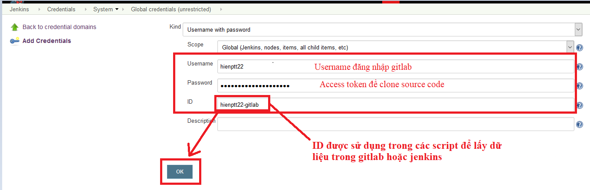

# Tài liệu hướng dẫn cấu hình chi tiết một job jenkins để triển khai luồng CI/CD pipeline

Trong phần này sẽ cấu hình hướng dẫn từng bước cụ thể để có
thể triển khai CI/CD vào một dự án.

Trong các tài liệu trước mô tả từng stage và cách thức để
nhúng đoạn code groovy hỗ trợ viết một pipeline hoàn chỉnh.
Trong phần này sẽ hướng dẫn từng bước cấu hình và link đính kèm
của jenkinsfile.
`**Lưu ý**`: Đối với việc triển khai CI/CD theo luồng pipeline qua
jenkins đề nghị đội dự án tuân thủ theo đúng quy định về việc áp dụng
`git flow` và sử dụng jenkins để cấu hình.

## Bước 1: Tạo một folder domain cho dự án chứa tất cả các job CI/CD của dự án đó

- [Tham khảo phần Bước 1 - Cấu hình jenkins](./setup-ci-pipelines-for-a-project.md#bước-1-tạo-một-folder-cho-project-folder-này-sẽ-chứa-tất-cả-các-job)

## Bước 2: Tạo một job CI/CD tương ứng

- [Tham khảo phần Bước 2 - Cấu hình jenkins](./setup-ci-pipelines-for-a-project.md#bước-2-tạo-job-ci-tương-ứng-và-cấu-hình-chung-cho-job)
## Bước 3: Cấu hình lựa chọn các Gitlab event mà job sẽ xử lý

- [Tham khảo phần Bước 3 - Cấu hình jenkins](./setup-ci-pipelines-for-a-project.md#bước-3-cấu-hình-lựa-chọn-các-gitlab-event-mà-job-sẽ-xử-lý)

## Bước 4: Cấu hình init script

- [Tham khảo phần Bước 4 - Cấu hình jenkins](./setup-ci-pipelines-for-a-project.md#bước-4-cấu-hình-init-script-cả-2-job-đều-dùng-chung-1-init-script)

## Bước 5: Cấu hình trigger trong gitlab

- [Tham khảo cấu hình gitlab](./setup-ci-pipelines-for-a-project.md#cấu-hình-gitlab)

## Bước 6: Tạo file config chung cho cả folder Domain để chạy job

Cấu hình một số tham số cần thiết:

## Bước 7: Tạo file pom.xml chung cho project

## Bước 8: Copy các jenkinsfile cần thiết để chạy thử project.

  `**Lưu ý**`: Đây là file template cần chỉnh sửa cho phù hợp với từng project như:
        - CredentialID trong file `jenkinsfile_utiles.groovy` ==> Có thể sử dụng biến cục bộ hoặc sử dụng credentialID của bot.
        - Các stage build trong jenkinsfile_CI.groovy`
        - projectID, env.groupname,... trong `ci-config`  --> Cấu hình trong folder trên jenkins.

### Hướng dẫn lấy tạo CredentialID
  - CredentialID trong jenkins được sử dụng với một số mục đích sau:
      - Authen để lấy source code gitlab. Dạng User/pass nhưng pass được sử dụng là Access token.
      - Dùng để chứng thực đối với một số hệ thống như :
       - Nexus: User/pass
       - Habor docker: user/pass
  - Hướng dẫn tạo mới một CredentialID trên jenkins:
    - Truy cập vào link sau để tạo: [đường dẫn](http://10.60.156.96:8080/credentials/store/system/domain/_/newCredentials) để tạo mới một credential: Chọn loại credential là user/pass
      - Nhập username đăng nhập gitlab
      - Nhập password là access token để clone source code.

- [ci-config](../../resource/ci-cd-script-example/configFileGroovy/ci-config)
- [jenkinsfile_bootstrap.groovy](../../resource/ci-cd-script-example/jenkinsfile_groovy/jenkinsfile_bootstrap.groovy)
- [jenkinsfile_CD.groovy](../../resource/ci-cd-script-example/jenkinsfile_groovy/jenkinsfile_CD.groovy)
- [jenkinsfile_CI.groovy](../../resource/ci-cd-script-example/jenkinsfile_groovy/jenkinsfile_CI.groovy)
- [jenkinsfile_utils.groovy](../../resource/ci-cd-script-example/jenkinsfile_groovy/jenkinsfile_utils.groovy)

### Xác định các stage cần thiết trong luồng pipeline của dự án.
  Trong phần này sẽ hướng dẫn chi tiết cách để tích hợp thêm các stage trong luồng triển khai CI/CD bao gồm:

  1. Đối với CI/CD level 3, các stage yêu cầu bao gồm: SonarQuebe, Unittest,build,deploy,automationstest.
  - SonarQube: Tham khảo tại [Stage SonarQube](./setup-ci-pipelines-for-a-project.md#stage-sonarqube)

  - Unittest: Tham khảo tại [Stage Unittest](./setup-ci-pipelines-for-a-project.md#stage-unit-test)
    Đây là phần code tích hợp unittest. Để có thể chạy được trong project, yêu cầu cần add jacoco tới file pom.xml.
      Tham khảo file [pom.xml](../../resource/ci-cd-script-example/unit-test/pom.xml)

  - Các stage build, deploy sẽ được sửa tùy theo từng loại dự án như maven, npm, .NET,...
    - Tham khảo tại [Stage build](./setup-ci-pipelines-for-a-project.md#stage-build).
      Tham khảo Script build tham khảo cho từng loại project:

      - Dựa án Maven [Scipt Build](./setup-ci-pipelines-for-a-project.md#1project-maven)

      - Dựa án Angular-NPM [Scipt Build](./setup-ci-pipelines-for-a-project.md#2project-npm-angular)

      - Dựa án .NET [Scipt Build](./setup-ci-pipelines-for-a-project.md#3-project-net)

      - Dựa án Android Gradle [Scipt Build](./setup-ci-pipelines-for-a-project.md#4-project-android-build-gradle)

    - Tham khảo tại [Stage Deploy](./setup-ci-pipelines-for-a-project.md#stage-deploy)

      - Dự án sử dụng k8s [Sciprt deploy](./setup-ci-pipelines-for-a-project.md#1-k8s)

      - Dự án thông thường sử dụng ansible [Sciprt deploy](./setup-ci-pipelines-for-a-project.md##2-%C4%91%E1%BB%91i-v%E1%BB%9Bi-c%C3%A1c-d%E1%BB%B1-%C3%A1n-th%C3%B4ng-th%C6%B0%E1%BB%9Dng)

  - Stage automations Test: Tham khảo tại [Stage Automations Test](./setup-ci-pipelines-for-a-project.md#stage-automations-test)

  2. Đối với CI/CD level 4, các stage yêu cầu bao gồm: SonarQuebe, Unittest, build, deploy, automationstest, performance test, security test, tích hợp quản lý version database.

  - Stage performance test: Tham khảo tại [Stage autoPerfomance](./setup-ci-pipelines-for-a-project.md#stage-run-performance-test)

  - Stage security test: Tham khảo tại [Stage acunetixScan](./setup-ci-pipelines-for-a-project.md#Cau-hinh-stage-run-security-test-voi-acunetix)

  - Tích hợp quản lý version database: Tùy từng dự án sẽ thực hiện cấu hình cho phù hợp.

  - Job CD cơ bản sẽ bao gồm các stage như sau: phân quyền deploy, lấy version ứng dụng
  deploy lên server, update database, run automations test.

### Tham khảo hướng dẫn
  [Hướng dẫn đẩy file lên repo maven Nexus](../../../generate/Nexus.md)

  [Hướng dẫn xử lý lỗi khi tạo job CI/CD trên jenkins](../../../generate/HuongDanDebug.md)

`**NOTE**`: job chỉ chạy khi thực hiện push commit/merge request tới repository.
==> **KHÔNG THỰC HIỆN TEST BẰNG CÁCH NHẤN BUTTON BUILD NOW TRÊN JENKINS**
khi đó sẽ bị `lỗi` do jenkins không thể lấy được các biến môi trường của gitlab,
`ví dụ` : lỗi không checkout được source code.
