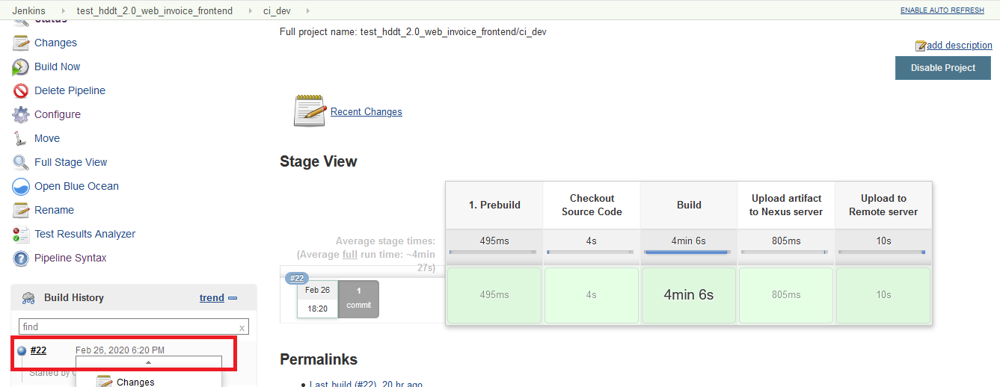
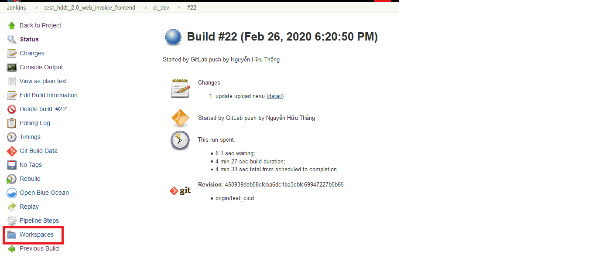
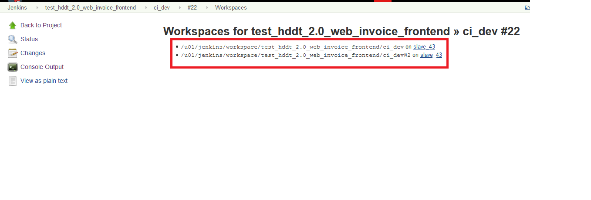

# Hướng dẫn Debug lỗi khi chạy job CI/CD trong jenkins

Trong quá trình tạo job trên jenkins để có thể triển khai CI/CD có thể xảy ra một số lỗi như sau:

## Không lấy được code trên gitlab

Sau khi cấu hình xong connect từ gitlab tới server jenkins, có thể xảy ra trường hợp
chạy lỗi do không tìm thấy file. Nếu xảy ra trường hợp này vào workspace để kiểm tra code mà
jenkins lấy về. Thực hiện:

1. Vào job jenkins --> Nhấn vào build Number --> workspace
   
2. Chọn Build Number
   
3. Chọn Workspace
   

Trong trường hợp này sẽ nhìn thấy hai workspace riêng trên jenkins do đang chạy parallel build.
Khi options này được sử dụng thì sẽ tạo ra 2 workspace để chạy hai stage hay task riêng biệt.

`NOTE`: Phải đảm bảo source code phải được checkout thành công trước khi chạy quét sonar, build, test
hay bất kỳ stage nào được cấu hình mà sử dụng config trong source code.

## Lỗi build faild do connect bị mất

Có thể thực hiện rebuild bằng cách enable build khi commment tới kết quả build trong gitlab.
Phần này đã được hướng dẫn sử dụng `recheck`

## Đối với tất cả các job trong jenkins chạy pipeline đảm bảo cần bỏ chọn tích phần `Use Groovy Sandbox`

Trường hợp này user bình thường được cấp trên jenkins sẽ không có quyền approve. Yêu cầu liên hệ
với đầu mối để approve.
